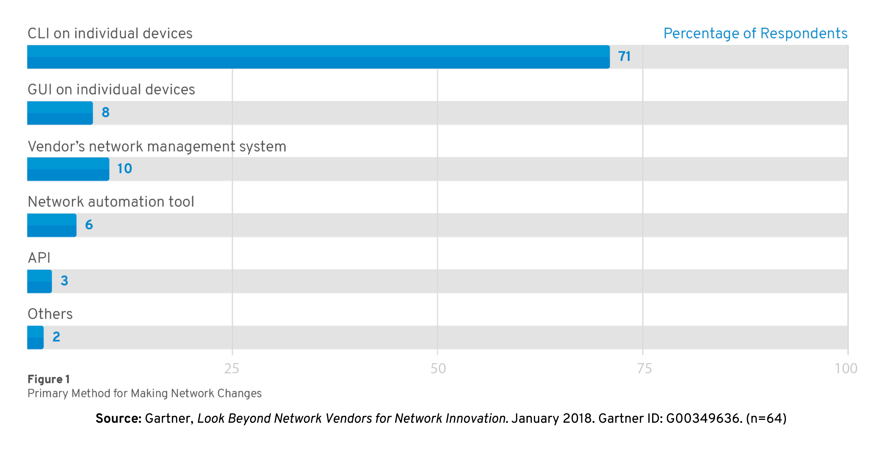

# Managing networks hasn't changed in 30 years

- Networks are mission critical
- Every network is a unique snowflake
- Ad-hoc changes that proliferate
- Vendor specific implementations
- Testing is expensive/impossible

Note: TODO - check on branding/lettering


# According to Gartner...



# Automation considerations

- Compute is no longer the slowest link in the chain
- Businesses demand that networks deliver at the speed of cloud
- Automation of repeatable tasks
- Bridge silos

Note: TODO - Transition slide from problem to solution.


# What is Ansible?
Red Hat Ansible network automation is enterprise software for automating and managing IT infrastructure.

As a vendor agnostic framework Ansible can automate Arista (EOS), Cisco (IOS, IOS XR, NX-OS), Juniper (JunOS), Open vSwitch and VyOS.

Ansible Tower is an enterprise framework for controlling, securing and managing your Ansible automation with a **UI and RESTful API.**


<section data-background-image="images/simple-powerful-agentless-diagram.svg">
</section>


# Ansible: The universal automation framework
<section data-background-image="images/language.svg"></section>


<section data-background-image="images/network_automation.svg"></section>


# Common use cases

- Backup and restore device configurations
- Upgrade network device OS
- Ensure configuration compliance
- Apply patches to address CVE
- Generate dynamic documentation

_Basically anything an operator can do manually, Ansible can automate.
_


# Common use cases - automating discrete tasks
- Ensure VLANs are present/absent
- Enable/Disable netflow on WAN interfaces
- Manage firewall access list entries


# How Ansible Works


# Understanding Ansible vocabulary


# Playbooks


# Inventory


# Modules & Tasks


# Plugins


# Understanding inventory
<div class="columns">
    <div class="col">
<pre>
```
10.1.1.2
10.1.1.3
172.16.1.1
172.16.1.2
192.168.1.2
192.168.1.3
```</pre>

</div>
<div></div>


# Inventory - Groups

<div class="columns">
    <div class="col">
    There is always a group called **"all"** by default
<pre>
```
[atl]
access1.atl.com ansible_host=10.1.1.2
access2.atl.com ansible_host=192.168.1.2

[core]
core1.nw.com
core2.nw.com

[access]
access1.nw.com
access2.nw.com
```</pre>

</div>

<div>
Groups can be nested
<pre>
```
[DC:children]
core
access

[east-coast:children]
DC
atl

[atl]
access1.atl.com ansible_host=10.1.1.2
access2.atl.com ansible_host=192.168.1.2

[core]
core1.nw.com
core2.nw.com

[access]
access1.nw.com
access2.nw.com
```</pre></div>


# Inventory - variables

<div class="columns">
    <div class="col">

<pre>
```
[all:vars]
ansible_username=admin
ansible_password=pa55w0rd
snmp_ro=public123
snmp_rw=private123

[east-coast:vars]
ntp_server=10.99.99.99
anycast=169.1.1.1

[DC:children]
core
access

[east-coast:children]
DC
atl

[atl]
access1.atl.com ansible_host=10.1.1.2 snmp_ro=atl123
access2.atl.com ansible_host=192.168.1.2

[core]
core1.nw.com snmp_ro=corepub123 snmp_rw=corepri123
core2.nw.com

[access]
access1.nw.com ansible_username=localadmin
access2.nw.com
```</pre>
</div>
<div>
<p>- Group variables apply for all devices in that group </p>
<p>- Host variables apply to the host and overrides group vars </p>
</div>


# A sample playbook

<div class="columns">
    <div class="col">
<pre>
```
---
- name: DEPLOY VLANS
  hosts: access
  connection: network_cli
  gather_facts: no

  tasks:

    - name: ENSURE VLANS EXIST
      nxos_vlan:
        vlan_id: 100
        admin_state: up
        name: WEB

```</pre>

</div>
<div>
<p>- Playbook is a list of plays. </p>

<p>- Each play is a list of tasks.</p>

<p>- Tasks invoke modules.</p>

A playbook can contain more than one play

</div>


<section data-state="title alt">
# Lab Time

#### Lab 1: Exercise 1

In this lab you will explore the lab environment and build familiarity with the lab inventory.

Approximate time: 20 mins


# Lab URLs:

- http://austin.redhatgov.io
- http://ansible.com/linklight


# Playbook definition for network automation

- Target play execution using **`hosts`**
- Define the connection : **`network_cli`**
- About **`gather_facts`**


# Running a playbook

<div class="columns">
    <div class="col">
<pre>
```
---
- name: GATHER INFORMATION FROM ROUTERS
  hosts: cisco
  connection: network_cli
  gather_facts: no

  tasks:
    - name: GATHER ROUTER FACTS
      ios_facts:
```</pre></div>

<div><pre>```
[student1@control-node networking-workshop]$ ansible-playbook gather_ios_data.yml

PLAY [GATHER INFORMATION FROM ROUTERS] ******************************************************************

TASK [GATHER ROUTER FACTS] ******************************************************************************
ok: [rtr1]
ok: [rtr4]
ok: [rtr3]
ok: [rtr2]

PLAY RECAP **********************************************************************************************
rtr1                       : ok=1    changed=0    unreachable=0    failed=0   
rtr2                       : ok=1    changed=0    unreachable=0    failed=0   
rtr3                       : ok=1    changed=0    unreachable=0    failed=0   
rtr4                       : ok=1    changed=0    unreachable=0    failed=0   

[student1@ip-172-16-101-121 networking-workshop]$

```</pre></div>


# Displaying output

Use the optional **verbose** flag during playbook execution

``` bash
student1@control-node networking-workshop]$ ansible-playbook gather_ios_data.yml  -v
Using /home/student1/.ansible.cfg as config file

PLAY [GATHER INFORMATION FROM ROUTERS] ******************************************************************

TASK [GATHER ROUTER FACTS] ******************************************************************************
ok: [rtr3] => {"ansible_facts": {"ansible_net_all_ipv4_addresses": ["10.100.100.3", "192.168.3.103", "172.16.235.46",
"192.168.35.101", "10.3.3.103"], "ansible_net_all_ipv6_addresses": [], "ansible_net_filesystems": ["bootflash:"],
"ansible_net_gather_subset": ["hardware", "default", "interfaces"], "ansible_net_hostname": "rtr3", "ansible_net_image":
"boot:packages.conf", "ansible_net_interfaces": {"GigabitEthernet1": {"bandwidth": 1000000, "description": null, "duplex":"Full",
"ipv4": [{"address": "172.16.235.46", "subnet": "16"}], "lineprotocol": "up ", "macaddress": "0e93.7710.e63c", "mediatype": "Virtual",
"mtu": 1500, "operstatus": "up", "type": "CSR vNIC"}, "Loopback0": {"bandwidth": 8000000, "description": null, "duplex": null, "ipv4": [{"address": "192.168.3.103", "subnet": "24"}], "lineprotocol": "up ", "macaddress": "192.168.3.103/24", "mediatype": null,
"mtu": 1514, "operstatus": "up", "type": null}, "Loopback1": {"bandwidth": 8000000, "description": null,
"duplex": null, "ipv4": [{"address": "10.3.3.103",
"subnet": "24"}], "lineprotocol": "up ", "macaddress": "10.3.3.103/24", "mediatype": null, "mtu": 1514, "operstatus": "up", "type": null},
"Tunnel0": {"bandwidth": 100, "description": null, "duplex": null, "ipv4": [{"address": "10.100.100.3", "subnet": "24"}]

.
.
.
.
.
<output truncated for readability>
```

_Increase the level of verbosity by adding more "v's" -vvvv_


# Limiting playbook execution

Playbook execution can be limited to a subset of devices using the **--limit** flag.

``` bash
$ ansible-playbook gather_ios_data.yml  -v --limit rtr1
```


# A note about magic variables

Other than the user defined variables, Ansible supports many **magic** inbuilt variables. For example

| Variable           | Explanation                                           |
|--------------------|-------------------------------------------------------|
| ansible_*          | Output of fact gathering                              |
| inventory_hostname | Name of the device the task is executing against      |
| hostvars           | A dictionary variable whose key is inventory_hostname |
|                    |                                                       |


# Displaying output - The "debug" module
The **debug** module is used like a "print" statement in most programming languages.
Variables are accessed using "{{ }}" - quoted curly braces

#### Demo of the debug module


<section data-state="title alt">
# Lab time

#### Lab 1: Exercise 2

In this lab you will write your first playbook and run it to gather facts from Cisco routers. You will also practice the use of "verbose" and "limit" flags in addition to working with variables within a playbook.

Approximate time: 20 mins


# Modules
Modules do the actual work in ansible, they are what gets executed in each playbook task.
- Typically written in Python (but not limited to it)
- Modules are idempotent
- Modules take user input in the form of parameters


# Network modules
Ansible modules for network automation typically references the vendor OS followed by the module name.
    <div class="columns">
            <div class="col">
              <ul>
                <li>\*_facts</li>
                <li>\*_command</li>
                <li>\*\_config</li>
                <li>more modules depending on platform</li>
              </ul>
            </div>
            <div class="col">
              <ul>
                <li>Arista EOS = eos\_\*</li>
                <li>Cisco IOS/IOS-XE = ios\_\*</li>
                <li>Cisco NX-OS = nxos\_\*</li>
                <li>Cisco IOS-XR = iosxr\_\*</li>
                <li>Juniper Junos = junos\_\*</li>
                <li>VyOS = vyos\_\*</li>
              </ul>
            </div>
          </div>


# Modules per network platform

```
  tasks:
    - name: configure eos system properties
      eos_system:
        domain_name: ansible.com
        vrf: management
      when: ansible_network_os == 'eos'

    - name: configure nxos system properties
      nxos_system:
        domain_name: ansible.com
        vrf: management
      when: ansible_network_os == 'nxos'

```


# Modules Documentation

<div class="columns">
    <div class="col">
    <p><strong>http://docs.ansible.com/</strong></p>
    </div>
<div class="col">

</div>


# Modules Documentation
``` bash
# List out all modules installed
$ ansible-doc -l
...
ios_banner                                Manage multiline banners on Cisco IOS devices
ios_command                               Run commands on remote devices running Cisco IOS
ios_config                                Manage Cisco IOS configuration sections
...

# Read documentation for installed module
$ ansible-doc ios_command
> IOS_COMMAND

     Sends arbitrary commands to an ios node and returns the results read from the
     device. This module includes an argument that will cause the module to wait for a
     specific condition before returning or timing out if the condition is not met. This
     module does not support running commands in configuration mode. Please use
     [ios_config] to configure IOS devices.

Options (= is mandatory):
...
```


# Limiting tasks within a play

- **Tags** allow the user to selectively execute tasks within a play.
- Multiple tags can be associated with a given task.
- Tags can also be applied to entire plays or roles.

``` yaml
    - name: DISPLAY THE COMMAND OUTPUT
      debug:
        var: show_output
      tags: show
```

Tags are invoked using the **--tags** flag while running the playbook

``` bash
[student1@control-node networking-workshop]$ ansible-playbook gather_ios_data.yml --tags=show

```
_This is useful while working with large playbooks, when you might want to "jump" to a specific task._


# Registering the output

The **register** parameter is used to collect the output of a task execution. The output of the task is 'registered' in a variable which can then be used for subsequent tasks.

``` yaml
    - name: COLLECT OUTPUT OF SHOW COMMANDS
      ios_command:
        commands:
          - show run | i hostname
          - show ip interface brief
      tags: show
      register: show_output
```


<section data-state="title alt">
# Lab Time

#### Lab 1: Exercise 3

In this lab you will learn how to use module documentation. You will also learn how to selectively run tasks using tags and learn how to collect task output into user defined variables within the playbook.

Approximate time: 20 mins


# The *_config module

Vendor specific config modules allow the user to update the configuration on network devices. Different ways to invoke the *_config module:

``` yaml
  tasks:
    - name: ENSURE THAT THE DESIRED SNMP STRINGS ARE PRESENT
      ios_config:
        commands:
          - snmp-server community ansible-public RO
          - snmp-server community ansible-private RW
          - snmp-server community ansible-test RO
```

``` yaml
  tasks:
    - name: ENSURE THAT ROUTERS ARE SECURE
      ios_config:
        src: secure_router.cfg
```


# Validating changes before they are applied

Ansbile lets you validate the impact of the proposed configuration using the **--check** flag. Used together with the **--verbose** flag, it lets you see the actual change being pushed to the device
``` bash
[student1@control-node networking-workshop]$ ansible-playbook router_configs.yml  --check -v
Using /home/student1/.ansible.cfg as config file

PLAY [UPDATE THE SNMP RO/RW STRINGS] ********************************************************************************************************************************************************

TASK [ENSURE THAT THE DESIRED SNMP STRINGS ARE PRESENT] *************************************************************************************************************************************
changed: [rtr3] => {"banners": {}, "changed": true, "commands": ["snmp-server community ansible-test RO"],
"updates": ["snmp-server community ansible-test RO"]}

```


<section data-state="title alt">
# Lab Time

#### Lab 2: Exercise 1

In this lab you will learn how to make configuration changes using Ansible. The exercise will demonstrate the idempotency of the module. Additionally you will learn how to validate a change before actually applying it to the devices.

Approximate time: 20 mins


<section data-state="title alt">
# Scenario: Day2 Ops - Backing up and restoring router configuration


# Backing up router configuration

``` yaml
---
- name: BACKUP ROUTER CONFIGURATIONS
  hosts: cisco
  connection: network_cli
  gather_facts: no

  tasks:
    - name: BACKUP THE CONFIG
      ios_config:
        backup: yes
      register: config_output
```

The backup parameter of the **ios_config** module triggers the backup and automatically stores device configuration backups within a **backups** directory


# Cleaning up the backed up configuration

The backed up configuration has 2 lines that should be removed:

``` shell
Building configuration...

Current configuration with default configurations exposed : 393416 bytes

```

The **lineinfile** module is a general purpose module that is used for manipulating file contents.


# Clean up (Contd..)
Cleaning up an exact line match

``` yaml
    - name: REMOVE NON CONFIG LINES
      lineinfile:
        path: "./backup/{{inventory_hostname}}.config"
        line: "Building configuration..."
        state: absent
```


# Clean up (Contd..)
Matching using a regular expression

``` yaml
    - name: REMOVE NON CONFIG LINES - REGEXP
      lineinfile:
        path: "./backup/{{inventory_hostname}}.config"
        regexp: 'Current configuration.*'
        state: absent
```


# Restoring the configuration
If any out of band changes were made to the device and it needs to be restored to the last known good configuration, we could take the following approach:

- Copy over the cleaned up configuration to the devices
- Use vendor provided commands to restore the device configuration

\*In our example we use the Cisco IOS command **config replace**. This allows for applying only the differences between running and the copied configuration


# Restoring (Contd..)

```
---
- name: RESTORE CONFIGURATION
  hosts: cisco
  connection: network_cli
  gather_facts: no

  tasks:
    - name: COPY RUNNING CONFIG TO ROUTER
      command: scp ./backup/{{inventory_hostname}}.config {{inventory_hostname}}:/{{inventory_hostname}}.config

    - name: CONFIG REPLACE
      ios_command:
        commands:
          - config replace flash:{{inventory_hostname}}.config force

```
Note the use of **inventory_hostname** to effect host specific changes.


<section data-state="title alt">
# Lab Time

#### Lab 2: Exercises 2 & 3

In this lab you will implement a typical Day 2 Ops scenario of backing up and restoring device configurations.

Approximate time: 30 mins


<section data-state="title alt">
# Scenario:Creating living/dynamic documentation


# Templates
- Ansible has native integration with the [Jinja2](https://jinja.pocoo.org) templating engine
- Render data models into device configurations
- Render device output into dynamic documentation

Jinja2 enables the user to manipulate variables, apply conditional logic and extend programmability for network automation.


# Using templates to generate configuration

#### Demo

<div class="columns">
    <div class="col">
<pre>
Data model:
```
vlans:
  - id: 10
    name: WEB
  - id: 20
    name: APP
  - id: 30
    name: DB

```Jinja2 template
```

vlan {{ vlan.id }}
  name {{ vlan.name }}

```</pre>

</div>

<div>
<pre>
Tying it all together

```
- name: RENDER THE VLAN CONFIGURATION
  template:
    src: vlans.j2
    dest: "vlan_configs/{{ inventory_hostname }}.conf"
``` leaf1.conf
```
vlan 10
  name WEB
vlan 20
  name APP
vlan 30
  name DB

```</pre></div>


# Using templates to build dynamic documentation
<div class="columns">
    <div class="col">
<pre>
```
{{ inventory_hostname.upper() }}
---
{{ ansible_net_serialnum }} : {{ ansible_net_version }}
```
```
RTR1
---
9YJXS2VD3Q7 : 16.08.01a

```
```
RTR2
---
9QHUCH0VZI9 : 16.08.01a

```
```
RTR3
---
9ZGJ5B1DL14 : 16.08.01a

```
```
RTR4
---
9TCM27U9TQG : 16.08.01a

```</pre>

</div>

<div>
<p>- Generate documentation that never goes stale</p>
<p>- Build troubleshooting reports </p>
<p>- Same data to generate exec reports and engineering reports using different templates </p>
</div>


# Assembling the data

The **assemble** module is used to generate a consolidated file by combining fragments. This is a common strategy used to put snippets together into a final document.

``` yaml
    - name: CONSOLIDATE THE IOS DATA
      assemble:
        src: reports/
        dest: network_os_report.md
      delegate_to: localhost
      run_once: yes
```

``` html
RTR1
---
9YJXS2VD3Q7 : 16.08.01a

RTR2
---
9QHUCH0VZI9 : 16.08.01a

RTR3
---
9ZGJ5B1DL14 : 16.08.01a
RTR4
---
9TCM27U9TQG : 16.08.01a
```


<section data-state="title alt">
# Lab Time

#### Lab 3: Exercise 1

In this lab you will use a basic Jinja2 template to generate a markdown report that contains the device name, serial number and operating system version. You will create a report per device and then use the assemble module to consolidate them.

Approximate time: 20 mins


# A quick introduction to roles
The 2 basic files needed to get started with Ansible are:

- Inventory
- Playbook


# Roles

- Roles help simplify playbooks.
- Think of them as callable functions for repeated tasks
- Roles can be distributed/shared; similar to libraries

<div class="columns">
    <div class="col">
<pre>
```
site.yml
roles/
   common/
     files/
     templates/
     tasks/
     handlers/
     vars/
     defaults/
     meta/
   ospf/
     files/
     templates/
     tasks/
     handlers/
     vars/
     defaults/
     meta/
```</pre>

</div>

<div>
<pre>
```
# site.yml
---
- hosts: routers
  roles:
     - common
     - ospf
```</pre></div>


# Ansible Galaxy

**http://galaxy.ansible.com**

Ansible Galaxy is a hub for finding, reusing and sharing Ansible roles.

Jump-start your automation project with content contributed and reviewed by the Ansible community.
``` yaml
---
- name: GENERATE INTERFACE REPORT
  hosts: cisco
  gather_facts: no
  connection: network_cli

  roles:
    - ansible-network.network-engine
```

_The network-engine role can be installed from Ansible Galaxy_

#### Demo Ansible galaxy


# Using parsers to generate custom reports
On most network devices, show command output is "pretty" formatted but not structured.
The Ansible **network-engine** role provides support for 2 text parsing engines:
- TextFSM
- Command Parser

``` yaml
---
- name: GENERATE INTERFACE REPORT
  hosts: cisco
  gather_facts: no
  connection: network_cli

  roles:
    - ansible-network.network-engine

  tasks:
    - name: CAPTURE SHOW INTERFACES
      ios_command:
        commands:
          - show interfaces
      register: output

    - name: PARSE THE RAW OUTPUT
      command_parser:
        file: "parsers/show_interfaces.yml"
        content: "{{ output.stdout[0] }}"
```


# Structured data from show commands

<div class="columns">
    <div class="col">
<pre>
```
rtr2#show interfaces
GigabitEthernet1 is up, line protocol is up
  Hardware is CSR vNIC, address is 0e56.1bf5.5ee2 (bia 0e56.1bf5.5ee2)
  Internet address is 172.17.16.140/16
  MTU 1500 bytes, BW 1000000 Kbit/sec, DLY 10 usec,
     reliability 255/255, txload 1/255, rxload 1/255
  Encapsulation ARPA, loopback not set
  Keepalive set (10 sec)
  Full Duplex, 1000Mbps, link type is auto, media type is Virtual
  output flow-control is unsupported, input flow-control is unsupported
  ARP type: ARPA, ARP Timeout 04:00:00
.
.
.
.
.
<output omitted for brevity>  
```</pre>

</div>
<div>
<pre>
```
TASK [DISPLAY THE PARSED DATA] **************************************************************************************************************************************************************
ok: [rtr1] => {
    "interface_facts": [
        {
            "GigabitEthernet1": {
                "config": {
                    "description": null,
                    "mtu": 1500,
                    "name": "GigabitEthernet1",
                    "type": "CSR"
                }
            }
        },
        {
            "Loopback0": {
                "config": {
.
.
.
.
.
<output omitted for brevity>                
```</pre></div>


<section data-state="title alt">
# Lab Time

#### Lab 3: Exercise 2

The objective of this lab is to generate a dynamic documentation from the output of a device **show** command. You will use the **network-engine** role installed from **Ansible Galaxy** to invoke the **command_parser** module to create structured data. You will then use a pre-written Jinja2 template to generate the desired report

Approximate time: 20 mins


# Next Steps
- **It's easy to get started**

   ansible.com/get-started
- **Join the Ansible community**

   ansible.com/community
- **Would you like to learn a lot more?**

   redhat.com/en/services/training/do407-automation-ansible
