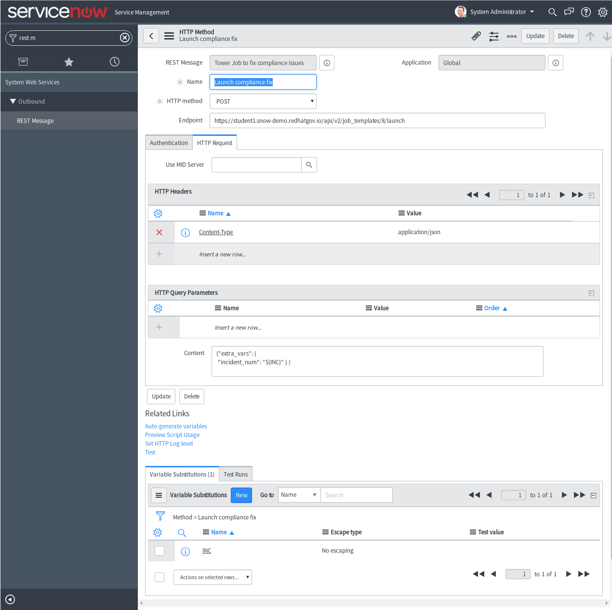
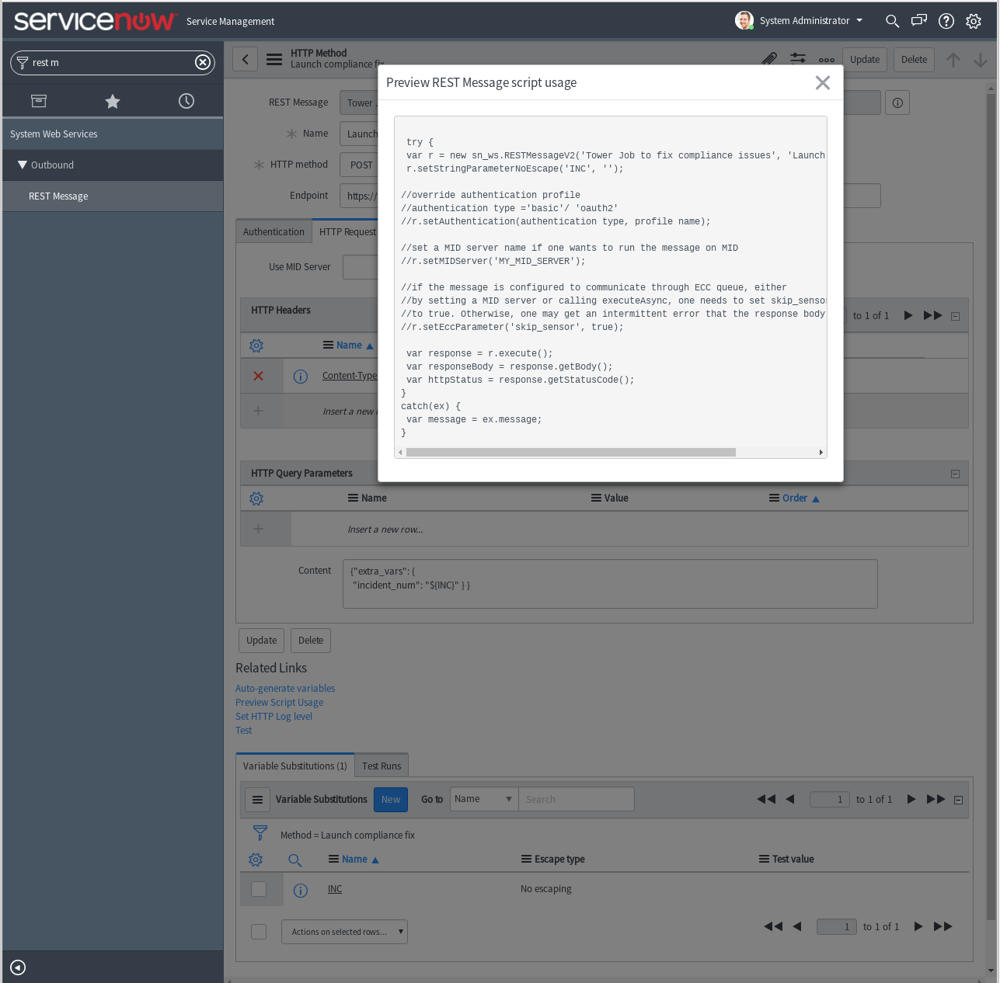

# Notes from Ajay

This is how you grab the correct Javascript from ServiceNow and edit it:

 - Click on the *Auto-generate variable* link
 

 - Click the *Preview Script Usage* link at the bottom and copy the contents.
 

 ```javascript
  try {
var r = new sn_ws.RESTMessageV2('Ansible Tower Demo', 'Launch compliance fix');
r.setStringParameterNoEscape('INC', '');

//override authentication profile
//authentication type ='basic'/ 'oauth2'
//r.setAuthentication(authentication type, profile name);

//set a MID server name if one wants to run the message on MID
//r.setMIDServer('MY_MID_SERVER');

//if the message is configured to communicate through ECC queue, either
//by setting a MID server or calling executeAsync, one needs to set skip_sensor
//to true. Otherwise, one may get an intermittent error that the response body is null
//r.setEccParameter('skip_sensor', true);

var response = r.execute();
var responseBody = response.getBody();
var httpStatus = response.getStatusCode();
}
catch(ex) {
var message = ex.message;
}

```


 - Click submit
