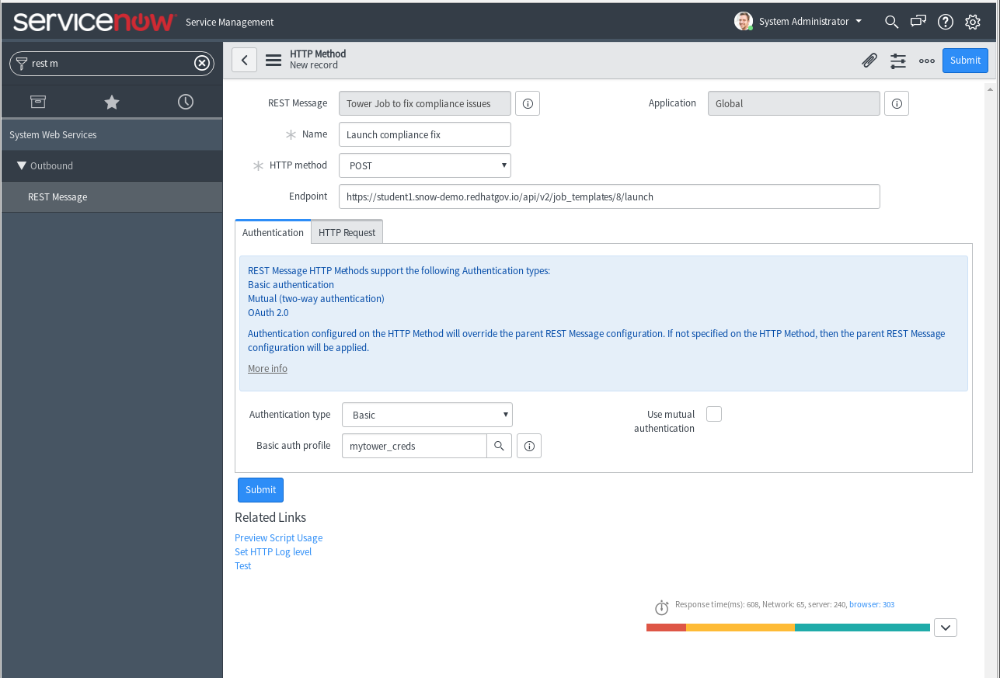
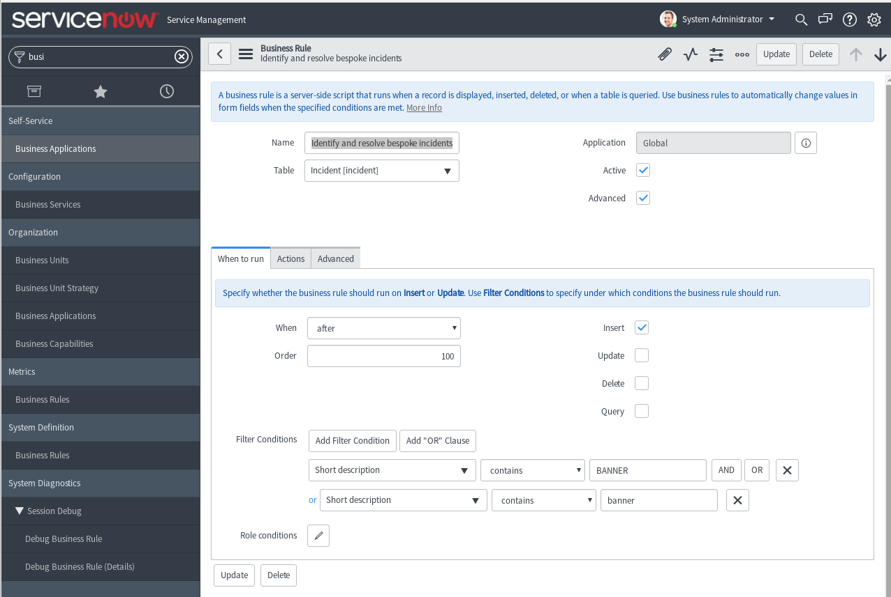

# ServiceNow Demo for Linklight

#### Preface

This demo is built for the Linklight workbench.  To use the demo it is recommended to run the [provisioner](../../provisioner/README.md) for **networking mode**.  By standardizing demos on the Linklight workbench it is easier to test and verify demos are always working.  Feel free re-use any component of this demo but this demo is only supported in this fashion.


## Demo 02 - Closed Loop Incident Management

### Objective

Demonstrate a closed loop incident management scenario. 
1. Check devices for compliance.  When a device does not meet compliance requirements, a ServiceNow ticket with relevant information will be created. 

2. The ticketing system has business logic to automatically fix bespoke incidents - in this case, a device that is out of compliance should be brought into compliance. ServiceNow will call out to Tower to use automation and fix the incident.

3. The Tower automation job will bring the device into compliance and then reach out to ServiceNow to resolve and close out the ticket

Thus a BSS system is able to maintain a statement of record while automatically fixing incidents at the same time.

## Setup

#### Step 1
  - Setup a free account
    https://developer.servicenow.com/

  - Click **Manage** and create an instance

    

    A URL will be provided like ```https://dev66073.service-now.com/```

  - Login to your WebURL and reset your password.
    

  - Record these three pieces of information that will provide authentication.

    | Field | Input |
    | -------- |:--------------------|
    | username | admin |
    | password | ThisIsAFakePassword |
    | instance | dev66073      |

    **Tip 1** the instance is part the webURL e.g. https://dev66073.service-now.com/ is `dev66073`

    **Tip 2** the password is **not** the same as your password to login to https://developer.servicenow.com/.  To reset it click on **Action** and then **Reset admin password**

    
    
    
#### Step 2
  - Install pysnow on the control node
    https://pysnow.readthedocs.io/en/latest/

    ```
    # source /var/lib/awx/venv/ansible/bin/activate
    # umask 0022
    # pip install pysnow
    # deactivate
    ```

#### Step 3

Navigate to the demo directory (~/demos/servicenow/close_loop_incident_mgmt) and update the following files with the relevant data:

1. `input_vars.yaml` : Update this with the tower admin username and password for your tower instance
*Example data:*
    
```yaml
---
tower_username: admin
tower_password: ansible
```

    
2. `./snow_demo2/snow_vars.yaml`: Update this with the details you recorded while creating the instance 
    
*Example input:*
```yaml
---
SN_USERNAME: admin
SN_PASSWORD: ThisIsafakepassword
SN_INSTANCE: dev66073
```
    
#### Step 4

Run the `demo_setup.yaml` playbook as follows. This will create the necessary job templates for the demo in your tower instance:

``` shell
[student1@ansible closed_loop_incident_mgmt]$ ansible-playbook demo_setup.yaml -e @input_vars.yaml 
```

After this step, log into your tower instance and verify that the 2 "SNOW" job templates are present:


#### Step 5

> *Extremely important: Make sure you use FQDNs that have valid SSL certs for the demo to work*

Navigate to the API URI (api/v2/job_templates/) of your tower instance. For example: https://student1.snow-demo.redhatgov.io/api/v2/job_templates/ and identify the API endpoint for the **SNOW-Demo-Compliance-Fix** job template. 

For example, it is https://student1.snow-demo.redhatgov.io/api/v2/job_templates/8 in my instance.

Adding a "launch" URI will make this template executable remotely. Record this URL endpoint as we will need it in a further step. For example: https://student1.snow-demo.redhatgov.io/api/v2/job_templates/8/launch


#### Step 5
Now, in your servicenow instance, navigate to **System Web Services >> Outbound >> REST Message** 

> You can also use the search bar at the top left and search for "rest message"


  - Click on *New* at the top of the page:
    
    
  - Give it a name and set the endpoint to the URL we captured in the previous step.
  - Under the *Authentication* tab, chose "Basic" Authentication type.
  - For the Basic auth profile, click on the search bar. This will open yet another window. Click on new and add your Tower instance' login information
    
  - Click Submit
  - Click again on the REST message you just created and add a new HTTP method
  
  - Give it a name, select **POST** and add the same end-point
  
  - Click on the *HTTP Request* Tab. Under the "HTTP Headers" add a new HTTP header with the name "Content-Type" and value "application/json"
  - At the bottom, in the "Content" area, add the following"
  ```json
  {"extra_vars": {
 "incident_num": "${INC}" } }
 ```
 
 > The extra_vars is how the Service Now API is going to pass the incident number information to the Tower instance
  - Click on the *Auto-generate variable* link
  
  
  - Click the *Preview Script Usage* link at the bottom and copy the contents.
  
  
  ```javascript
   try { 
 var r = new sn_ws.RESTMessageV2('Tower Job to fix compliance issues', 'Launch compliance fix');
 r.setStringParameterNoEscape('INC', '');

//override authentication profile 
//authentication type ='basic'/ 'oauth2'
//r.setAuthentication(authentication type, profile name);

//set a MID server name if one wants to run the message on MID
//r.setMIDServer('MY_MID_SERVER');

//if the message is configured to communicate through ECC queue, either
//by setting a MID server or calling executeAsync, one needs to set skip_sensor
//to true. Otherwise, one may get an intermittent error that the response body is null
//r.setEccParameter('skip_sensor', true);

 var response = r.execute();
 var responseBody = response.getBody();
 var httpStatus = response.getStatusCode();
}
catch(ex) {
 var message = ex.message;
}

```

    
  - Click submit
  
 
#### Step 6

 - Navigate to **System Definition >> Business Rules** and click on *New* to add a new business rule
 
 > For this demo, the bespoke incident type that should be automatically fixed is router login banner compliance. So the rule is looking for a new *incident* ticket whose description contains banner.
 - Click on the *Advanced* checkbox to enable the *Advanced* Tab
 
 > NOTE: Ensure that the Business rule is run **after** the ticket is inserted into the incidents table (see screencap above for all dropdowns and checkboxes)
 
 
** If you have used the exact naming conventions in this README, you can copy and paste the following into the *Advanced* tab.**

``` javascript
(function executeRule(current, previous /*null when async*/) {

	// Add your code here
	  try { 
 var r = new sn_ws.RESTMessageV2('Tower Job to fix compliance issues', 'Launch compliance fix');
 r.setStringParameterNoEscape('INC', current.number);

//override authentication profile 
//authentication type ='basic'/ 'oauth2'
//r.setAuthentication(authentication type, profile name);

//set a MID server name if one wants to run the message on MID
//r.setMIDServer('MY_MID_SERVER');

//if the message is configured to communicate through ECC queue, either
//by setting a MID server or calling executeAsync, one needs to set skip_sensor
//to true. Otherwise, one may get an intermittent error that the response body is null
//r.setEccParameter('skip_sensor', true);

 var response = r.execute();
 var responseBody = response.getBody();
 var httpStatus = response.getStatusCode();
 current.comments = "Contacting Ansible Tower to fix bespoke incident";
 current.state = '2';
 current.update();
}
catch(ex) {
 var message = ex.message;
}

})(current, previous);
```
 

- Click "Submit"


## Running the Demo

### Animation of the Demo


#### Step 1

Ensure that the router does not have a current banner (required condition for the device to be out of compliance:


```
[student1@ansible closed_loop_incident_mgmt]$ ssh rtr1


rtr1#


```

> If there is an existing banner you can use  the `no banner login` command in config mode to remove it


#### Step 2
Log into the Tower instance and launch the "SNOW-Demo-Compliance-Check" Template

>Observe the following 2 tasks as that template runs

```
TASK [CREATE AN INCIDENT] ******************************************************
changed: [rtr1 -> localhost]

TASK [VISUAL OUTPUT OF INCIDENT NUMBER] ****************************************
ok: [rtr1] => {
    "snow_var.record.number": "INC0010034"
}

```


#### Step 3

Switch over to the ServiceNow instance and see that the ticket number as see in the previous output has been created.


#### Step 4

Switch back to the Ansible Tower Jobs and click on the "SNOW-Demo-Compliance-Fix" Job 

>Observe that after sleeping for 180s, the job will fix the issue on the router, resolve and close out the ticket

``` 
TASK [sleep for 180 seconds and continue with play] ****************************
ok: [rtr1 -> localhost]
TASK [CONFIGURE THE LOGIN BANNER] **********************************************
changed: [rtr1]
TASK [MARK THE TICKET AS RESOLVED] *********************************************
changed: [rtr1]
TASK [MARK THE TICKET AS CLOSED] ***********************************************
changed: [rtr1]

```

#### Step 5
Log back into the router and see that you are greeted with the new banner:


```
[student1@ansible servicenow]$ ssh rtr1

DEMO BANNER FOR DEVICE rtr1


rtr1#

```

#### Step 6
Finally log back into servicenow to notice the history of the ticket


  
  
  
