# Ansible + ServiceNow - Closed Loop Incident Management

For a short video overview of this demonstration please refer to this YouTube video: [https://youtu.be/TkXRj4w2G2Y](https://youtu.be/TkXRj4w2G2Y)

# Objective

Demonstrate a closed loop incident management scenario.

1. Check devices for compliance.  When a device does not meet compliance requirements, a ServiceNow ticket with relevant information will be created.
2. The ticketing system has business logic to automatically fix bespoke incidents - in this case, a device that is out of compliance should be brought into compliance. ServiceNow will call out to Tower to use automation and fix the incident.
3. The Ansible Tower automation job will bring the device into compliance and then reach out to ServiceNow to resolve and close out the ticket

Thus a BSS (Business Services System) is able to maintain a statement of record while automatically fixing incidents at the same time.


## Table of Contents

- [Step 1 - Connect to workbench](#step-1---connect-to-workbench)
- [Step 2 - Provide ServiceNow credentials](#step-2---provide-servicenow-credentials)
- [Step 3 - Run demo setup playbook](#step-3---run-demo-setup-playbook)
- [Step 4 - The named URL](#step-4---the-named-url)
- [Step 5 - Setup ServiceNow REST Message](#step-5---setup-servicenow-rest-message)
- [Step 6 - Setup ServiceNow Business Rule](#step-6---setup-servicenow-business-rule)
- [Running the Demo](#running-the-demo)

## Step 1 - Connect to workbench

Connect to the workshop workbench:

```
[user@RHEL ~]$ ssh student1@student1.workshop.rhdemo.io
student1@student1.workshop.rhdemo.io's password:

```

Move into the `demos/servicenow/1-config-drift` directory.

```
[student1@ansible ~]$
[student1@ansible ~]$ cd ~/demos/servicenow/2-closed_loop_incident_mgmt
```


## Step 2 - Provide ServiceNow credentials

Define the login information (username, password and instance) as defined in the [Common Setup](../README.md).  Fill this information out in `login_info.yml` with your text editor of choice.

```
[student1@ansible ~]$ nano login_info.yml
```

## Step 3 - Run demo setup playbook

Run the `demo_setup.yml` playbook as follows. This will create the necessary job templates for the demo in your tower instance:

```
[student1@ansible closed_loop_incident_mgmt]$ ansible-playbook demo_setup.yml
```

After this step, log into your tower instance and verify that the 2 "SNOW" job templates are present:
- **SNOW-Demo-Compliance-Check** - this Job Template will check for the banner being in compliance.  It will not modify the banner.
- **SNOW-Demo-Compliance-Fix** - this Job Template will change the banner to the desired banner

screenshot of Job Templates in Red Hat Ansible Tower:
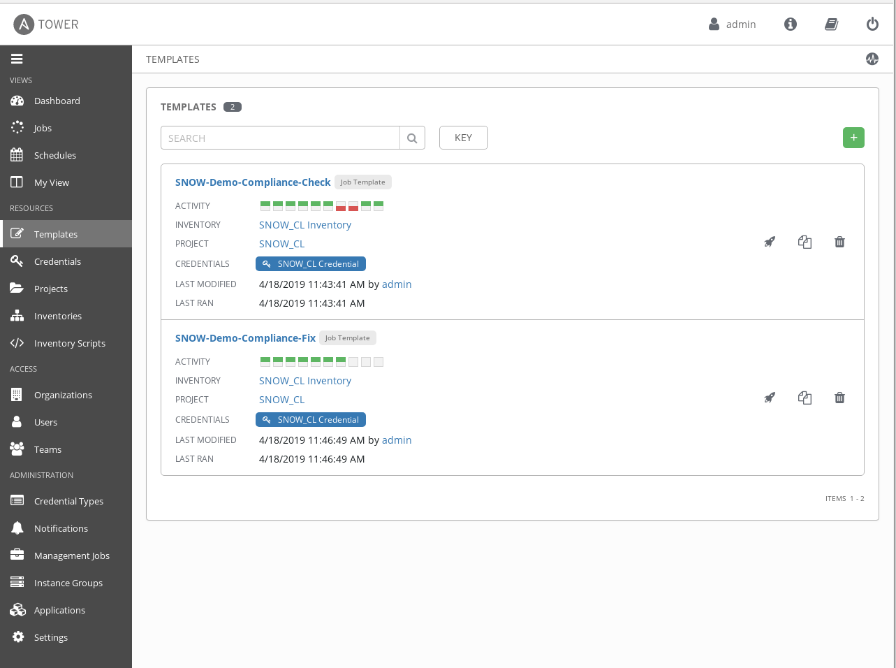

## Step 4 - The named URL

> *Extremely important: Make sure you use FQDNs that have valid SSL certs for the demo to work*

The Ansible Tower API has the concept of a named URL (`named_url`).  The named URL feature allows you to access Tower resources via resource-specific human-readable identifiers.  More info can be found in the documentation at: https://docs.ansible.com/ansible-tower/latest/html/towerapi/access_resources.html

The URL for the **SNOW-Demo-Compliance-Fix** will be:

```
$TOWER_URL/api/v2/job_templates/SNOW-Demo-Compliance-Fix/launch
```

for example:

```
https://student1.sean_workshop.rhdemo.io/api/v2/job_templates/SNOW-Demo-Compliance-Fix/launch
```

## Step 5 - Setup ServiceNow REST Message

  - In the ServiceNow instance, navigate to **System Web Services >> Outbound >> REST Message**

    > You can also use the search bar at the top left and search for "rest message"

    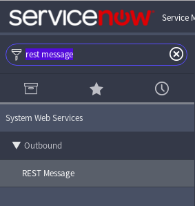


  - Click on **New** at the top of the page:

    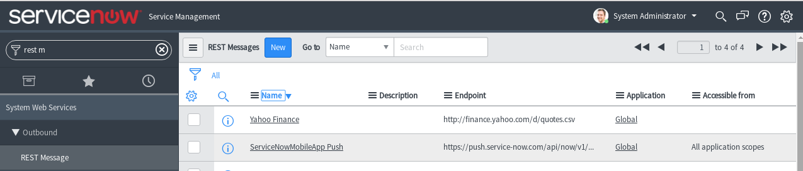

  - Fill out the following:

    | Parameter   | Value  |
    |---|---|
    | Name  | Ansible Tower Demo |
    | Endpoint | `$TOWER_URL/api/v2/job_templates/SNOW-Demo-Compliance-Fix/launch` <br><br>make sure to use correct $TOWER_URL, example in previous step.  |

  - Under the **Authentication** tab, choose the **Basic** Authentication type.
  - For the Basic Auth Configuration, click on the search icon. This will open window. Click on new and add your Ansible Tower login information:

    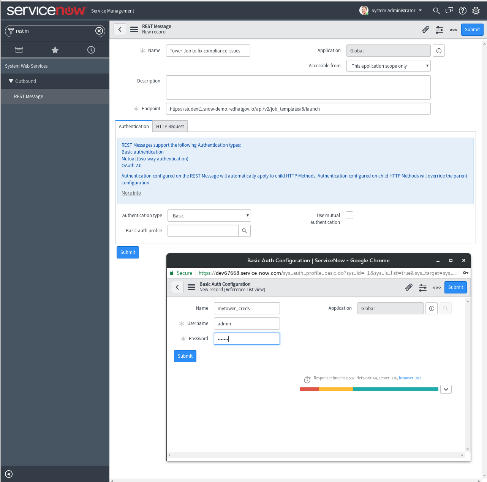  
  - Click Submit, the user interface should look similar to the following:

    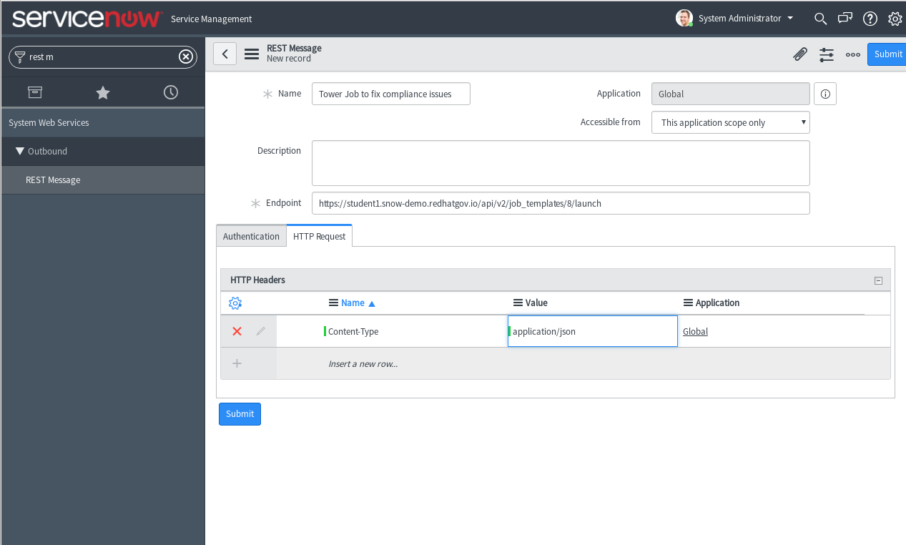
  - Click on the REST message you just created click on new to add a HTTP method

    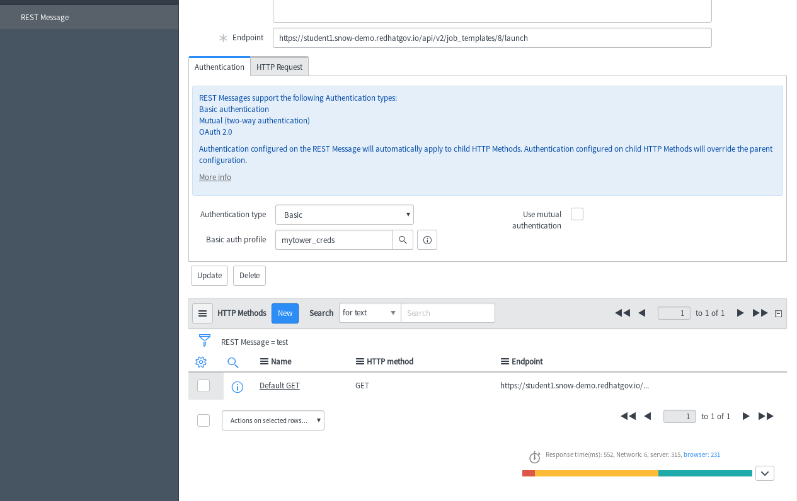

  - Fill out the following values:

    | Parameter   | Value  |
    |---|---|
    | Name  | Launch Compliance Fix |
    | HTTP method | `POST` |
    | Endpoint | Leave this blank |

  - Click on the **HTTP Request** tab. Under the "HTTP Headers" add a new HTTP header with the following name and value:
    | Name   | Value  |
    |---|---|
    | `Content-Type`  | `application/json` |

  - At the bottom, in the **Content** text area, add the following:

  ```json
    {"extra_vars": {
   "incident_num": "${INC}" } }
  ```

  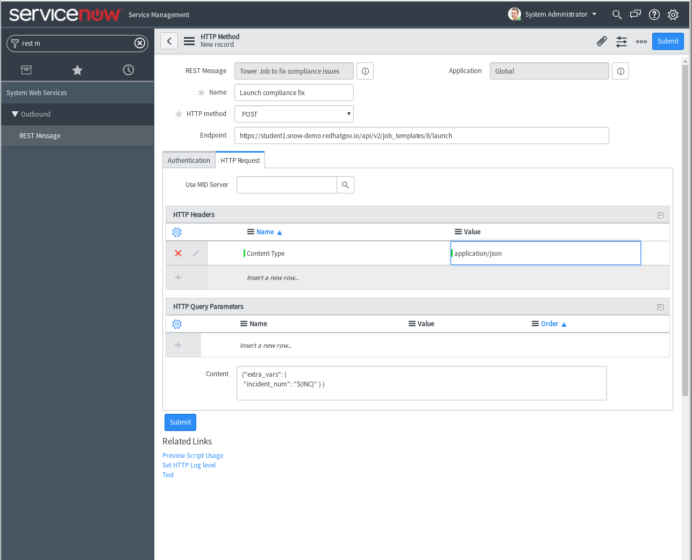

  The `extra_vars` is how the ServiceNow API is going to pass the incident number information to the Ansible Tower instance

  - Click Submit


## Step 6 - Setup ServiceNow Business Rule

 - Navigate to **System Definition >> Business Rules**

 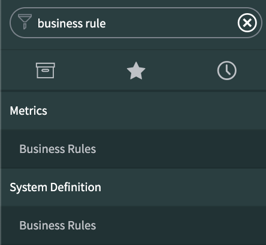


- Click on **New** to add a new business rule.  Fill out the following parameters:

    | Parameter   | Value  |
    |---|---|
    | Name  | Ansible Tower Demo |
    | Table | `Incident [incident]` |
    | Active | ✓ |
    | Advanced | ✓ |


- Under the **When to run** tab:

    | Parameter   | Value  |
    |---|---|
    | When | after |
    | Insert | ✓ |

- Click on the **Add Filter Condition** button and fill out the filter:

    | Field  | Operation  | Value |
    |---|---|---|
    | Short description   | contains  | BANNER |

  It should look similar to this screenshot:

 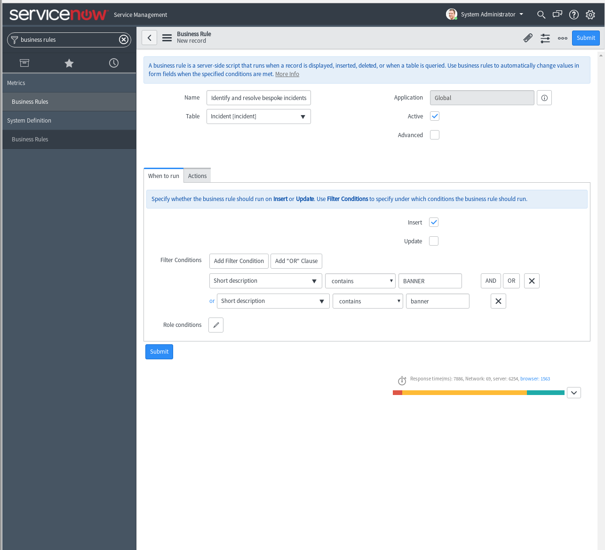

- Click on the **Advanced** tab

  If you have used the exact naming conventions in this README, you can copy and paste the following:

```javascript
(function executeRule(current, previous /*null when async*/ ) {

    try {
        var r = new sn_ws.RESTMessageV2('Ansible Tower Demo', 'Launch compliance fix');
        r.setStringParameterNoEscape('INC', current.number);

        var response = r.execute();
        var responseBody = response.getBody();
        var httpStatus = response.getStatusCode();
        current.comments = "Contacting Ansible Tower to fix bespoke incident";
        current.state = '2';
        current.update();
    } catch (ex) {
        var message = ex.message;
    }

})(current, previous);
```

  It should look similar to this screenshot:

 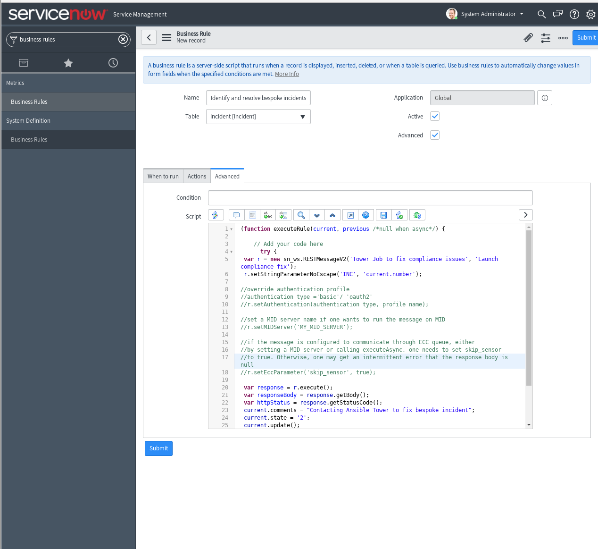

- Click **Submit**


# Running the Demo

Reminder, for a short video overview of this demonstration please refer to this YouTube video: [https://youtu.be/TkXRj4w2G2Y](https://youtu.be/TkXRj4w2G2Y)


## Step 1

Ensure that the router does not have a current banner (required condition for the device to be out of compliance:


```
[student1@ansible]$ ssh rtr1


rtr1#


```

> If there is an existing banner you can use  the `no banner login` command in config mode to remove it


## Step 2
Log into the Tower instance and launch the **SNOW-Demo-Compliance-Check** Job Template

>Observe the following 2 tasks as that template runs

```
TASK [CREATE AN INCIDENT] ******************************************************
changed: [rtr1 -> localhost]

TASK [VISUAL OUTPUT OF INCIDENT NUMBER] ****************************************
ok: [rtr1] => {
    "snow_var.record.number": "INC0010034"
}

```


## Step 3

Switch over to the ServiceNow instance and see that the ticket number as see in the previous output has been created.

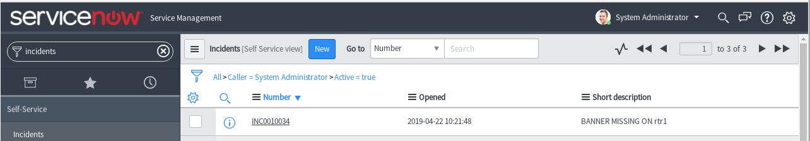


## Step 4

Switch back to the Ansible Tower Jobs and click on the **SNOW-Demo-Compliance-Fix** Job

>Observe that the job will fix the issue on the router, resolve and close out the ticket

```
TASK [CONFIGURE THE LOGIN BANNER] **********************************************
changed: [rtr1]
TASK [MARK THE TICKET AS RESOLVED] *********************************************
changed: [rtr1]
TASK [MARK THE TICKET AS CLOSED] ***********************************************
changed: [rtr1]

```

## Step 5

- Log back into the router and see that you are greeted with the new banner:

```
[student1@ansible]$ ssh rtr1

DEMO BANNER FOR DEVICE rtr1


rtr1#

```

## Step 6

 - Finally log back into ServiceNow and observe the history of the ticket:

   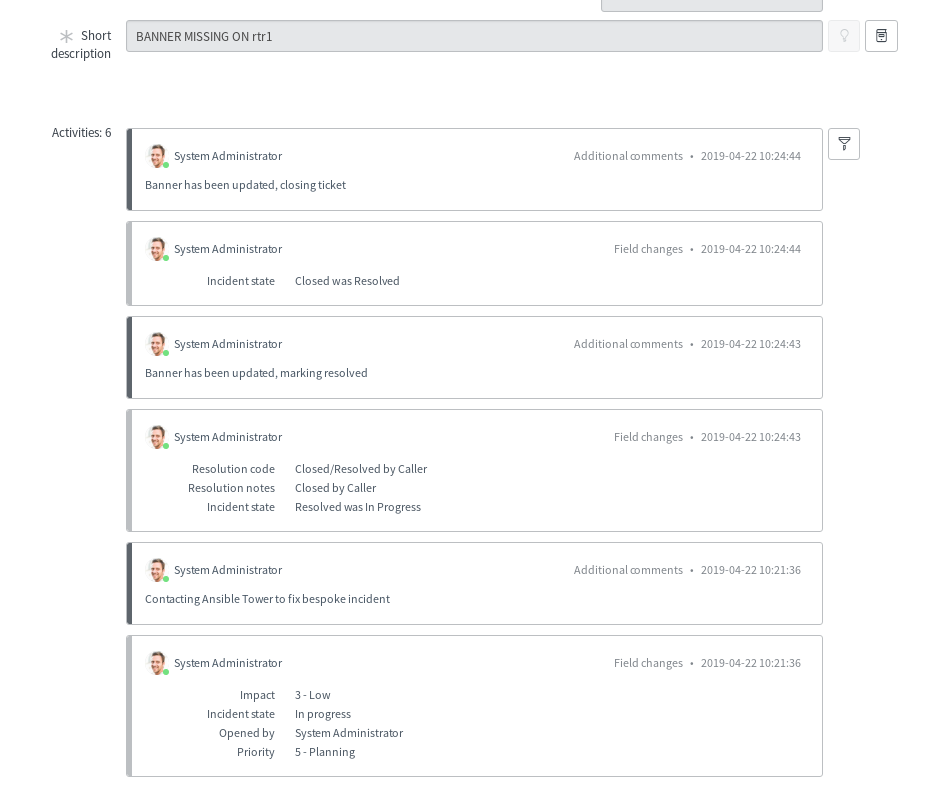

---

