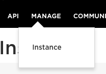
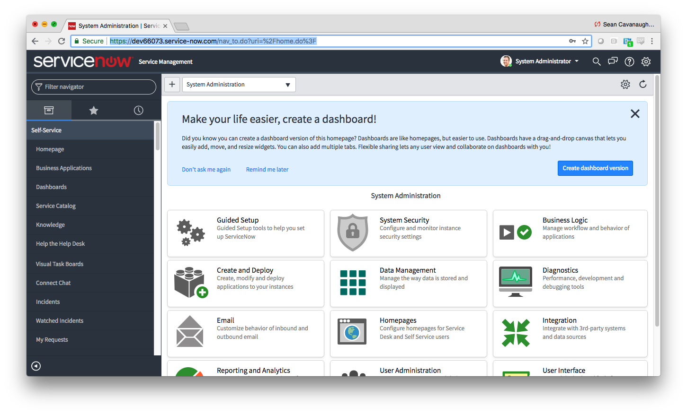
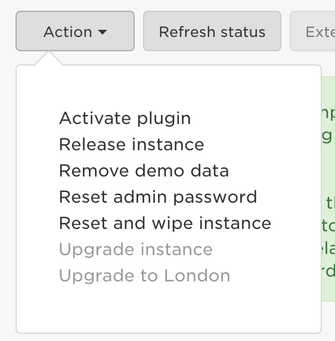

# Ansible + ServiceNow Demos

These demos are intended for effectively demonstrating Ansible + ServiceNow capabilities with prescriptive guides on the Ansible Automation Workshop infrastructure.

# Table of Contents

- [Demo Catalog](#demo-catalog)
- [Common Setup](#common-setup)

# Demo Catalog

| Demo Name   | Brief Description  | Workshop Type | Uses Ansible Tower |
|---|---|---|---|
| [Config Drift](1-config-drift)  | Demonstrate automatic ticket creation for configuration drift.  When the configuration for a Cisco CSR router doesn't match desired config, a ServiceNow ticket with relevant information will be created. | `workshop_type: networking` | ✗ |
| [Closed Loop Incident Mgmt](2-closed_loop_incident_mgmt) | Ansible Tower will find the router that is out of compliance and open an incident in ServiceNow.  ServiceNow will use a business rule to identify the newly opened incident, then kick off an Ansible Tower job to fix the issue. | `workshop_type: networking`  | <font color="green">✓</font> |

## Common Setup

You must have the following setup to deliver these demos:

1. [A ServiceNow instance setup](#servicenow_setup)
2. The correct Ansible Workshop type provisioned (e.g. `workshop_type: networking`).  Please refer to the table above for the corresponding `workshop_type`.

## ServiceNow Setup

  - Setup a free account
    https://developer.servicenow.com/

  - Click **Manage** and create an instance

    

    A URL will be provided like ```https://dev66073.service-now.com/```

  - Login to your WebURL and reset your password.
    

  - Record these three pieces of information that will provide authentication.

    | Field | Input |
    | -------- |:--------------------|
    | username | admin |
    | password | ThisIsAFakePassword |
    | instance | dev66073      |

    **Tip 1** the instance is part the webURL e.g. https://dev66073.service-now.com/ is `dev66073`

    **Tip 2** the password is **not** the same as your password to login to https://developer.servicenow.com/.  To reset it click on **Action** and then **Reset admin password**

    

---

