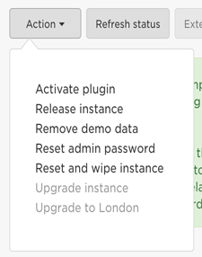

# ServiceNow Demo for Linklight

## Table of Contents
  - [Setup](#setup)
  - [Demo 01 - Config Drift](#Demo-01-Config-Drift)
    - [Explanation](#explanation)

## Setup

  - Setup a free account
    https://developer.servicenow.com/

  - Click **Manage** and create an instance

    

    A URL will be provided like ```https://dev66073.service-now.com/```

  - Login to your WebURL and reset your password.
    

  - Record these three pieces of information that will provide authentication.

    | Field | Input |
    | -------- |:--------------------|
    | username | admin |
    | password | ThisIsAFakePassword |
    | instance | dev66073      |

    **Tip 1** the instance is part the webURL e.g. https://dev66073.service-now.com/ is `dev66073`

    **Tip 2** the password is **not** the same as your password to login to https://developer.servicenow.com/.  To reset it click on **Action** and then **Reset admin password**

    

  - Install pysnow
    https://pysnow.readthedocs.io/en/latest/

    ```$ pip install pysnow```

    **Tip** When using Tower, use [this guide](https://docs.ansible.com/ansible-tower/latest/html/upgrade-migration-guide/virtualenv.html).  Tower uses a virtualenv so the install changes slightly:

    ```
    # source /var/lib/awx/venv/ansible/bin/activate
    # umask 0022
    # pip install pysnow
    # deactivate

## Demo 01 - Config Drift

### Objective

Demonstrate automatic ticket creation for configuration drift.  When the configuration for a Cisco CSR router doesn't match desired config, a ServiceNow ticket with relevant information will be created.

### Guide

#### Preface

This demo is built for the Linklight workbench.  To use the demo it is recommended to run the [provisioner](../../provisioner/README.md) for **networking mode**.  By standardizing demos on the Linklight workbench it is easier to test and verify demos are always working.  Feel free re-use any component of this demo but this demo is only supported in this fashion.

#### Overview

- Playbook will check for desired configuration on rtr1  

- The configuration is missing which generates a Service Now ticket indicating rtr1 is out of compliance.

#### Step 1

Connect to the Linklight workbench:

```
[user@RHEL ~]$ ssh student1@X.X.X.X
student1@X.X.X.X's password:
```

Move into the `demos/servicenow` directory.

```
[student1@ansible ~]$
[student1@ansible ~]$ cd demos/servicenow
```


#### Step 2

Define the login information (username, password and instance) as defined in the [Setup](#setup).  Fill this information out in `login_info.yml` with your text editor of choice.

```
[student1@ansible ~]$ nano login_info.yml
```

#### Step 3

Run the `config_drift.yml` playbook:

```
[student1@ansible ~]$ ansible-playbook config_drift.yml
```


#### Step 3

  - Login to the Web URL
    e.g. `https://dev66073.service-now.com/`
  - Click the Incidents link on the left menu
  - The Incident just created will show up at the top of the list, assigned to the `System Administrator` which is the default user for the ServerNow developer instance.
  - Scroll down to to read the `Short Desription` and the `Additional Comments`.


#### Explanation

The Ansible Playbook runs a task to configure a Cisco CSR router.

```
- name: configure interface settings
  ios_config:
    lines:
      - description test
    parents: interface GigabitEthernet1
  check_mode: yes
  register: changeFlag
```

This task uses the `check_mode: yes` which means the task will not make any changes on remote systems.  This will force the task to report what changes they would have made rather than making them.  To read more about [check mode click here](https://docs.ansible.com/ansible/latest/user_guide/playbooks_checkmode.html). This means the task will always report changed (for the purpose of the demo).  

This task also is using the `register` keyword and storing the output to variable `changeFlag`.  This means subsequent tasks can use see if this task reported changed or not.

Looking at the output from changeFlag there is a lot of useful information:


```
ok: [rtr1] => {
    "changeFlag": {
        "banners": {},
        "changed": true,
        "commands": [
            "interface GigabitEthernet1",
            "description test"
        ],
        "failed": false,
        "updates": [
            "interface GigabitEthernet1",
            "description test"
        ]
    }
}
```

Here is a snippet of ServiceNow task:

```yaml
    - name: SERVICENOW IF CHANGED
      block:
        - name: CREATE AN INCIDENT
          snow_record:
<<info removed for brevity>>
            data:
              short_description: "CONFIG OUT OF COMPLIANCE ON {{inventory_hostname}}"
              severity: 3
              priority: 2
              caller_id: "System Administrator"
              comments: "The configuration:\n--------\n {{item}}\n\n--------\n is missing on {{inventory_hostname}}"
          delegate_to: localhost
      when: changeFlag.changed
```

The block uses the conditional `when` to only run if the previous task **changed**.  This means a ServiceNow ticket is only generated if the task actually reports changed.

# End of Demo
