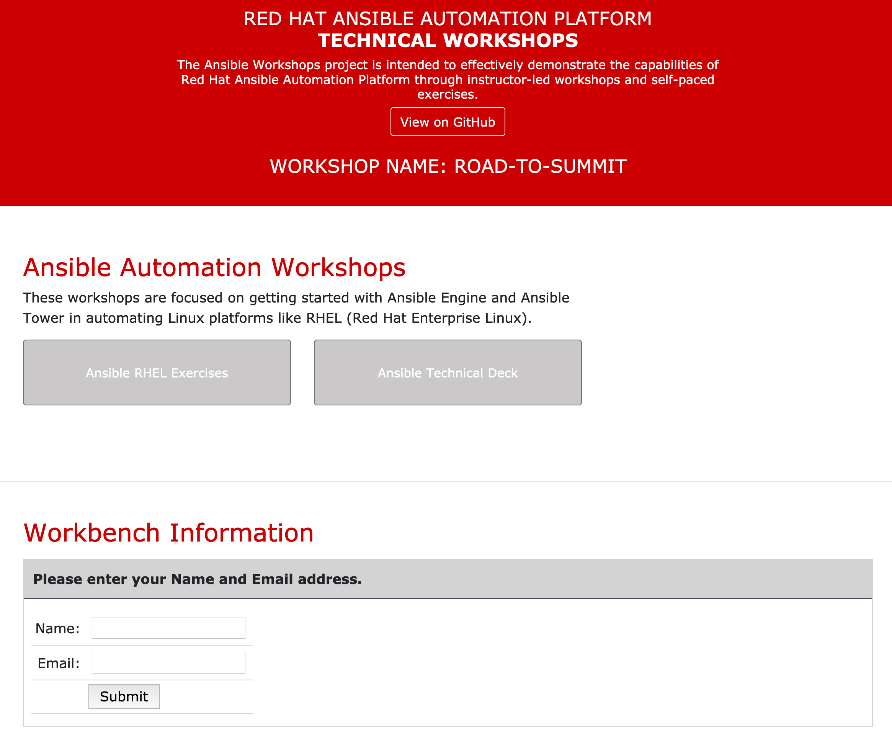
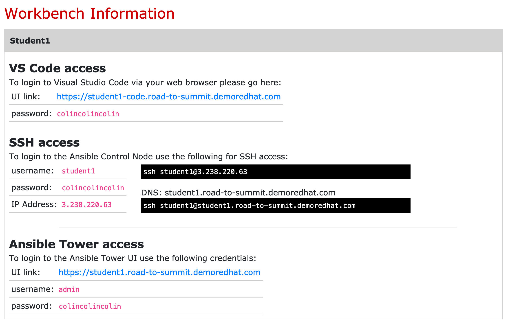
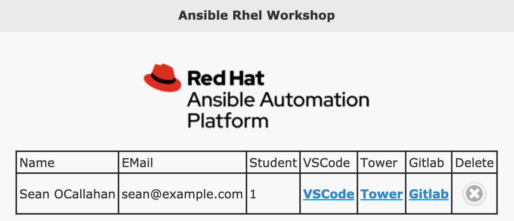

# Attendance host

## Each workshop is provisioned with a website that requests name and email address and delivers numbered student environments (student1, student2, etc), credentials and access instructions. 

## Passwords are the same for every student, and the single password is random for each workshop provision. 

## The workshop instructor is able to view student number assignments by appending `/list.php` to the url of the login page and entering the randomly generated password for the workshop.
