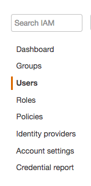

# AWS DIRECTIONS HELP

These steps will walk you through where to create credentials (Access Key ID and Secret Access Key) on AWS to use for provisioning VMs with Ansible.

## Login

Login to the AWS Console on [https://aws.amazon.com/](https://aws.amazon.com/)

## Go to IAM

Under Services click on IAM to reach the IAM Management Console

## Go to Users

On the left pane click on the users link

On the right side, pick the tab "Security credentials". Now you need to either add a new user

OR find the user you want to add credentials <- this is more common

## Add Credentials

You need to create a new access key, only then will the necessary key and key ID be shown. Make sure you save them somewhere!! (But don't upload to GitHub or someone will start mining Bitcoins on your account)

You now have your Access Key ID and Secret Access Key!

## AWS References

- [Access Key ID and Secret Access Key](http://docs.aws.amazon.com/IAM/latest/UserGuide/id_credentials_access-keys.html)
- [managing-aws-access-keys.html](http://docs.aws.amazon.com/general/latest/gr/managing-aws-access-keys.html).

[Return to aws_lab_setup directions](../../provisioner/README.md)
