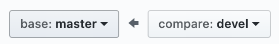
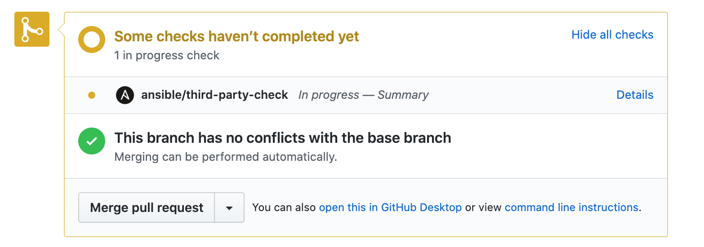
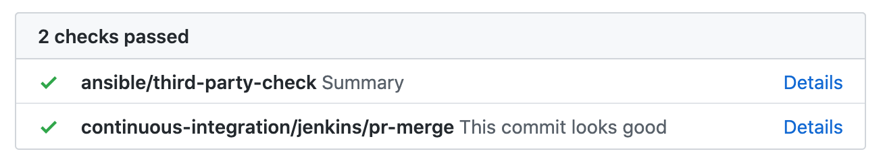

# Release PR

The Ansible Automation Workshops have two main branches

- `master` - this is the stable supported branch.  This is what RHPDS (Red Hat Product Demo System) points to
- `devel` - this is the development branch.  This is where PRs (Pull Requests) go into, and get tested.

A **release** is when we move `devel` into `master`.  This means the stable `master` branch will pickup all new features, bug fixes and changes that `devel` branch has been testing.

# How to push a release

1. An administrator has to create a PR (pull request) from `devel` into `master` from `https://github.com/ansible/workshops`

  

2. Title the PR with `Date Release PR`

  For example:
  `April 16th, 2020 Release PR`

3. Copy the last PR's contents into your new PR contents, here is an example: [https://github.com/ansible/workshops/pull/800](https://github.com/ansible/workshops/pull/800)

e.g. here is a template you can use

```
# SUMMARY
this is a release PR, a release PR merges the devel branch to the master branch taking in multiple PRs over the last period of time. The last release was on April 16th, 2020 https://github.com/ansible/workshops/pull/784
this merges PRs for the following since the last review:
- https://github.com/ansible/workshops/pull/785 - cleaning up tower exercises
- https://github.com/ansible/workshops/pull/786 - Fix start of YAML marker
- https://github.com/ansible/workshops/pull/790 - add synchronization with ansible/product-demos
- https://github.com/ansible/workshops/pull/795 - new exercise for rhel lab with system roles
- https://github.com/ansible/workshops/pull/799 - fixing RHEL workshop exercises
# ISSUE TYPE
Release PR
cc @cloin @liquidat @goetzrieger @Spredzy
```

4. The goal of the PR summary is to:

  - indicate this is a release PR
  - link to the last release PR
  - summarize all PRs into `devel` since the last time there was a release (this means only purple merged PRs, not closed PRs, or PRs still not merged yet)

5. wait for CI testing to complete

   

6. merge when you get passing CI

  

7.  If there are major changes, announce these to Roland to make sure they reach his newsletter :)
