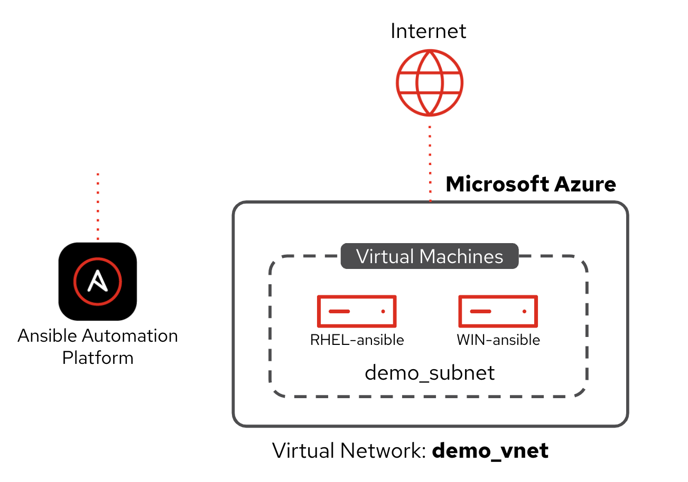

# Introduction to cloud automation

This self-paced lab will demonstrate how Ansible Automation Platform can help you orchestrate, operationalize and govern your hybrid cloud environments. Use-cases will include infrastructure visibility, compliance and infrastructure optimization. Learn how Ansible can start helping you tame your hybrid cloud deployments today. This self-paced lab requires students to have beginner level knowledge of common public cloud terminology and limited to no knowledge of Ansible.

> **NOTE** 
> 
> You will have the option to use **Microsoft Azure** or **Amazon Web Services (AWS)** for each exercise.

> **IMPORTANT TO NOTE:** This is NOT a deep dive, in the weeds, advanced workshop — it's an introduction.

## Workshop Resources

<table>
<thead>
<tr>
<th>Resource</th>
<th>Link</th>
</tr>
</thead>
<tbody>
<tr>
<td>Workshop content and exercises</td>
<td><a target="_blank" href="https://labs.demoredhat.com/webpages/ansible-cloud-lab">labs.demoredhat.com/webpages/ansible-cloud-lab</a></td>
</tr>
<tr>
<td>Certain registration page &amp; promotional email copy</td>
<td><a target="_blank" href="https://docs.google.com/document/d/1kX_pI-Ono1_ob9R3zXQ-HSI-kqTJErYMBaKzXCyVosw/edit?usp=sharing">Registration page &amp; promotional email copy</a></td>
</tr>
<tr>
<td>Presenter instructions and guide</td>
<td><a target="_blank" href="https://labs.demoredhat.com/webpages/ansible-cloud-lab">Presenter instructions and guide</a></td>
</tr>
<tr>
<td>Certain event banners</td>
<td><a target="_blank" href="https://drive.google.com/drive/folders/17P9yNwk74yzkH_59Fpv0fRRMLezwm8xO?usp=sharing">Event banners (Google Drive)</a></td>
</tr>
</tbody>
</table>

## Who is this workshop best for?

This workshop is intended for people who want to learn the basics of cloud automation. This workshop will demonstrate how Ansible Automation Platform can help you orchestrate, operationalize and govern your hybrid cloud environments. This workshop is a first step before the [Red Hat Ansible Automation Platform on AWS workshop](https://source.redhat.com/departments/marketing/globalcampaignsteamgtc/automation/automation_wiki/it_automation_technical_workshop__red_hat_ansible_automation_platform_on_aws).

## Target audience

Cloud Operators, SREs, System Administrators.

If you need help with understanding cloud personas please refer to the [How to have a hybrid cloud automation discussion](https://docs.google.com/presentation/d/1HhvqXkHwqYRwNhaznUhAZ-4J4f7TJ4PMD-M43vIEW2U/edit?usp=sharing) presentation.

## Attendee Prerequisites

* A basic understanding of working with Linux systems
* Must bring/use a laptop with Chrome 73+, Firefox 60+, Edge 40+, or Safari 12+ installed

There is no student prep work required prior to the workshop.

## Presentation Deck

- [Google Slides](https://docs.google.com/presentation/d/1LNzCv16dZ9nNDrfEY-wOMd1jYAZMZlIcla_fUJLsq0U/edit?usp=sharing) - For Red Hat employees
- [PDF](decks/lab-introduction-to-cloud-automation.pdf) - For everyone

Optional module **Terraforming Clouds with Ansible** deck:
- [Google Slides](https://docs.google.com/presentation/d/1LNzCv16dZ9nNDrfEY-wOMd1jYAZMZlIcla_fUJLsq0U/edit?usp=sharing) - For Red Hat employees
- [PDF](decks/lab-terraforming-clouds-with-ansible.pdf) - For everyone

## Lab provisioner

This workshop uses the [Red Hat Demo Platform](https://catalog.demo.redhat.com/catalog) to load the labs inside your browser.

## Lab Index (Estimate total time ⏱️ 90 minutes)

<table>
<thead>
<tr>
<th>Activity</th>
<th>Link</th>
<th>Estimated Time</th>
</tr>
</thead>
<tbody>
<tr>
<td><b>Slides</b>: Introduction + Workshop Brief (slides 1–16)</td>
<td><a target="_blank" href="https://docs.google.com/presentation/d/1LNzCv16dZ9nNDrfEY-wOMd1jYAZMZlIcla_fUJLsq0U/edit?usp=sharing">🖥️ Google Slides</a></td>
<td>⏱️ 15 minutes</td>
</tr>
<tr>
<td>Lab: Infrastructure visibility</td>
<td><a target="_blank" href="https://catalog.demo.redhat.com/catalog?item=babylon-catalog-prod/zt-ansiblebu.zt-ans-bu-cloud-visibility-25.prod">🚀 AWS</a> | <a target="_blank" href="https://catalog.demo.redhat.com/catalog?item=babylon-catalog-prod/zt-ansiblebu.zt-ans-bu-cloud-azure-visibility-aap.prod">🚀 Azure</a></td>
<td>⏱️ 20 minutes</td>
</tr>
<tr>
<td><b>Slides</b>: Lab Brief (slides 17–23)</td>
<td><a target="_blank" href="https://docs.google.com/presentation/d/1LNzCv16dZ9nNDrfEY-wOMd1jYAZMZlIcla_fUJLsq0U/edit?usp=sharing">🖥️ Google Slides</a></td>
<td>⏱️ 6 minutes</td>
</tr>
<tr>
<td>Lab: Cloud Operations</td>
<td><a target="_blank" href="https://catalog.demo.redhat.com/catalog?item=babylon-catalog-prod/zt-ansiblebu.zt-ans-bu-cloud-operations-25.prod">🚀 AWS</a> | <a target="_blank" href="https://catalog.demo.redhat.com/catalog?item=babylon-catalog-prod/zt-ansiblebu.zt-ans-bu-azure-operations-aap.prod">🚀 Azure</a></td>
<td>⏱️ 20 minutes</td>
</tr>
<tr>
<td><b>Slides</b>: Lab Brief (slides 24–31)</td>
<td><a target="_blank" href="https://docs.google.com/presentation/d/1LNzCv16dZ9nNDrfEY-wOMd1jYAZMZlIcla_fUJLsq0U/edit?usp=sharing">🖥️ Google Slides</a></td>
<td>⏱️ 6 minutes</td>
</tr>
<tr>
<td>Lab: Infrastructure optimization</td>
<td><a target="_blank" href="https://catalog.demo.redhat.com/catalog?item=babylon-catalog-prod/zt-ansiblebu.zt-ans-bu-cloud-optimization-25.prod">🚀 AWS</a> | <a target="_blank" href="https://catalog.demo.redhat.com/catalog?item=babylon-catalog-prod/zt-ansiblebu.zt-ans-bu-cloud-azure-optimization-aap.prod">🚀 Azure</a></td>
<td>⏱️ 20 minutes</td>
</tr>
<tr>
<td><b>Slides</b>: Close Out (slides 32–34)</td>
<td><a target="_blank" href="https://docs.google.com/presentation/d/1LNzCv16dZ9nNDrfEY-wOMd1jYAZMZlIcla_fUJLsq0U/edit?usp=sharing">🖥️ Google Slides</a></td>
<td>⏱️ 3 minutes</td>
</tr>
</tbody>
</table>

## Optional Lab

<table>
<thead>
<tr>
<th>Lab Title</th>
<th>Link</th>
<th>Estimated Time</th>
</tr>
</thead>
<tbody>
<tr>
<td>Terraforming Clouds with Ansible</td>
<td><a target="_blank" href="https://catalog.demo.redhat.com/catalog?item=babylon-catalog-prod/zt-ansiblebu.zt-ans-bu-hashi-aap.prod">🚀 Launch Lab</a></td>
<td>⏱️ 60 minutes</td>
</tr>
</tbody>
</table>

## Lab Diagram AWS

## Lab Diagram Azure

## Demos

Any of the individual labs (that make up the workshop) can be used as a standalone demo.

# Learning Resources

- [Red Hat Ansible Automation Platform - Training + Certification slides](https://docs.google.com/presentation/d/16pkh6Js89q7gR5VUILEQEU0mYRi6Ti98c9aRTcPOBVs/edit?usp=sharing)
- [Hybrid Cloud Automation slides](https://ansible.github.io/slides/#hybrid-cloud-automation)

## Documentation

- [https://labs.demoredhat.com/webpages/ansible-cloud-lab](https://labs.demoredhat.com/webpages/ansible-cloud-lab)
- [https://github.com/ansible/workshops](https://github.com/ansible/workshops)

# Free e-books

- [Automate your hybrid cloud at scale](https://www.redhat.com/en/engage/automate-hybrid-cloud-20221006)
- [Connect your hybrid cloud environment with IT automation](https://www.redhat.com/en/engage/hybrid-cloud-environment-20220412)
- [Using automation to get the most from your public cloud](https://www.redhat.com/en/engage/automation-public-cloud-20221014)

# Ansible Workshop

This is an official Ansible Workshop

This workshop is maintained by the Red Hat Ansible Technical Marketing Team.  
Please open an [issues on Github](https://github.com/ansible/workshops/issues/new?title=New+cloud+workshop+issue&body=)

