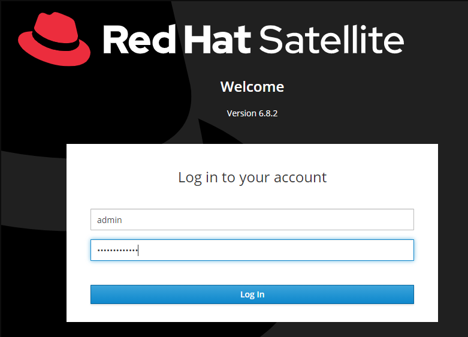
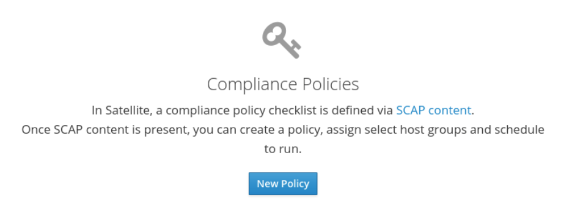
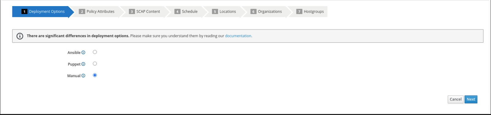
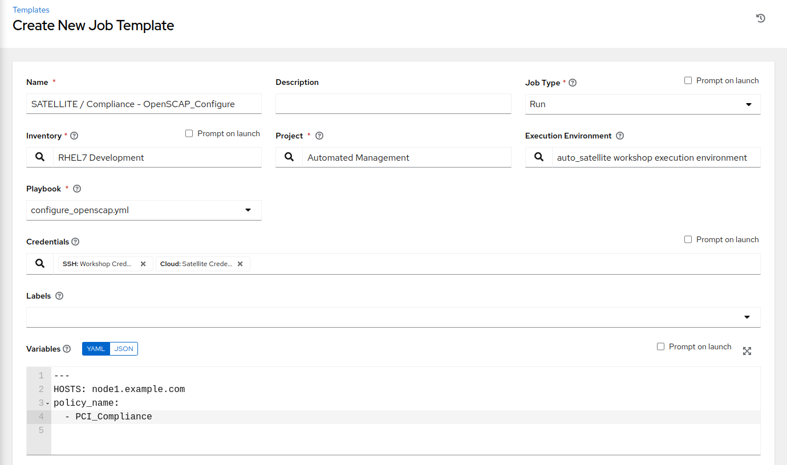
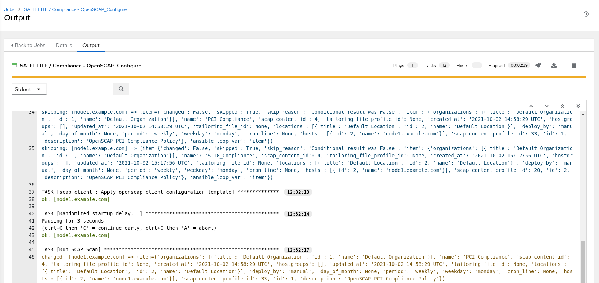
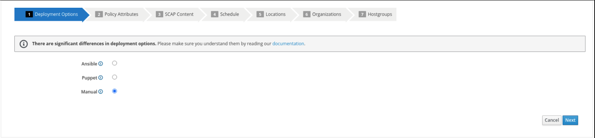
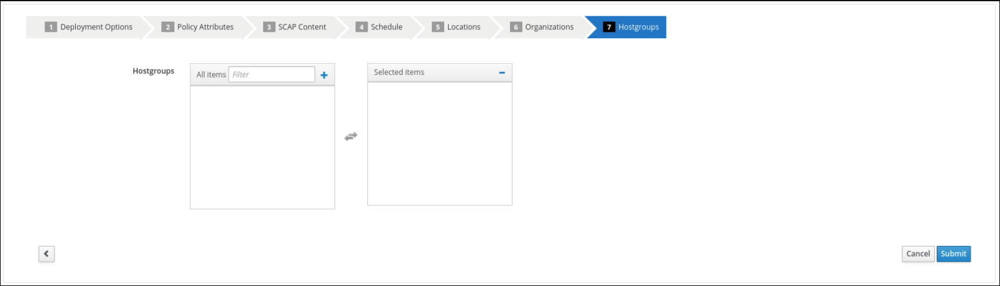
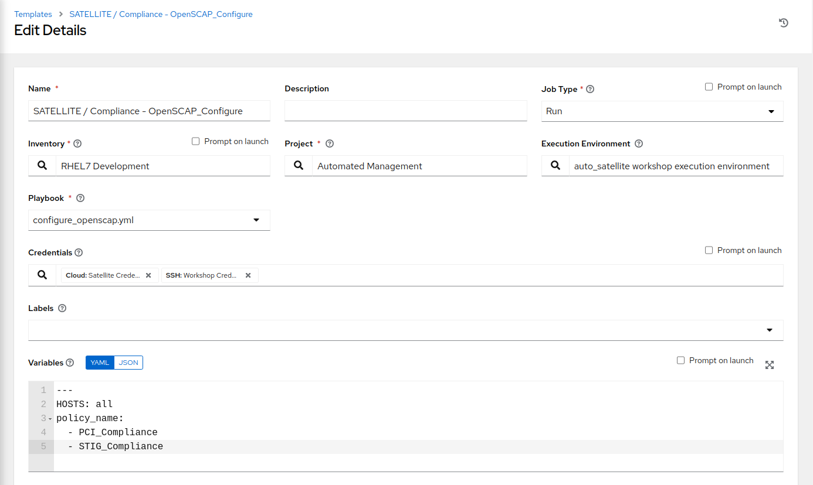

Automated Satellite Workshop: Configuring and performing an OpenSCAP Scan
================================================================================

**Read this in other languages**:
<br> [English](README.md),  [Français](README.fr.md).
<br>

In this exercise, we will learn how to configure and perform an OpenSCAP scan using playbooks in Ansible Automation Platform 2 with Satellite. When running multiple Red Hat Enterprise Linux systems, it's important to keep all of these systems compliant with a meaningful security policy and perform security scans often. OpenSCAP is an open source project that is used by government agencies, corporations, as well as e-commerce (just to name a few examples). OpenSCAP provides tools for automated vulnerability checking. Satellite can be loaded with RPM packages for SCAP workbench v1.2.0-8 which will provide scanning capabilities. Satellite is also loaded with the SCAP security guide v0.1.54-3 for RHEL7 and CentOS devices which provides the appropriate XCCDF benchmarks for PCI and STIG compliance for the purpose of this exercise. This exercise will focus on RHEL systems, CentOS will be out of scope.

Environment
-----------

-   Red Hat Satellite v6.x, Ansible Automation Platform 4.x

-   3 x Red Hat Enterprise Linux clients v7.9

Pre-requisites
--------------------------------------------------------------------------------------

-   Exercise 0 : Lab Setup

-   Organization to be used = Default Organization

-   Content view = RHEL7

-   Lifecycle environments = Dev, QA, Prod

Exercise
--------

#### 1\. Logging into Satellite

-   Use a web browser on your computer to access the Satellite GUI provided , then login using the following nomenclature: *admin /* <*password*>



-   You will see the Satellite dashboard when you login


#### 2\. Creating a new compliance policy

Now we will start configuring a compliance policy that we can use to scan our RHEL nodes.

-   In Satellite hover over 'Hosts' from the menu on the left side pane, and then click on 'Policies'

-   Click on the "New Policy" button, and fill out the details as followed in step 3.



#### 3\. Configuring a new compliance policy

Now we will start configuring our Satellite server to be able to manage a compliance policy

-   Select "Manual" from the deployment options and click "Next"



-   Create the policy name "PCI_Compliance" and provide any description you like. Then click "Next"


-   Select the "Red Hat rhel7 default content" and "PCI-DSS v3.2.1 Control Baseline for Red Hat Enterprise Linux 7". There is no tailoring file. Then click "Next"


-   It is necessary to set a schedule when creating a new compliance policy. You can select "Weekly" and "Monday" for the purposes of this exercise. Then click "Next"


-   Steps 5, 6, and 7 as part of the New Compliance Policy can use default values. Click "Next" through "Locations", and "Organizations". For "Hostgroups" click "Submit"


#### 4\. Logging into the Ansible Automation Platform

-   Use a web browser on your computer to access the Ansible GUI via the link found in your Environment then login using the following nomenclature: *admin /* <*password*>


-   Once you have logged into Ansible Automation Platform 2, you will be shown the most recently visited page.


#### 5\. Configure and launch an Ansible Automation Platform template to run an OpenSCAP scan.

This step will allow us to scan a single rhel7 host with the ```PCI_Compliance``` policy that we configured on Satellite.

-   In Ansible Automation Platform click 'Templates' from the left side pane menu

-   Click the BLUE 'Add' drop-down icon and select 'Add job template' from the drop-down selection menu. Fill out the details as follows:

        Name: SATELLITE / Compliance - OpenSCAP_Configure

        Job Type: Run

        Inventory: RHEL7 Development (Click the magnifying glass icon to select.)

        Project: Automated Management (Click the magnifying glass icon to select.)

        Execution Environment: smart_mgmt workshop execution environment (Click the
        magnifying glass icon to select.)

        Playbook: configure_openscap.yml (Click drop-down to select.)

        Credentials: Workshop Credential, and Satellite Credential
        (Click the magnifying glass icon to select.)
          NOTE: In this new menu. Select the Workshop Credential radio button
          button. The 'Selected Category' for this is 'Machine'. Next, use the
          'Selected Category' drop-down menu again to select Satellite_Collection.
          You will choose the Satellite Credential. This will provide you with
          two sets of credentials. Choosing 'Select' will save your changes
          and exit the menu.

          Extra Variables (Keep the exact spacing provided below. Note that the
          extra-vars that we are supplying need to be in YAML format):

        ---
        HOSTS: node1.example.com
        Policy_scan:
          - PCI_Compliance



-   Leave the rest of the fields blank or as they are, and click 'Save'. You can
then select 'Launch' to deploy the job template.


Selecting launch will take you to the **Jobs > SATELLITE / Compliance - OpenSCAP_Configure** output window where you will be able to follow each task executed as part of the playbook. This will take approximately 3 mins to complete.  Wait for the job template to complete before proceeding to the next step.




#### 6\. Navigate back to Satellite to examine the Asset Reporting File (ARF).

-   Hover over 'Hosts' from the side pane menu and then click on 'Reports'.

-   Click on the 'Full Report' button, under Actions, for 'node1.example.com' to evaluate

-   Scroll down to the **Rule Overview** section. You can sort by "Pass", "Fail", "Fixed", or any number of qualifiers as well as group rules by "Severity"


-   Selecting a rule presents further information regarding rationale as well as a description of the rule that includes references and identifiers.
-   Now, uncheck everything except the **fail** checkbox. Then scroll down and
click on the failure "Prevent Login to Accounts With Empty Password"

-   If you scroll the page you will notice multiple remediation options including
an 'Ansible' snippet. Click "show" next to the 'Remediation Ansible snippet',
which then presents tasks you can include within a playbook to automate
remediation across affected systems.


#### 7\. Expanding OpenSCAP policy scans

This step will expand our OpenSCAP policy scan to add another XCCDF compliance profile called ```STIG_Compliance```. We will also expand to include all systems in the 'RHEL7 Development' inventory by adjusting the 'HOSTS' extra variable to 'all' instead of specifying a single system.

-   In Satellite, hover over "Hosts" from the menu on the left side of the screen, and then click on "Policies".

-   Click on the "New Compliance Policy" button

-   Select "Manual" from the deployment options and click "Next"



-   Create the policy name "STIG_Compliance" and provide any description you like. Then click "Next"


-   Select the "Red Hat rhel7 default content" and "DISA STIG for Red Hat Enterprise Linux 7". There is no tailoring file. Then click "Next"


-   It is necessary to set a schedule when creating a new compliance policy. You can select "Weekly" and "Monday" for lab purposes. Then click "Next"


-   Steps 5, 6, and 7 as part of the New Compliance Policy can use default values. Click "Next" through "Locations", "Organizations", and "Hostgroups"



-   Now, we will update our OpenSCAP_Configure job template in Ansible Automation Platform and run another PCI compliance scan, plus the STIG compliance scan.
-   In Ansible Automation Platform, click 'Templates' from the left side pane menu
-   Select the OpenSCAP_Configure job template, and click edit at the bottom of the template to make changes to the "Extra Variables":

        Extra Variables (Keep the exact spacing provided below.
        Note that the extra-vars that we are supplying need to be
        in YAML format):

        ---
        HOSTS: all
        Policy_scan:
          - PCI_Compliance
          - STIG_Compliance



- Leave the rest of the fields blank or as they are, and click 'Save'. You can then select 'Launch' to deploy the job template.

- Selecting launch will take you to the **Jobs > SATELLITE / Compliance - OpenSCAP_Configure** output window. This will take approximately 5 mins to complete.  Wait for the job template to complete before proceeding to the next step.


#### 8\. Navigate back to Satellite to examine the Asset Reporting File (ARF).

-   Hover over "Hosts" from the menu on the left side of the screen, and then click on "Reports".

-   Notice that we've now easily scaled to six scans, 2 scans of each node for PCI_Compliance and for STIG_Compliance.


-   Each report can be reviewed independent of other node scans and remediations for rule findings can be completed according to the requirements of your own internal policies.

#### 9\. End Lab

-   You have finished the lab.
-   Continue to [Exercise 2: Patch Management / OS](../2-patching/README.md), OR [Return to the main workshop page](../README.md)
