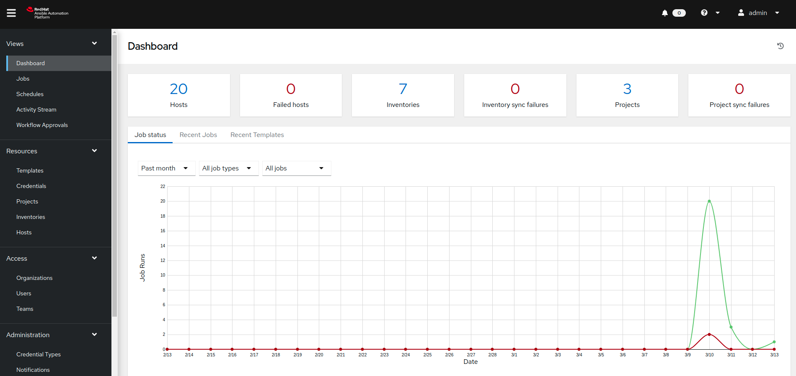
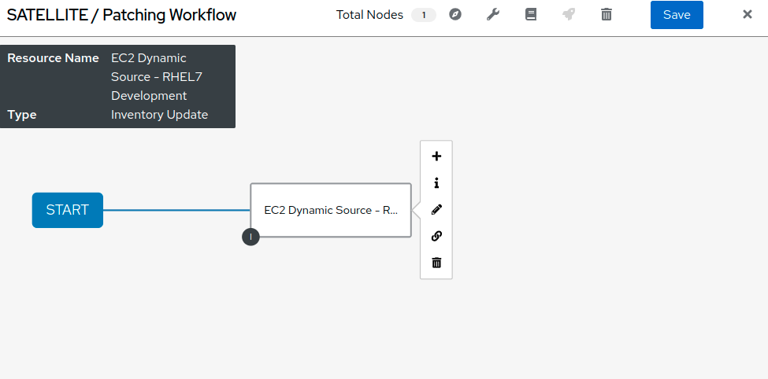
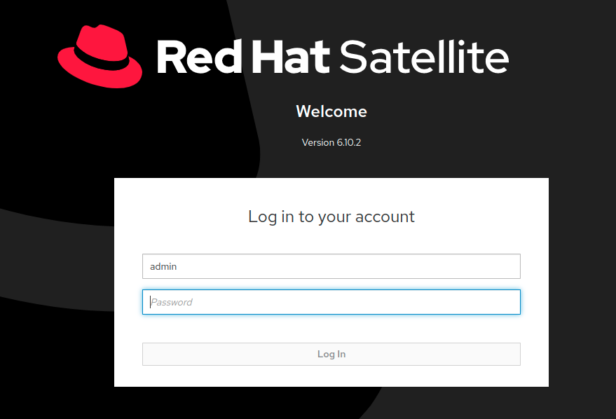
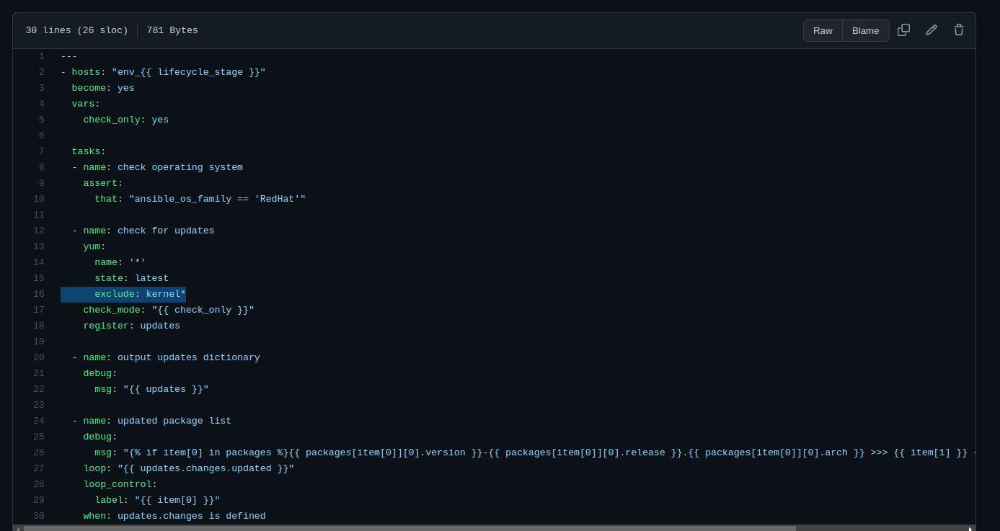

Automated Satellite Workshop: Automating Patch Management
================================================================

**Read this in other languages**:
  [English](README.md),  [Français](README.fr.md).
 

In this part of the workshop, we will learn how to leverage the use of workflows in Ansible Automation Platform to orchestrate patch management for several linux servers . Automating patch management reduces human error and improves configuration and patch accuracy. Additionally, automation provides capabilities to reduce the manual input associated with identifying, testing and patching systems.  Using Automation Platform enables more complicated patching scenarios.

Environment
-----------

-   Satellite 6.x, Ansible Automation Platform 4.x

-   3 x Red Hat Enterprise Linux clients v7.9

Pre-requisites
--------------

-   Exercise 0 : Lab Setup

-   Organization to be used = Default Organization

-   Location to be used = Default Location

-   A content view = RHEL7

-   Lifecycle environments = Dev, QA, Prod

Exercise
--------

#### 1\. Logging into the Ansible Automation Platform

-   Use a web browser on your computer to access the Ansible Automation Platform GUI via the link found in the Environment above. And use the following username and password to login: admin / <password you were provided>

-   Once you're in the Automation Platform you will be able to see a dashboard

#### 2\. Creating a new Patching Workflow

Now we will start configuring a workflow that encompasses publishing a content view, promoting a content view, a fact scan, as well as a server patching. The goal is to publish a new content view and promote our rhel7_DEV environment to QA.

-   Start by clicking "Templates" from the left side pane menu, and then click on the blue "Add" dropdown button and choose "Add workflow template".

-   Create the name "SATELLITE / Patching Workflow" and click Save (there are no other options necessary to select on this page).

-   This should open a blank workflow, offering to start building it by choosing the green Start button. You can always get back to this workflow from the template by selecting the 'Visualizer' tab.

-   Select Start to add a node. From the drop-down menu "Node Type" select "Inventory Source Sync" and click on "EC2 Dynamic Source - RHEL7 Development". This sets up the inventory you will use in your workflow. Click 'Save'.

-   Hover over Start again to add a second node (Click on the appearing "+"). From the drop-down menu "Node Type" select "Job Template" then look up and click on 'SATELLITE / RHEL - Publish Content View'. Leave "Convergence" on "Any". Click Next - a survey is attached to this template so you will need to select the correct content view for the servers we will patch. Select the 'RHEL7' content view and click 'next'. You will then need to confirm the preview of this workflow node by clicking 'Save':

This step in the workflow adds your first job template which runs a playbook called 'satellite_publish.yml'.

-   Add third node to the workflow by hovering over your 'EC2 Dynamic Source - RHEL7 Development' inventory node and select the + icon to generate another workflow node.  In the pop-up window, select 'On Success', and then Next. In the follow-on window, Node Type will be 'Job Template'. Select 'SERVER / RHEL7 - Fact Scan', leave 'Convergence' to 'Any' again and select Next. This step in the workflow will scan the nodes in our Satellite inventory to check for package updates and errata.  You don't need to limit the job template, so just click Next, and then Save to finish the node setup.

At this point your workflow should resemble the following:

-   There are two more nodes to add to this workflow. Hover the 'SATELLITE / RHEL - Publish Content View' node and click the + icon. In the pop-up window, select 'On Success' and then Next.  Add the 'SATELLITE / RHEL - Promote Content View' Job Template, and leave 'Convergence' to 'Any' again. There is a survey attached that requires variables for content view, current lifecycle environment, and next lifecycle environment. For the purpose of this lab we're going to promote Dev to QA.

-   Select RHEL7 for 'Content View'

-   Select RHEL7_Dev for 'Current Lifecycle Environment'

-   Select RHEL7_QA for 'Next Lifecycle Environment'

Click 'Next'. You will then need to 'Save' the preview.

-   Add the last node by hovering over 'SATELLITE / RHEL- Promote Content View' and selecting the + icon. In the pop-up window, select 'On Success', and then Next. Add the 'SERVER / RHEL7 - Patch' Job Template, leave 'Convergence' to 'Any' again and select Next. This template also has a survey attached. You will need to select from drop-down list 'Select Environment' the environment you would like to patch. Choose 'RHEL7_Dev'. The 'Check' drop-down is a selection that tells server_patch.yml whether or not to apply updates to the servers in our inventory. Since we want to apply the patches, we will select 'No'. Click 'Next' at the bottom of the window and click 'Save'.

-   Before we can finish the workflow we need to link 'SERVER / RHEL7 - Fact Scan' to 'SERVER / RHEL7 - Patch' and coverage on success. Hover over 'SERVER / RHEL7 - Fact Scan' and click on the chain icon. Then click to the right of the 'SERVER / RHEL7 - Patch' node to link. You will be promoted on the right side pane menu to to Run 'On Success'. Click 'Save'. You will then need to click on the 'SERVER / RHEL7 - Patch', edit the node and select 'ALL' from the CONVERGENCE drop-down. Continue with Next, Next and Save.

Your workflow should resemble the following:

You can now save and exit the workflow template.

#### 3\. Logging into Satellite

-   Use a web browser on your computer to access the Satellite GUI via the link found in the Environment above

-   Once you're in Satellite, you'll be able to see a dashboard.

#### 4\. Exploring the Satellite host configuration

-   Hover over 'Hosts' and select 'Content Hosts'. Observe the multiple security, bug fix, enhancements and package updates available for each server, which will vary depending on the date of when the workshop takes place. Further, take note of the life cycle environment.

-   Navigate to 'Content' and select 'Content Views'. Since the servers that we are working with are RHEL7 select the 'RHEL7' content view. We may need to publish a new content view version, however, we set that up as part of our workflow! (Note: your content view version may differ from this example, that is OK)

-   Click on 'Content' then 'Content Views' and select RHEL7. Notice the new content view version.

-   Navigate to Hosts > All Hosts and select node1.example.com. Select the 'content' tab under Details. Notice the Installable errata; this is your number of errata before running your patch workflow.

#### 5\. Navigate back to Ansible and let's launch the workflow job

-   Click on Templates to locate the 'SATELLITE / Patching Workflow' template. You can either click on the rocketship to the right of the template or select the template and select LAUNCH. (they do the same thing).

-   Observe the job kicking off in Ansible.  You need to wait for this workflow to complete before moving on to the next step.  This workflow should take ~5 mins to complete.  Watch the green boxes expanding and contracting in each of the workflow nodes.  The node box will go green when the step is complete - you can also hover over a workflow node to see a status.

#### 6\. Navigate back to Satellite to examine smart automation

-   Click on 'Content' then 'Content Views' and select RHEL7. Notice the new content view version.

-   Navigate to Hosts > All Hosts and select node1.example.com. Select the 'content' tab under Details. Notice that the Installable errata has decreased. This indicates that we have applied our updates.

-   You may notice that not all issues are remediated. This is to showcase that you can exclude updates based on type. In this case we're not pushing out updates for kernel changes. This can of course be configurable through use of the yum module in server patch

#### 7\. End Lab

-   You have finished the lab.
-   Continue to [Exercise 3: CentOS/RHEL migration and upgrade](../3-convert2rhel/README.md), OR [Return to the main workshop page](../README.md)
