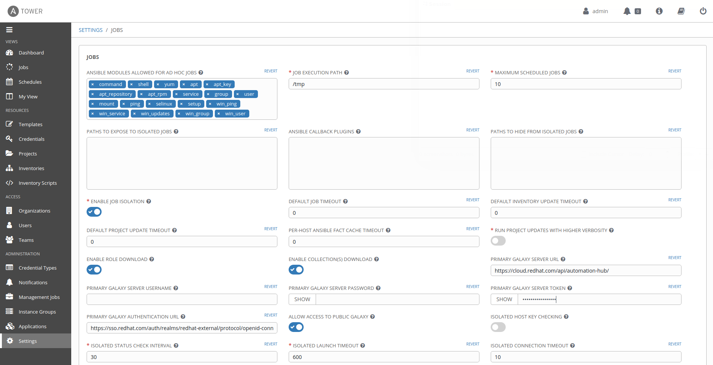

# 演習 5 - Red Hat Automation Hub の使用方法

## 目次

- [目的](#objective)
- [Red Hat Automation Hub](#red-hat-automation-hub)
    - [認定コンテンツ](#certified-content)
    - [サポートされる自動化](#supported-automation)
- [Ansible Galaxy](#ansible-galaxy)
- [Automation Hub の使用方法](#how-to-use-automation-hub)
    - [コレクションへのアクセス](#accessing-collections)
       - [トークンの作成](#creating-a-token)
       - [認証トークンの使用](#using-authentication-token)
       - [コレクションの使用](#using-collections)
    - [Automation Hub への Tower の認証](#authenticate-tower-to-automation-hub)
- [重要なこと](#takeaways)

# 目的

このラボでは、Red Hat Automation Hub の価値の提案と、提供されているコンテンツの使用方法について説明します。

# Red Hat Automation Hub

これは、Red Hat SaaS オファリングの一部として提供されるサービスです。これは、Red Hat およびそのパートナーがサポートし、認定する
Ansible
コンテンツコレクションのみを検出およびダウンロードする場所で構成されます。これらのコンテンツコレクションには、自動化の使用方法、これをインフラストラクチャーで実装するためのガイドが含まれます。Automation
Hub のサポートは Red Hat Automation Platform サブスクリプションに含まれています。

> **注記**: [https://cloud.redhat.com/ansible/automation-hub](https://cloud.redhat.com/ansible/automation-hub): にある Red Hat Automation Hub には、Red Hat カスタマーポータルの認証情報と有効な Red Hat Automation Platform サブスクリプションが必要です。

## 認定コンテンツ

Automation Hub のポータルで、ユーザーは Red Hat
および認定パートナーの信頼できるコンテンツコレクションに直接アクセスできます。認定コレクションは、Red Hat
およびそのパートナーによって開発、テスト、構築、配信、サポートされています。サポート範囲の詳細については、[Ansible 認定コンテンツ
FAQ](https://access.redhat.com/articles/4916901) を参照してください。

## サポートされる自動化

Automation Hub は、Red Hat のサポートに支えられた、Ansible
コンテンツのワンストップショップで、お客様にさらなる安心感を提供するものです。これらのコレクションに対する追加のサポートは、"Maintained
and Supported By" の下、Red Hat パートナーのいずれかによって提供される場合があります。

# Ansible Galaxy

これは、Ansible ロールと呼ばれる事前にパッケージ化された作業単位を最初に提供し始めたより広い Ansible
コミュニティーの場所になります。ロールを Ansible Playbook にドロップして、すぐに動作させることができます。Galaxy
の最近のバージョンでは、Ansible コンテンツコレクションの提供も開始しました。

Ansible Galaxy は [https://galaxy.ansible.com/](https://galaxy.ansible.com/)
にあります。

# Automation Hub の使用方法

## コレクションへのアクセス

Ansible
コレクションは、複数の場所から使用したり、ダウンロードしたりできます。これらのコレクションは、要件ファイルを使用してダウンロードし、git
リポジトリーに静的に含めるか、または最終的に仮想環境に個別にインストールすることができます。

この演習内では、Automation Hub からコンテンツにアクセスする方法に焦点を当てています。これには、認証トークンと認証 URL
が必要です。アクセスするには、Ansible Tower で一部の設定手順を実行する必要があります。

## Automation Hub への Tower の認証

### トークンの作成

Ansible Tower を認証するには、トークンが必要です。トークは、以下の手順を使用して取得できます。

1. [https://cloud.redhat.com/ansible/automation-hub/token/](https://cloud.redhat.com/ansible/automation-hub/token/)
   に移動します。

   

1. **Load Token** をクリックします。

1. **copy icon** をクリックして、API トークンをクリップボードにコピーします。

   

### 認証トークンの使用

1. ユーザー管理者として、*Settings l> Jobs* に移動します。

1. **PRIMARY GALAXY SERVER URL** を
   `https://cloud.redhat.com/api/automation-hub/` に設定します。

1. **PRIMARY GALAXY AUTHENTICATION** URL を
   `https://sso.redhat.com/auth/realms/redhat-external/protocol/openid-connect/token`
   に設定します。

1. **PRIMARY GALAXY SERVER TOKEN** を <COPIED_TOKEN> に設定します。

> **ヒント**: Red Hat Automation Hub をプライマリー Galaxy Server URL として使用して、Red Hat Ansible Automation サブスクリプションを介して Red Hat およびそのパートナーによる認定およびサポート対象のコンテンツを使用することが推奨されます。

  

### コレクションの使用

Automation Hub にアクセスするために Ansible Tower
を認証した後に、`collections/requirements.yml` ファイルを使用することで、最初のソースとして Automation Hub
からコンテンツコレクションを自動的に取得します。

# 重要なこと

- Red Hat Automation Hub は、Red Hat およびそのパートナーがサポートする認定コレクションを提供します。これは、Red
Hat Ansible Automation Platform を介して利用できます。  - Ansible Galaxy
はアップストリームのコミュニティーコンテンツコレクションをホストします。  - Red Hat Ansible Tower は、Tower
内の特定のプロジェクトで使用される認定およびサポート対象のコンテンツコレクションを取得するために、Red Hat Automation Hub
に対して認証を行うように設定できます。

----
**ナビゲーション**
 
[前の演習](../4-collections-from-tower/)

[Click here to return to the Ansible for Red Hat Enterprise Linux
Workshop](../README.md)
