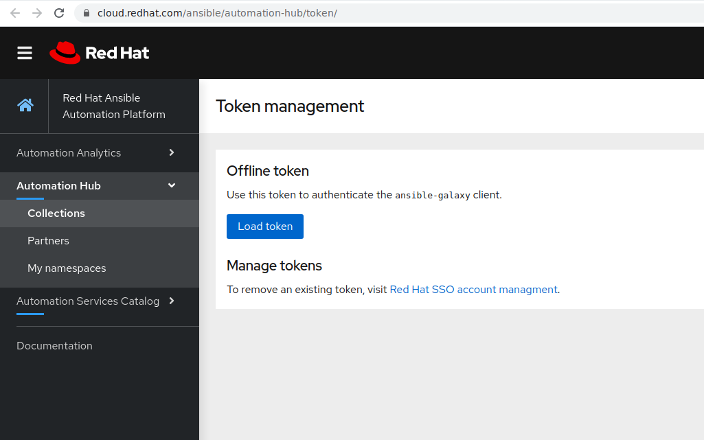

# Exercise 7 - How to use Red Hat Automation Hub?

## Table of Contents
- [Objective](#objective)
- [Red Hat Automation Hub](#red-hat-automation-hub)
    - [Certified Content](#certified-content)
    - [Supported Automation](#supported-automation)
- [Ansible Galaxy](#ansible-galaxy)
- [How to use Automation Hub](#how-to-use-automation-hub)
    - [Accessing collections](#accessing-collections)
       - [Creating a token](#creating-a-token)
       - [Using authentication token](#using-authentication-token)
       - [Using Collections](#using-collections)
    - [Authenticate Tower to Automation Hub](#authenticate-tower-to-automation-hub)
- [Takeaways](#takeaways)

# Objective

# Red Hat Automation Hub
It is a service that is provided as part of the Red Hat SaaS Offering. It consists of the location where to discover and download only supported and certified Ansible Content Collections by Red Hat Partners. These content collections contain ways to consume automation, how-to-guides to implement them in your infrastructure. The support Automation Hub is included with Red Hat Automation Platform subscription.

- Red Hat Automation Hub resides on https://cloud.redhat.com/ansible/automation-hub : requires Red Hat customer portal credentials and a valid Red Hat Automation Platform subcription.

## Certified Content
In the portal of Automation Hub, users have direct access to trusted content collections from Red Hat Certified Partners.

## Supported Automation
  Automation Hub provides a one-stop-shop for Ansible content that is backed by support from Red Hat and its partners to deliver additional reassurance for customers.

# Ansible Galaxy
Automation Hub provides a one-stop-shop for Ansible content that is backed by support from Red Hat and its partners to deliver additional reassurance for customers.

. Ansible Galaxy resides on https://galaxy.ansible.com/

# How to use Automation Hub

## Accessing collections
Ansible collections can be used and downloaded from multiple locations. They can either be downloaded using a requirement file, statically included in the git repository or eventually installed separately in the virtual environment.
In the scope of this exercise, the focus is on how access content from Automation Hub. This requires an authentication token and authentication URL. To do, some configuration steps need to be done in Ansible Tower.

## Authenticate Tower to Automation Hub

### Creating a token
Authenticating Ansible Tower requires either a token. It can be achieved using the setps below:
  1. Navigate to https://cloud.redhat.com/ansible/automation-hub/token/
  
  
   
    
  
  2. Click **Load Token**.
  3. Click **copy icon** to copy the API token to the clipboard.
  
   
    
### Using authentication token
    
 1. As user admin, navigate to the *Settings l> Jobs*
 2. Set **PRIMARY GALAXY SERVER URL** to: `https://cloud.redhat.com/api/automation-hub/`
 3. Set **PRIMARY GALAXY AUTHENTICATION** URL to: `https://sso.redhat.com/auth/realms/redhat-external/protocol/openid-connect/token`
 4. Set **PRIMARY GALAXY SERVER TOKEN** to: <COPIED_TOKEN> 
    
> **TIP**: It is recommended using Red Hat Automation Hub as primary Galaxy Server URL to ensure using certified and supported
> content by Red Hat and its partners via Red Hat Ansible Automation subscription.

### Using collections

After authenticating Ansible Tower to access Automation Hub, using `collections/requirements.yml` file will automatically fecthes the content collections from Automation Hub as first source.

# Takeaways

- The Red Hat Automation Hub provides certified collections that supported by Red Hat and its Partners. It's available via Red Hat Ansible Automation Platform.
- Ansible Galaxy hosts upstream community content collections.
- Red Hat Ansible Tower can be configured to authenticate to Red Hat Automation Hub in order to fetch certified and supported content collections that are utilized in a given project within tower.
