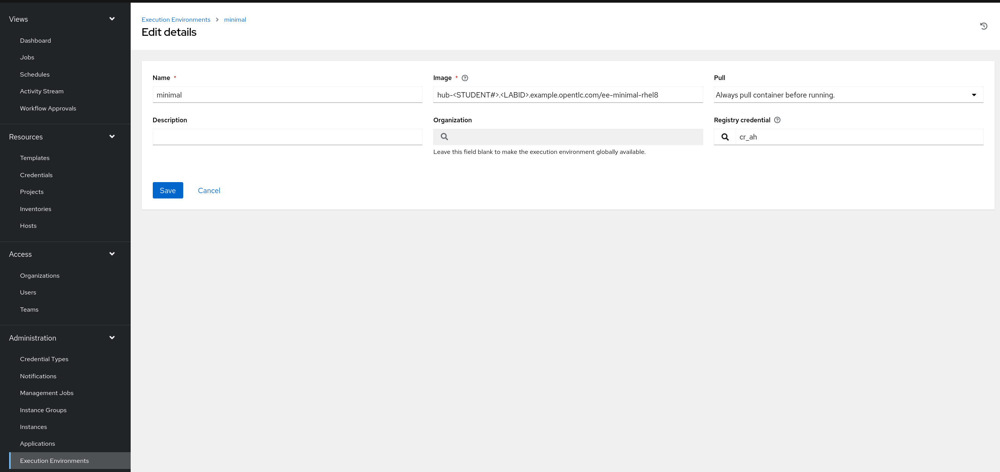
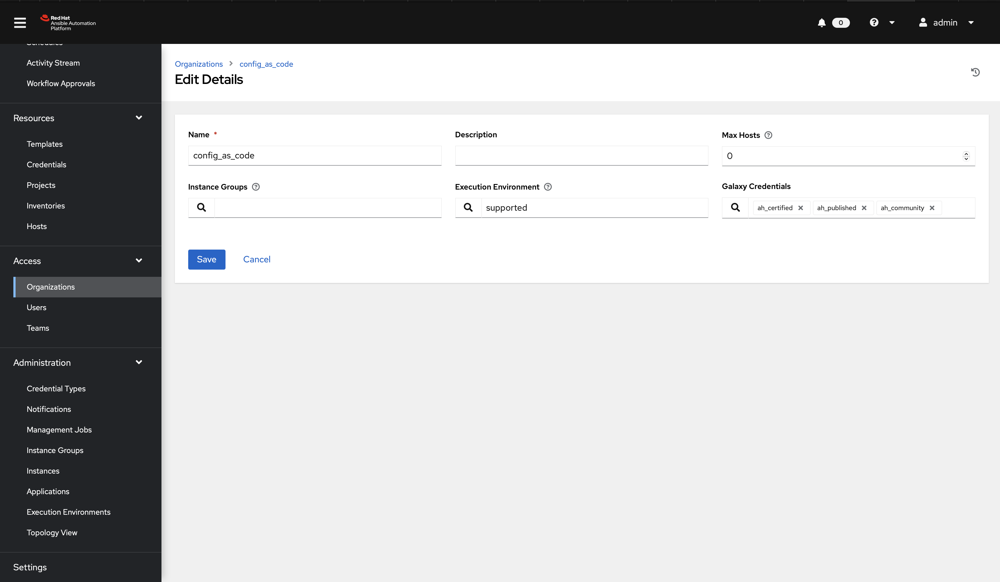
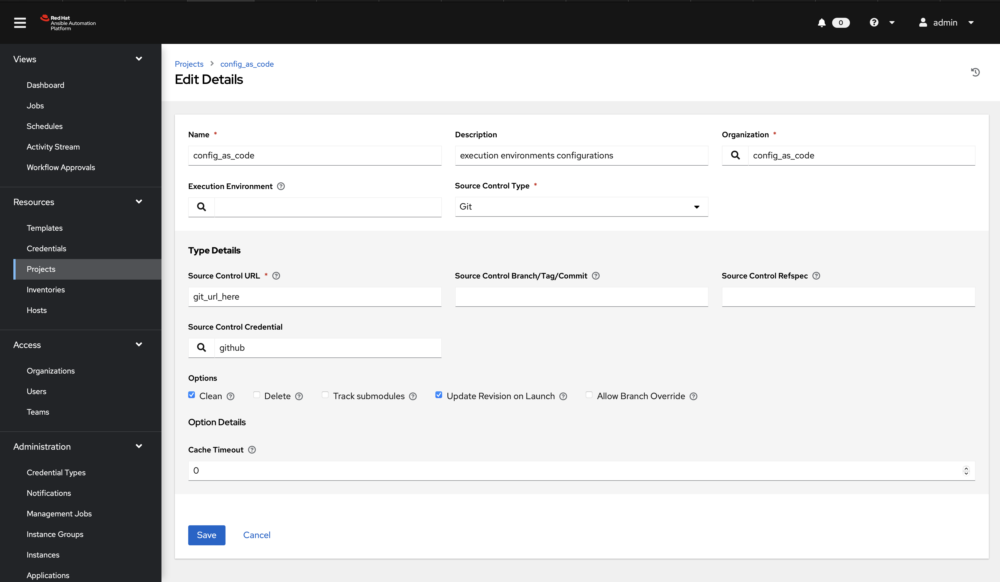
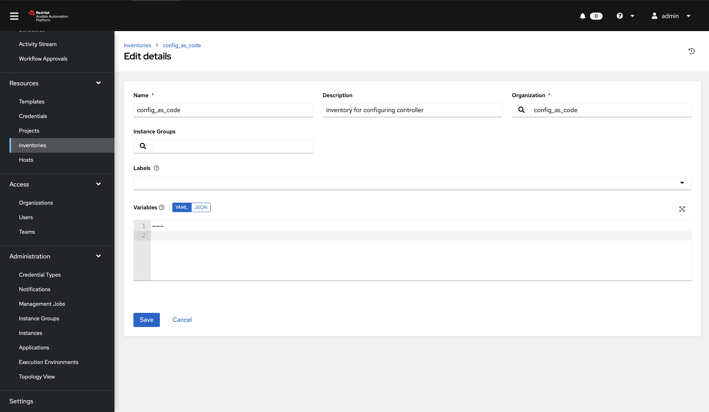
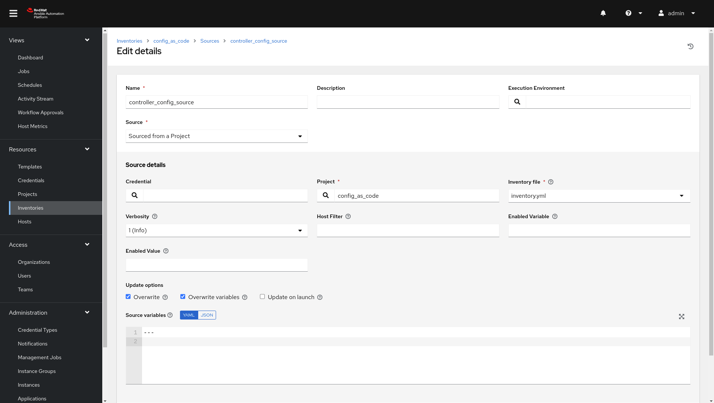
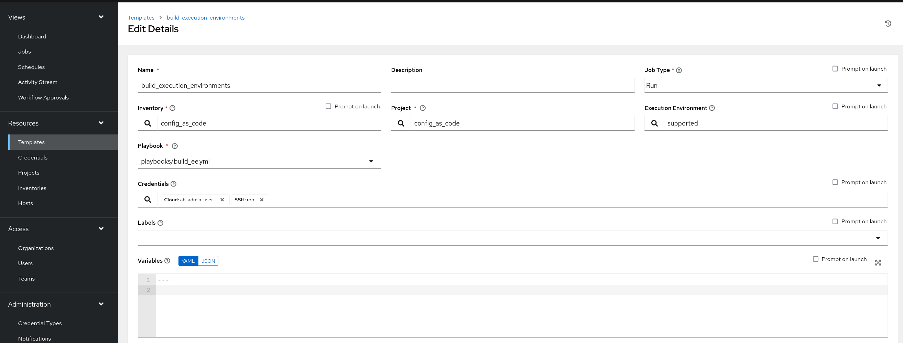
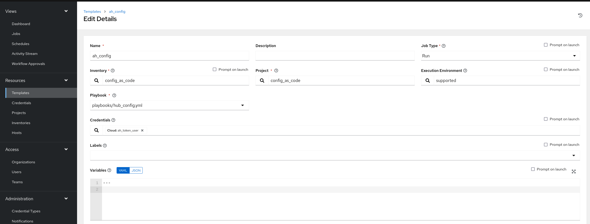
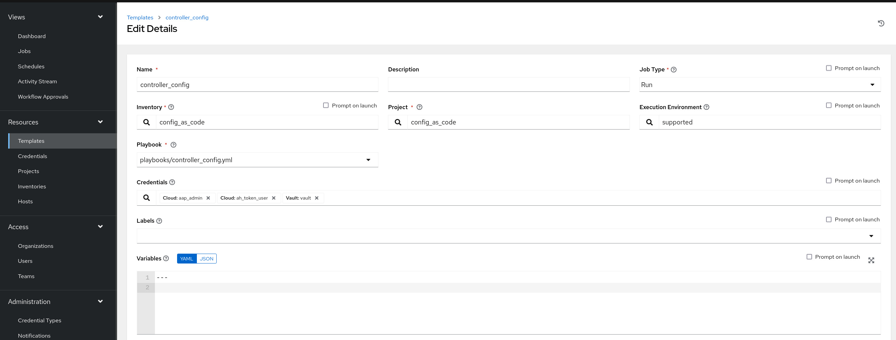

# Intro

In this section, you will only be given a summary of the objects you need to create along with some screenshots of a controller that is configured with the completed code. You will also be provided the variables sections from the readme's for each of the required roles to help you complete this task.

## Step 1

Create a file `group_vars/all/settings.yml` and copy all this into the file.

```yaml
---
controller_settings:
  settings:
    GALAXY_IGNORE_CERTS: true
...
```

Further documentation for those who are interested to learn more see:

- [settings role](https://github.com/redhat-cop/controller_configuration/blob/devel/roles/settings/README.md)

## Step 2

Create a file `group_vars/all/execution_environments.yml` and add the required information to the list `controller_execution_environments` to configure the UI to look like the screenshots

```yaml
---
controller_execution_environments:

...

```





Further documentation for those who are interested to learn more see:

- [execution environments role](https://github.com/redhat-cop/controller_configuration/blob/devel/roles/execution_environments/README.md)

## Step 3

Create a file `group_vars/all/credential_types.yml` where we will create a list called `controller_credential_types` that has 5 variables per item which are:

- `name` this is required and will be what the credential type will be called
- `description` this is the description of the credential type
- `kind` The type of credential type being added. Note that only cloud and net can be used for creating credential types.
- `inputs` Enter inputs using either JSON or YAML syntax. Refer to the Ansible controller documentation for example syntax. These will be the fields in the GUI that prompt the user for input.
- `injectors` Enter injectors using either JSON or YAML syntax. Refer to the Ansible controller documentation for example syntax. These are the variables that will then be useable in a job.

which the role will loop over and for each item in this list it will create custom credential types for use in the controller.



```yaml
---
controller_credential_types:
  - name: automation_hub
    description: automation hub
    kind: cloud
    inputs:
      fields:
        - id: verify_ssl
          type: boolean
          label: Verify SSL
        - id: hostname
          type: string
          label: Hostname
        - id: username
          type: string
          label: Username
        - id: password
          type: string
          label: Password
          secret: true
        - id: token
          type: string
          label: Token
          secret: true
      required:
        - hostname
    injectors:
      env:
        AH_PASSWORD: !unsafe "{{ password }}"
        AH_USERNAME: !unsafe "{{ username }}"
        AH_HOST: !unsafe # Insert appropriate variable from above here
        AH_API_TOKEN: !unsafe # Insert appropriate variable from above here
        AH_VERIFY_SSL: !unsafe # Insert appropriate variable from above here
      extra_vars:
        ah_password: !unsafe "{{ password }}"
        ah_username: !unsafe "{{ username }}"
        ah_host: !unsafe # Insert appropriate variable from above here
        ah_token: !unsafe # Insert appropriate variable from above here
        ah_validate_certs: !unsafe # Insert appropriate variable from above here

  - name: ssh_priv_file
    kind: cloud
    description: creates temp ssh priv key to use (cannot have passphrase)
    inputs:
      fields:
        - id: priv_key
          type: string
          label: Certificate
          format: ssh_private_key
          multiline: true
          secret: true
    injectors:
      env:
        MY_CERT_FILE_PATH: !unsafe '{{ tower.filename.cert_file }}'
      file:
        template.cert_file: !unsafe '{{ priv_key }}'
...
```



Further documentation for those who are interested to learn more see:

- [credential types role](https://github.com/redhat-cop/controller_configuration/blob/devel/roles/credential_types/README.md)

## Step 4

Create a file `group_vars/all/organizations.yml` and add the required information to the list `controller_organizations` to configure the UI to look like the screenshot

```yaml
---
controller_organizations:

...

```



Further documentation for those who are interested to learn more see:

- [organizations role](https://github.com/redhat-cop/controller_configuration/blob/devel/roles/organizations/README.md)

## Step 5

Create a file `group_vars/all/credentials.yml` and add the required information to the list `controller_credentials` to configure the UI to look like the screenshot. Make it to look like the screenshot, but make sure to use parameters for the values. DO NOT PASTE YOUR CLEARTEST CREDENTIALS!



```yaml
---
controller_credentials:
  - name: aap_admin
    credential_type: Red Hat Ansible Automation Platform
    organization: config_as_code
    description: aap admin account
    inputs:
      host: "{{ controller_hostname }}"
      username: "{{ controller_username }}"
      password: "{{ controller_password }}"
      verify_ssl: false

  - name: ah_token_user
    credential_type: automation_hub
    organization: config_as_code
    description: automation hub api account
    inputs:
      hostname: "{{ ah_host }}"
      username: "{{ ah_token_username }}"
      token: "{{ ah_token }}"
      verify_ssl: false

  - name: ah_certified
    credential_type: Ansible Galaxy/Automation Hub API Token
    organization: config_as_code
    inputs:
      url: "https://{{ ah_host }}/api/galaxy/content/rh-certified/"
      token: "{{ ah_token }}"

  - name: ah_published
    credential_type: Ansible Galaxy/Automation Hub API Token
    organization: config_as_code
    inputs:
      url: "https://{{ ah_host }}/api/galaxy/content/published/"
      token: "{{ ah_token }}"

  - name: ah_community
    credential_type: Ansible Galaxy/Automation Hub API Token
    organization: config_as_code
    inputs:
      url: "https://{{ ah_host }}/api/galaxy/content/community/"
      token: "{{ ah_token }}"

  - name: cr_ah
    credential_type: Container Registry
    organization: config_as_code
    inputs:
      host: "{{ ah_host }}"
      username: "{{ ah_username }}"
      password: "{{ ah_password }}"
      verify_ssl: false

  - name: root
    credential_type: Machine
    organization: config_as_code
    description: local password
    inputs:
      username: student
      password: "{{ machine_pass }}"

  - name: github
    credential_type: Source Control
    organization: config_as_code
    description: git
    inputs:
      username: "{{ student_account }}"
      password: "{{ machine_pass }}"

  - name: vault
    credential_type: Vault
    organization: config_as_code
    description: vault password
    inputs:
      vault_password: "{{ vault_pass }}"
...
```




Further documentation for those who are interested to learn more see:

- [credentials role](https://github.com/redhat-cop/controller_configuration/blob/devel/roles/credentials/README.md)

## Step 6

Create a file `group_vars/all/projects.yml` and add the required information to the list `controller_projects` to configure the UI to look like the screenshot.

### What git project are we pointing at

```yaml
---
controller_projects:

...
```



Further documentation for those who are interested to learn more see:

- [projects role](https://github.com/redhat-cop/controller_configuration/blob/devel/roles/projects/README.md)

## Step 7

Create a file `group_vars/all/inventories.yml` and add the required information to the list `controller_inventories` to configure the UI to look like the screenshot

```yaml
---
controller_inventories:

...
```



Further documentation for those who are interested to learn more see:

- [inventories role](https://github.com/redhat-cop/controller_configuration/blob/devel/roles/inventories/README.md)

## Step 8

Create a file `group_vars/all/inventory_sources.yml` and add the required information to the list `controller_inventory_sources` to configure the UI to look like the screenshot
**NOTE the inventory file name should be just inventory.yml**

```yaml
---
controller_inventory_sources:

...
```



Further documentation for those who are interested to learn more see:

- [inventory sources role](https://github.com/redhat-cop/controller_configuration/blob/devel/roles/inventory_sources/README.md)

## Step 9

Create a file `group_vars/all/job_templates.yml` and add the required information to the list `controller_templates` to configure the UI to look like the screenshot

Pay attention to the credentials attached to each job template.

```yaml
---
controller_templates:

...
```





Further documentation for those who are interested to learn more see:

- [job templates role](https://github.com/redhat-cop/controller_configuration/blob/devel/roles/job_templates/README.md)

## Step 10

Create a playbook `playbooks/controller_config.yml` and copy all this into the file.



```yaml
---
- name: Playbook to configure ansible controller post installation
  hosts: all
  vars_files:
    - "../vault.yml"
  connection: local
  tasks:
    - name: Include setting role
      ansible.builtin.include_role:
        name: infra.controller_configuration.settings
      when: controller_settings is defined

    - name: Include organization role
      ansible.builtin.include_role:
        name: infra.controller_configuration.organizations
      vars:
        assign_galaxy_credentials_to_org: false
        assign_default_ee_to_org: false
      when: controller_organizations is defined

    - name: Include labels role
      ansible.builtin.include_role:
        name: infra.controller_configuration.labels
      when: controller_labels is defined

    - name: Include users role
      ansible.builtin.include_role:
        name: infra.controller_configuration.users
      vars:
        controller_configuration_users_secure_logging: true
      when: controller_user_accounts is defined

    - name: Include teams role
      ansible.builtin.include_role:
        name: infra.controller_configuration.teams
      when: controller_teams is defined

    # probably not optimal but works, looking for better solutions
    - name: Figuring out AH token
      when: ah_token is not defined or ah_token['token'] is defined
      block:
        - name: Authenticate and get an API token from Automation Hub
          infra.ah_configuration.ah_token:
            ah_host: "{{ ah_host | default(groups['automationhub'][0]) }}"
            ah_username: "{{ ah_token_username | default('admin') }}"
            ah_password: "{{ ah_token_password }}"
            ah_path_prefix: 'galaxy'  # this is for private automation hub
            ah_verify_ssl: false
          register: r_ah_token

        - name: Fixing format
          ansible.builtin.set_fact:
            ah_token: "{{ ah_token['token'] }}"
          when: r_ah_token['changed'] # noqa: no-handler

    - name: Include credential_types role
      ansible.builtin.include_role:
        name: infra.controller_configuration.credential_types
      when: controller_credential_types is defined

    - name: Include credential role
      ansible.builtin.include_role:
        name: infra.controller_configuration.credentials
      vars:
        controller_configuration_credentials_secure_logging: true
      when: controller_credentials is defined

    - name: Include credential_input_sources role
      ansible.builtin.include_role:
        name: infra.controller_configuration.credential_input_sources
      when: controller_credential_input_sources is defined

    - name: Include execution_environments role
      ansible.builtin.include_role:
        name: infra.controller_configuration.execution_environments
      when: controller_execution_environments is defined

    - name: Include organizations role
      ansible.builtin.include_role:
        name: infra.controller_configuration.organizations
      when: controller_organizations is defined

    - name: Include projects role
      ansible.builtin.include_role:
        name: infra.controller_configuration.projects
      when: controller_projects is defined

    - name: Include inventories role
      ansible.builtin.include_role:
        name: infra.controller_configuration.inventories
      when: controller_inventories is defined

    - name: Include inventory_sources role
      ansible.builtin.include_role:
        name: infra.controller_configuration.inventory_sources
      when: controller_inventory_sources is defined

    - name: Include inventory_source_update role
      ansible.builtin.include_role:
        name: infra.controller_configuration.inventory_source_update

    - name: Include groups role
      ansible.builtin.include_role:
        name: infra.controller_configuration.groups
      when: controller_groups is defined

    - name: Include applications role
      ansible.builtin.include_role:
        name: infra.controller_configuration.applications
      when: controller_applications is defined

    - name: Include job_templates role
      ansible.builtin.include_role:
        name: infra.controller_configuration.job_templates
      when: controller_templates is defined

    - name: Include workflow_job_templates role
      ansible.builtin.include_role:
        name: infra.controller_configuration.workflow_job_templates
      when: controller_workflows is defined

    - name: Include schedules role
      ansible.builtin.include_role:
        name: infra.controller_configuration.schedules
      when: controller_schedules is defined

    - name: Include roles role
      ansible.builtin.include_role:
        name: infra.controller_configuration.roles
      when: controller_roles is defined
...

```



## Step 11

Create a `collections/requirements.yml` file and add these collections to pull automatically.

```yaml
---
collections:
  - name: infra.controller_configuration
    version: 2.5.1
  - name: infra.ah_configuration
    version: 2.0.3
  - name: awx.awx
    version: 22.4.0
...
```

## Step 12

Run git commit and push to add all your current code into your repository.

```console
git add .
git commit -am "task3"
git push origin master
```

## Step 13

Run controller_config playbook.

**Replace rh####** with the correct shortname for the workshop.

```console
ansible-navigator run playbooks/controller_config.yml --eei hub-student#.rh####.example.opentlc.com/config_as_code -i inventory.yml -l automationcontroller --pa='--tls-verify=false' -m stdout
```

[previous task](../2-pah/README.md)
