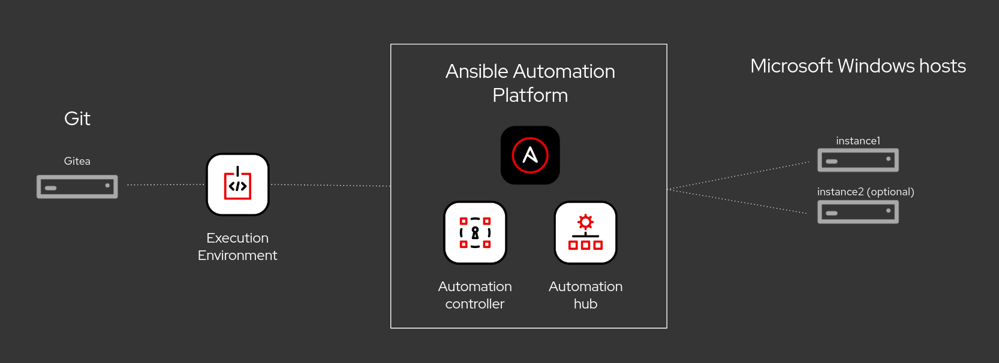

# Ansible Workshop - Configuration as Code for Ansible Automation Platform 2

<!-- TODO
**Read this in other languages**:
  [English](README.md),  [日本語](README.ja.md),  [Français](README.fr.md).
  -->

## **This is documentation for Ansible Automation Platform 2**

Configuration as Code(CasC) is the way to maintain all your infrastructure.

This workshop will provide code to demonstrate how to use CasC to maintain all aspects of AAP. The provided code will be a starting point, and will guide the user through how to utilize the code, and make it their own. This session will cover configuring controller, private automation hub, execution environments, and custom collections as well as the creation of workflows without the GUI as an example to follow along. These principles will help to prevent drift in configuration, allow changes to require approval before implementation, and help to maintain both a development and prod deployment.

## Presentations

The presenter deck is available here:
[Configuration as Code](../../decks/config_as_code.pdf)

## Time planning

The time required to do the workshops strongly depends on a couple factors: the number of participants and how much discussions are done in between.

Having said that, the exercises themselves should take roughly 1-3 hours. The accompanying presentation itself adds 10 minutes.

If your experience is different in scheduling these workshops, please let us know and file an issue.

## Lab Diagram

## Exercises

* [Exercise 0 - Setting up](./0-setup/README.md)
* [Exercise 1 - Building an Execution Environment](./1-ee/README.md)
* [Exercise 2 - Configure Private Automation Hub](./2-pah/README.md)
* [Exercise 3 - Configure Controller](./3-controller/README.md)
