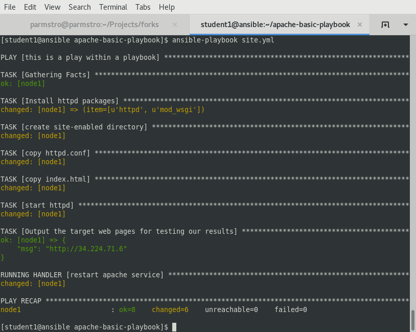

# 演習 4 - apache-basic-playbookを実行する

おめでとうございます! ここまでで、全てではないにしてもAnsibleの主要なコンセプトのほとんどを含んだPlaybookを書き終えることができました。感動も一入ですが、まずは実際に実行できるかを確認してみましょう。

では、始めます。

## セクション 1 - 新しいApache Playbookを実行する

### ステップ 1:
適切なディレクトリに居ることを確認し、hostsファイルを作成します。

```bash
cd ~/apache-basic-playbook
```

---
**NOTE**
hostsファイルの作成は既にLession 1.0で行っていますので、再利用してください。
---

### ステップ 2:
playbookを実行します。

```bash
ansible-playbook --private-key#~/.ssh/workshopname-tower -i ../hosts site.yml
```

## セクション 2: この演習の最後に
問題なく実行された場合、以下のような内容が標準出力として表示されます。もしそうでない場合は、問題箇所を特定するのでお知らせください。




---

[Click Here to return to the Ansible Linklight - Ansible Engine Workshop](../README.md)
