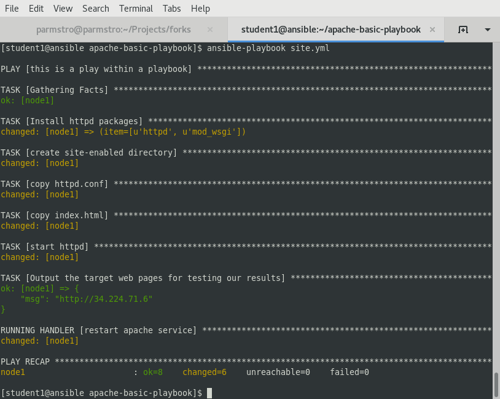

# Exercise 4 - Running the apache-basic-playbook

Congratulations!  You just wrote a playbook that incorporates some key Ansible concepts that you use in most if not all of your future playbooks.  Before you get too excited though, we should probably make sure it actually runs.

So, lets do that now.

## Section 1 - Running your new apache playbook

### Step 1:
Make sure you are in the right directory and create a host file.

```bash
cd ~/apache-basic-playbook
```

---
**NOTE**
Since you already did the work of creating a host file in Lession 1.0, feel free to re-use it.
---

### Step 2:
Run your playbook

```bash
ansible-playbook -i ~/lightbulb/lessons/lab_inventory/student##-instances.txt site.yml
```

## Section 2: Review

If successful, you should see standard output that looks very similar to the following.  If not, just let us know.  We'll help get things fixed up.




---

[Click Here to return to the Ansible Linklight - Ansible Engine Workshop](../README.md)
