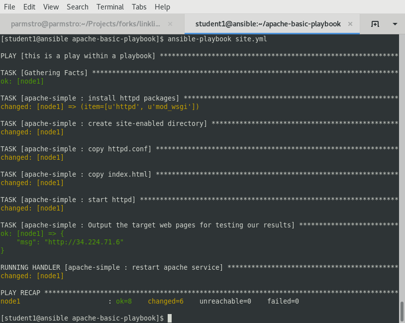

# 演習 1.5 - Roles: Playbookを再利用可能にする

このワークショップで行ってきているように、Playbookを1つのファイルに書くことも可能です。しかし最終的には、物事を整理してファイルを再利用したくなってくる筈です。


これを実現するのがAnsibleのRolesです。roleを作成する事でPlaybookをパーツとして分解し、構造化されたディレクトリに納めるのです。「え?? それは演習 1.2で触れられていた、ややこしい[ベスト・プラクティス](http://docs.ansible.com/ansible/playbooks_best_practices.html)のことですか?」って？ はい、まさにその通りです。

この演習では先に作成したPlaybookをリファクタリングしてroleへと変えます。さらにAnsible Galaxyの使い方も学びます。

では apache-basic-playbook をroleへとブレークダウンする方法を見て行きましょう。


幸いにも、これらのディレクトリやファイルの全てを手動で作成する必要はありません。ここで登場するのがAnsible Galaxyです。

## セクション 1: Ansible Galaxyを使って新しいroleを初期化する

Ansible Galaxyは、roleの検索とダウンロード、そして共有を可能にするフリーのサイトです。そしてまた、これを使えば今ここで行おうとしている事も容易に行えます。


### ステップ 1:

 `apache-basic-playbook` プロジェクトへ移動します。

```bash
cd ~/apache-basic-playbook
```


### ステップ 2:

 `roles` と命名したディレクトリを作成し `cd` でそこへ移動します。

```bash
mkdir roles
cd roles
```


### ステップ 3:

 `ansible-galaxy` コマンドで `apache-simple` と命名した新しいroleを初期化します。

```bash
ansible-galaxy init apache-simple
```

ここまでで作成された構造を確認してください。先の図 1とよく似た構造になっている筈です。しかし、セクション 2へ進む前にあと1つだけ終らせるステップが残っています。それはAnsibleのベスト・プラクティスで、利用しないディレクトリとファイルのクリーンアップです。 このroleでは `files` と `tests` からは何も利用しません。
Take a look around the structure you just created.  It should look a lot like Figure 1 above.  However, we need to complete one more ステップ before moving onto セクション 2.  It is Ansible best practice to clean out role directories and files you won't be using.  For this role, we won't be using anything from `files`, `tests`.


### ステップ 4:

`files` と `tests` ディレクトリを削除します。

```bash
cd ~/apache-basic-playbook/roles/apache-simple/
rm -rf files tests
```


## セクション 2: `site.yml` Playbookを新たに作成した`apache-simple` roleへ切り分ける


このセクションではPlaybookに含まれている`vars:`、 `tasks:`、 `template:`、 そして `handlers:` を主要パーツとして切り分けます。

### ステップ 1:

`site.yml` のバックアップ・コピーを作成し、新しい `site.yml` を作成します。

```bash
cd ~/apache-basic-playbook
mv site.yml site.yml.bkup
vim site.yml
```

### ステップ 2:

play の定義と role の呼び出しを追加します。

```yml
---
- hosts: web
  name: This is my role-based playbook
  become: yes

  roles:
    - apache-simple
```

### ステップ 3:

`roles/apache-simple/defaults/main.yml` のroleにデフォルトの変数を追加します。

```yml
---
# defaults file for apache-simple
apache_test_message: This is a test message
apache_max_keep_alive_requests: 115
```

### ステップ 4:

roleに特化した変数を`roles/apache-simple/vars/main.yml` のroleへ追加します。

[source,bash]
```
---
# vars file for apache-simple
httpd_packages:
  - httpd
  - mod_wsgi
```

---
**NOTE**
####
> えっと、ちょっと待ってください…​ いま変数を2つの場所に分けて置きませんでしたか？

ええ…​ 実はその通りです。変数は柔軟に配置することができます。例をあげると: +

- vars ディレクトリ
- defaultsディレクトリ
- group_varsディレクトリ
- Playbookの `vars:` セクション配下
- コマンドラインを使い `--extra_vars` オプションで指定された全てのファイル

結論から言えば、[variable precedence(英語)](http://docs.ansible.com/ansible/latest/playbooks_variables.html#variable-precedence-where-should-i-put-a-variable) に目を通し、どこで変数を定義するのか、そしてどのロケーションが優先されるのかを理解する必要があります。融通が利くように、この演習ではrole defaultsを利用していくつかの変数を定義しています。 それに続いて、role defaultsよりも高い優先性を持ち、デフォルトの変数をオーバーライドできる`/vars`にいくつかの変数を定義しています。

---

### ステップ 5:

`roles/apache-simple/handlers/main.yml` にroleのハンドラを作成します。


```yml
---
# handlers file for apache-simple
- name: restart apache service
  service:
    name: httpd
    state: restarted
    enabled: yes
```

### ステップ 6:

`roles/apache-simple/tasks/main.yml` のroleにtasksを追加します。

```yml

---
# tasks file for apache-simple
- name: install httpd packages
  yum:
    name: "{{ item }}"
    state: present
  with_items: "{{ httpd_packages }}"
  notify: restart apache service

- name: create site-enabled directory
  file:
    name: /etc/httpd/conf/sites-enabled
    state: directory

- name: copy httpd.conf
  template:
    src: templates/httpd.conf.j2
    dest: /etc/httpd/conf/httpd.conf
  notify: restart apache service

- name: copy index.html
  template:
    src: templates/index.html.j2
    dest: /var/www/html/index.html

- name: start httpd
  service:
    name: httpd
    state: started
    enabled: yes
    
```

### ステップ 7:

`roles/apache-simple/templates/` へいくつかのテンプレートをダウンロードします。その後すぐ、演習 2.1の古いテンプレート・ディレクトリを削除し、クリーンアップを行います。

```bash
mkdir -p ~/apache-basic-playbook/roles/apache-simple/templates/
cd ~/apache-basic-playbook/roles/apache-simple/templates/
curl -O http://ansible-workshop.redhatgov.io/workshop-files/httpd.conf.j2
curl -O http://ansible-workshop.redhatgov.io/workshop-files/index.html.j2
rm -rf ~/apache-basic-playbook/templates/
```

## セクション 3: ロール・ベースの新しいPlaybookを実行します。

これでオリジナルのPlaybookをroleに切り分けることができました。では実際に実行してみましょう。

### ステップ 1:

Rplaybookを実行します。

```bash
ansible-playbook --private-key ~/.ssh/workshopname-tower -i ../hosts site.yml
```

もしも問題なく実行されれば、標準出力は以下の図のようになる筈です。



## セクション 4: この演習の最後に

You should now have a completed playbook, `site.yml` with a single role called `apache-simple`.  The advantage of structuring your playbook into roles is that you can now add new roles to the playbook using Ansible Galaxy or simply writing your own.  In addition, roles simplify changes to variables, tasks, templates, etc.
これで、1つの `apache-simple` roleを持つPlaybook、`site.yml` は完成です。Playbookを構造化されたrolesにすることの利点は、新たなrolesをAnsible Galaxyを使って、または自身の手で記述して追加できることにあります。またrolesを用いれば、容易に変数やtasksやテンプレート等を変更できます。

---

[Click Here to return to the Ansible Linklight - Ansible Engine Workshop](../README.md)
