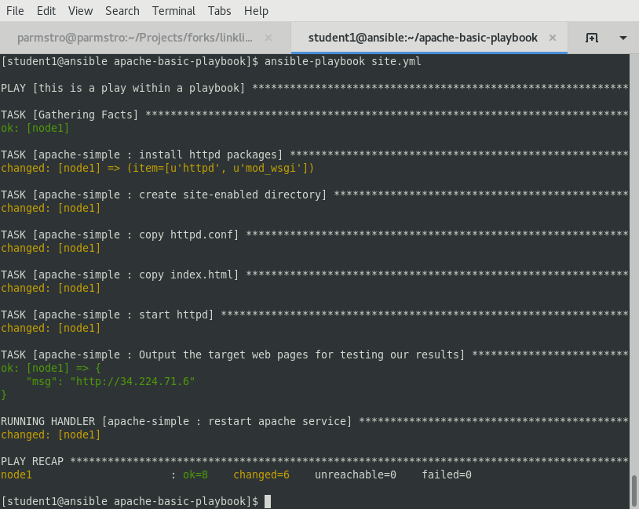

# Exercise 5 - Roles: Making your playbooks reusable

While it is possible to write a playbook in one file as we've done throughout this workshop, eventually you’ll want to reuse files and start to organize things.

Ansible Roles is the way we do this.  When you create a role, you deconstruct your playbook into parts and those parts sit in a directory structure.  "Wha??  You mean that seemingly useless [best practice](http://docs.ansible.com/ansible/playbooks_best_practices.html) you mentioned in exercise 2?".  Yep, that one.

For this exercise, you are going to take the playbook you just wrote and refactor it into a role.  In addition, you'll learn to use Ansible Galaxy.

Let's begin with seeing how your apache-basic-playbook will break down into a role.


Fortunately, you don't have to create all of these directories and files by hand.  That's where Ansible Galaxy comes in.

## Section 1: Using Ansible Galaxy to initialize a new role

Ansible Galaxy is a free site for finding, downloading, and sharing roles.  It's also pretty handy for creating them which is what we are about to do here.


### Step 1:

Navigate to your `apache-basic-playbook` project.

```bash
cd ~/apache-basic-playbook
```


### Step 2:

Create a directory called `roles` and `cd` into it.

```bash
mkdir roles
cd roles
```


### Step 3:

Use the `ansible-galaxy` command to initialize a new role called `apache-simple`.

```bash
ansible-galaxy init apache-simple
```

Take a look around the structure you just created.  It should look a lot like Figure 1 above.  However, we need to complete one more step before moving onto section 2.  It is Ansible best practice to clean out role directories and files you won't be using.  For this role, we won't be using anything from `files`, `tests`.


### Step 4:

Remove the `files` and `tests` directories

```bash
cd ~/apache-basic-playbook/roles/apache-simple/
rm -rf files tests
```


## Section 2: Breaking Your `site.yml` Playbook into the Newly Created `apache-simple` Role


In this section, we will separate out the major parts of your playbook including `vars:`, `tasks:`, `template:`, and `handlers:`.

### Step 1:

Make a backup copy of `site.yml`, then create a new `site.yml`.

```bash
cd ~/apache-basic-playbook
mv site.yml site.yml.bkup
vim site.yml
```

### Step 2:

Add the play definition and the invocation of a single role.

```yml
---
- hosts: web
  name: This is my role-based playbook
  become: yes

  roles:
    - apache-simple
```

### Step 3:

Add some default variables to your role in `roles/apache-simple/defaults/main.yml`.

```yml
---
# defaults file for apache-simple
apache_test_message: This is a test message
apache_max_keep_alive_requests: 115
```

### Step 4:

Add some role-specific variables to your role in `roles/apache-simple/vars/main.yml`.

[source,bash]
```
---
# vars file for apache-simple
httpd_packages:
  - httpd
  - mod_wsgi
```

---
**NOTE**
####
> Hey, wait just a minute there buster... did you just have us put variables in two seperate places?

Yes... yes we did.  Variables can live in quite a few places.  Just to name a few: +

- vars directory
- defaults directory
- group_vars directory
- In the playbook under the `vars:` section
- In any file which can be specified on the command line using the `--extra_vars` option
- On a boat, in a moat, with a goat  _(disclaimer:  this is a complete lie)_

Bottom line, you need to read up on [variable precedence](http://docs.ansible.com/ansible/latest/playbooks_variables.html#variable-precedence-where-should-i-put-a-variable) to understand both where to define variables and which locations take precedence.  In this exercise, we are using role defaults to define a couple of variables and these are the most malleable.  After that, we defined some variables in `/vars`
which have a higher precedence than defaults and can't be overridden as a default variable.

---

### Step 5:

Create your role handler in `roles/apache-simple/handlers/main.yml`.

```yml
---
# handlers file for apache-simple
- name: restart apache service
  service:
    name: httpd
    state: restarted
    enabled: yes
```

### Step 6:

Add tasks to your role in `roles/apache-simple/tasks/main.yml`.

```yml

---
# tasks file for apache-simple
- name: install httpd packages
  yum:
    name: "{{ item }}"
    state: present
  with_items: "{{ httpd_packages }}"
  notify: restart apache service

- name: create site-enabled directory
  file:
    name: /etc/httpd/conf/sites-enabled
    state: directory

- name: copy httpd.conf
  template:
    src: templates/httpd.conf.j2
    dest: /etc/httpd/conf/httpd.conf
  notify: restart apache service

- name: copy index.html
  template:
    src: templates/index.html.j2
    dest: /var/www/html/index.html

- name: start httpd
  service:
    name: httpd
    state: started
    enabled: yes
    
```

### Step 7:

Download a couple of templates into `roles/apache-simple/templates/`.  And right after that, let's clean up from exercise 2.1 by removing the old templates directory.

```bash
mkdir -p ~/apache-basic-playbook/roles/apache-simple/templates/
cd ~/apache-basic-playbook/roles/apache-simple/templates/
curl -O http://ansible-workshop.redhatgov.io/workshop-files/httpd.conf.j2
curl -O http://ansible-workshop.redhatgov.io/workshop-files/index.html.j2
rm -rf ~/apache-basic-playbook/templates/
```

## Section 3: Running your new role-based playbook

Now that you've successfully separated your original playbook into a role,
let's run it and see how it works.

### Step 1:

Run the playbook.

```bash
ansible-playbook -i ~/lightbulb/lessons/lab_inventory/student##-instances.txt site.yml
```

If successful, your standard output should look similar to the figure below.



## Section 4: Review

You should now have a completed playbook, `site.yml` with a single role called `apache-simple`.  The advantage of structuring your playbook into roles is that you can now add new roles to the playbook using Ansible Galaxy or simply writing your own.  In addition, roles simplify changes to variables, tasks, templates, etc.


---

[Click Here to return to the Ansible Linklight - Ansible Engine Workshop](../README.md)
