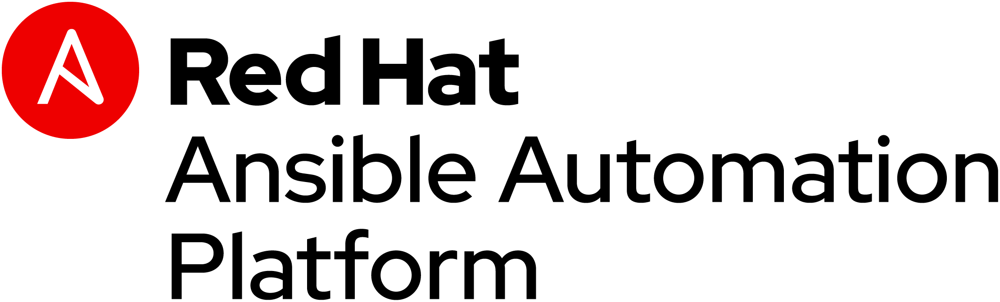

# Ansible Linklight - Ansible エンジン

このコンテンツは、Ansibleの効果的なデモンストレーション、ワークショップ、ハンズオン、自己学習など、さまざまな目的や用途で利用可能なツールです。

**Read this in other languages**: [ English](README.md),  [ 日本語](README.ja.md).

## プレゼンテーション

プレゼンテーション資料はこちら:
[Ansible Essentials Deck](../../decks/ansible-essentials.html)

## Ansible エンジン演習

 - [演習 1 - アドホック・コマンドの実行](1-adhoc/README.ja.md)
 - [演習 2 - 初めてのplaybook作成](2-playbook/README.ja.md)
 - [演習 3 - 変数、ループ、ハンドラを使う](3-variables/README.ja.md)
 - [演習 4 - apache-basic-playbookを実行する](4-runplaybook/README.ja.md)
 - [演習 5 - Roles：Playbookを再利用可能にする](5-role/README.ja.md)

## 追加情報
 - [Ansible - はじめに](http://docs.ansible.com/ansible/latest/intro_getting_started.html)

---

Red Hat® Ansible® Automation は 3つの製品が含まれます:

- [Red Hat® Ansible® Engine](https://www.ansible.com/ansible-engine): サポートが提供されているAnsibleプロジェクトの基本エンジン機能

- [Red Hat® Ansible® ネットワーク アドオン](https://www.ansible.com/ansible-engine): Arista (EOS)、Cisco (IOS、IOS XR、 NX-OS)、Juniper (Junos OS)、 Open vSwitch、 VyOS等サポートが提供されているネットワークモジュール

- [Red Hat® Ansible® Tower](https://www.ansible.com/tower): Ansible を装備した環境に、制御、ナレッジ、委譲機能を追加し、チームが複雑かつ複数層のデプロイメントを管理支援するツール

さらなる情報が必要ですか?
[Ansible Engine、Tower、ネットワークアドオンのさらなる情報はこちら](https://www.ansible.com/blog/red-hat-ansible-automation-engine-vs-tower)
