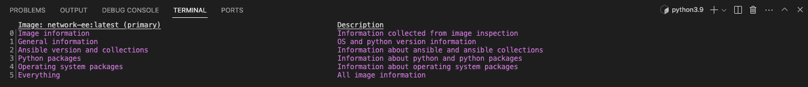

### Exercise 1.0: Exploring the lab environment

**Read this in other languages**:  [English](README.md),   [日本語](README.ja.md).

Before you get started, please join us on slack! [Click here to join the ansiblenetwork slack](https://join.slack.com/t/ansiblenetwork/shared_invite/zt-3zeqmhhx-zuID9uJqbbpZ2KdVeTwvzw).  This will allow you to chat with other network automation engineers and get help after the workshops concludes.

## Table of Contents

* [Objective](#objective)
* [Guide](#guide)
   * [Step 1 - Connecting via VS Code](#step-1---connecting-via-vs-code)
   * [Step 2 - Using the Terminal](#step-2---using-the-terminal)
   * [Step 3 - Examining Execution Environments](#step-3---examining-execution-environments)
   * [Step 4 - Examining the ansible-navigator configuration](#step-4---examining-the-ansible-navigator-configuration)
   * [Step 5 - Examining inventory](#step-5---examining-inventory)
   * [Step 6 - Understanding inventory](#step-6---understanding-inventory)
   * [Step 7 - Using ansible-navigator to explore inventory](#step-7---using-ansible-navigator-to-explore-inventory)
* [Complete](#complete)

## Objective

Explore and understand the lab environment.

These first few lab exercises will be exploring the command-line utilities of the Ansible Automation Platform.  This includes

- [ansible-navigator](https://github.com/ansible/ansible-navigator) - a command line utility and text-based user interface (TUI) for running and developing Ansible automation content.
- [ansible-core](https://docs.ansible.com/core.html) - the base executable that provides the framework, language and functions that underpin the Ansible Automation Platform.  It also includes various cli tools like `ansible`, `ansible-playbook` and `ansible-doc`.  Ansible Core acts as the bridge between the upstream community with the free and open source Ansible and connects it to the downstream enterprise automation offering from Red Hat, the Ansible Automation Platform.
- [Execution Environments](https://docs.ansible.com/automation-controller/latest/html/userguide/execution_environments.html) - not specifically covered in this workshop because the built-in Ansible Execution Environments already included all the Red Hat supported collections which includes all the network collections we use for this workshop.  Execution Environments are container images that can be utilized as Ansible execution.
- [ansible-builder](https://github.com/ansible/ansible-builder) - not specifically covered in this workshop, `ansible-builder` is a command line utility to automate the process of building Execution Environments.

If you need more information on new Ansible Automation Platform components bookmark this landing page [https://red.ht/AAP-20](https://red.ht/AAP-20)

<table>
<thead>
  <tr>
    <th>Before you get started, please join us on slack! <a href="https://join.slack.com/t/ansiblenetwork/shared_invite/zt-3zeqmhhx-zuID9uJqbbpZ2KdVeTwvzw">Click here to join the ansiblenetwork slack</a>.  This will allow you to chat with other network automation engineers and get help after the workshops concludes.  If the link goes stale please email <a href="mailto:ansible-network@redhat.com">Ansible Technical Marketing</a></th>
  </tr>
</thead>
</table>


## Guide

### Step 1 - Connecting via VS Code

<table>
<thead>
  <tr>
    <th>It is highly encouraged to use Visual Studio Code to complete the workshop exercises. Visual Studio Code provides:
    <ul>
    <li>A file browser</li>
    <li>A text editor with syntax highlighting</li>
    <li>A in-browser terminal</li>
    </ul>
    Direct SSH access is available as a backup, or if Visual Studio Code is not sufficient to the student.  There is a short YouTube video provided if you need additional clarity: <a href="https://youtu.be/Y_Gx4ZBfcuk">Ansible Workshops - Accessing your workbench environment</a>.
</th>
</tr>
</thead>
</table>

- Connect to Visual Studio Code from the Workshop launch page (provided by your instructor).  The password is provided below the WebUI link.

  

- Type in the provided password to connect.

  

- Open the `f5-workshop` directory in Visual Studio Code:

  

- From here on the left pane you can click on the individual exercise folders and then click on the `yaml` files to check the content of the files.

### Step 2 - Using the Terminal

- Open a terminal in Visual Studio Code:

  

Navigate to the `f5-workshop` directory on the Ansible control node terminal.

```bash
[student1@ansible-1 ~]$ cd ~/f5-workshop/
[student1@ansible-1 f5-workshop]$ pwd
/home/student1/f5-workshop
[student1@ansible-1 f5-workshop]$
```

* `~` - the tilde in this context is a shortcut for the home directory, i.e. `/home/student1`
* `cd` - Linux command to change directory
* `pwd` - Linux command for print working directory.  This will show the full path to the current working directory.

### Step 3 - Examining Execution Environments

Run the `ansible-navigator` command with the `images` argument to look at execution environments configured on the control node:

```bash
$ ansible-navigator images
```


> Note: The output  you see might differ from the above output

This command gives you information about all currently installed Execution Environments or EEs for short.  Investigate an EE by pressing the corresponding number.  For example pressing **2** with the above example will open the `ee-supported-rhel8` execution environment:



Selecting `2` for `Ansible version and collections` will show us all Ansible Collections installed on that particular EE, and the version of `ansible-core`:


### Step 4 - Examining the ansible-navigator configuration

Either use Visual Studio Code to open or use the `cat` command to view the contents of the `ansible-navigator.yml` file.  The file is located in the home directory:

```bash
$ cat ~/.ansible-navigator.yml
---
ansible-navigator:
  ansible:
    inventories:
    - /home/student1/lab_inventory/hosts
  execution-environment:
    image: quay.io/acme_corp/f5_ee:latest
    enabled: true
    container-engine: podman
    pull-policy: missing
    volume-mounts:
    - src: "/etc/ansible/"
      dest: "/etc/ansible/"
      label: "Z"
```

Note the following parameters within the `ansible-navigator.yml` file:

* `inventories`: shows the location of the ansible inventory being used
* `execution-environment`: where the default execution environment is set

For a full listing of every configurable knob checkout the [documentation](https://ansible-navigator.readthedocs.io/en/latest/settings/)

### Step 5 - Examining inventory

The scope of a `play` within a `playbook` is limited to the groups of hosts declared within an Ansible **inventory**. Ansible supports multiple [inventory](http://docs.ansible.com/ansible/latest/intro_inventory.html) types. An inventory could be a simple flat file with a collection of hosts defined within it or it could be a dynamic script (potentially querying a CMDB backend) that generates a list of devices to run the playbook against.

In this lab you will work with a file based inventory written in the **ini** format. Either use Visual Studio Code to open or use the `cat` command to view the contents of the `~/lab_inventory/hosts` file.

```bash
$ cat ~/lab_inventory/hosts
```

```bash
[all:vars]
ansible_user=student2
ansible_password=ansible
ansible_port=22

[lb]
f5 ansible_host=34.199.128.69 ansible_user=admin private_ip=172.16.26.136 ansible_password=admin

[control]
ansible ansible_host=107.23.192.217 ansible_user=ec2-user private_ip=172.16.207.49

[web]
node1 ansible_host=107.22.141.4 ansible_user=ec2-user private_ip=172.16.170.190
node2 ansible_host=54.146.162.192 ansible_user=ec2-user private_ip=172.16.160.13
```

### Step 6 - Understanding inventory

In the above output every `[ ]` defines a group. For example `[web]` is a group that contains the hosts `node1` and `node2`.

> Note: A group called **all** always exists and contains all groups and hosts defined within an inventory.


We can associate variables to groups and hosts. Host variables are declared/defined on the same line as the host themselves. For example for the host `f5`:

```
f5 ansible_host=34.199.128.69 ansible_user=admin private_ip=172.16.26.136 ansible_password=admin
```

 - `f5` - The name that Ansible will use.  This can but does not have to rely on DNS
 - `ansible_host` - The IP address that ansible will use, if not configured it will default to DNS
 - `ansible_user` - The user ansible will use to login to this host, if not configured it will default to the user the playbook is run from
 - `private_ip` - This value is not reserved by ansible so it will default to a [host variable](http://docs.ansible.com/ansible/latest/intro_inventory.html#host-variables).  This variable can be used by playbooks or ignored completely.
- `ansible_password` - The password ansible will use to login to this host, if not configured it will assume the user the playbook ran from has access to this host through SSH keys.  

> Does the password have to be in plain text?  No, Red Hat Ansible Tower can take care of credential management in an easy to use web GUI or a user may use [ansible-vault](https://docs.ansible.com/ansible/latest/network/getting_started/first_inventory.html#protecting-sensitive-variables-with-ansible-vault)

### Step 7 - Using ansible-navigator to explore inventory

We can also use the `ansible-navigator` TUI to explore inventory.

Run the `ansible-navigator inventory` command to bring up inventory in the TUI:


Pressing **0** or **1** on your keyboard will open groups or hosts respectively.


Press the **Esc** key to go up a level, or you can zoom in to an individual host:


```

## Complete

You have completed lab exercise 1!  

You now understand:

* How to connect to the lab environment with Visual Studio Code
* How to explore **execution environments** with `ansible-navigator`
* Where the Ansible Navigator Configuration (`ansible-navigator.yml`) is located
* Where the inventory is stored for command-line exercises
* How to use ansible-navigator TUI (Text-based user interface)


---
[Click here to return to the lab guide](../README.md)
