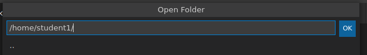
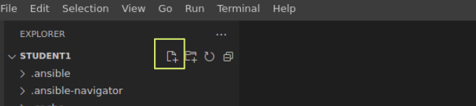

# 演習 1.1: bigip_device_info モジュールの使用

**他の言語でもお読みいただけます** : [English](README.md)、 [日本語](README.ja.md).

## 目次

- [目的](#objective)  - [ガイド](#guide)  - [Playbook の出力](#playbook-output)  -
[ソリューション](#solution)  - [より高度な操作のために](#going-further)

# 目的

[BIG-IP Info module](https://docs.ansible.com/ansible/latest/collections/f5networks/f5_modules/bigip_device_info_module.html) を使用して F5 BIG-IP デバイスからファクト（便利な情報）を取得し、[debug module](https://docs.ansible.com/ansible/latest/modules/debug_module.html) を使用してターミナルウィンドウに表示する方法を説明します。  

# ガイド

探索/ラボセットアップ演習で説明されているように、 VSCode ターミナルを開きます。ホームディレクトリーにいることを確認してください



## ステップ 1:

VSCode を使用して、左側のペインの新規ファイルアイコンをクリックして、`bigip-info.yml` という名前の新しいファイルを作成します。




## ステップ 2:

Ansible Playbook は **YAML** ファイルです。YAML
は構造化されたエンコーディング形式であり、人間が非常に読みやすくなっています (JSON 形式のサブセットとは異なり)。

次のプレイ定義を `bigip-info.yml` に入力します。

``` yaml
---
- name: GRAB F5 FACTS
  hosts: f5
  connection: local
  gather_facts: false
```

- ファイル上部の `---` は、これが YAML ファイルであることを示しています。
- `hosts: f5` は、プレイが F5 BIG-IP デバイスでのみ実行されることを示します
- `connection: local` は、（自身に SSH 接続するのではなく）ローカルで実行するように Playbook に指示します
- `gather_facts: no` はファクト収集を無効にします。


## ステップ 3

次に、最初の `task` を追加します。このタスクは、`bigip_device_info` モジュールを使用して BIG-IP
デバイスから有用な情報を取得します。


``` yaml
  tasks:
    - name: COLLECT BIG-IP FACTS
      f5networks.f5_modules.bigip_device_info:
        gather_subset:
          - system-info
        provider:
          server: "{{private_ip}}"
          user: "{{ansible_user}}"
          password: "{{ansible_password}}"
          server_port: 8443
          validate_certs: false
      register: device_facts
```


>プレイはタスクのリストです。タスクとモジュールには 1:1 の相関があります。Ansible モジュールは再利用可能なスタンドアロンのスクリプトで、Ansible API または ansibleやansible-playbook プログラムで使用できます。これらは、終了する前に JSON 文字列を stdout に出力して Ansible に情報を返します。

- `name: COLLECT BIG-IP FACTS` は、ターミナル出力に表示されるユーザー定義の説明です。  -
`bigip_device_info:` は、使用するモジュールをタスクに指示します。`register`
以外は、すべてモジュールのドキュメントページで定義されるモジュールパラメーターです。  - `gather_subset: system_info`
パラメーターは、システムレベルの情報だけを取得することをモジュールに指示します。  - `provider:` パラメーターは、BIG-IP
の接続詳細のグループです。  - `server: "{{private_ip}}"` パラメーターは、F5 BIG-IP IP
アドレスに接続するようにモジュールに指示します。このアドレスは、インベントリーの変数 `private_ip` として保存されます - `user:
"{{ansible_user}}"` パラメーターは、F5 BIG-IP デバイスにログインするためのユーザー名をモジュールに指示します -
`password: "{{ansible_password}}"` パラメーターは、F5 BIG-IP
デバイスにログインするためのパスワードをモジュールに指示します - `server_port: 8443` パラメーターは、F5 BIG-IP
デバイスに接続するためのポートをモジュールに指示します。8443
は、このラボで使用されるポートです。ただし、デプロイメントによって異なる場合があります。  - `validate_certs: false`
パラメーターは、SSL 証明書を検証しないようにモジュールに指示します。これはラボなので、デモ目的のためにのみ使用されます。  - `register:
device_facts` は、出力を変数 bigip_device_info に保存するようにタスクに指示します

## ステップ 4

次に、2 番目の `task` を上記に追加します。このタスクは `debug` モジュールを使用して、ファクトを登録した device_facts
変数からの出力を出力します。


```yaml
    - name: DISPLAY COMPLETE BIG-IP SYSTEM INFORMATION
      debug:
        var: device_facts
```


- `name: COMPLETE BIG-IP SYSTEM INFORMATION` は、ターミナル出力に表示されるユーザー定義の説明です。  -
`debug:` は、デバッグモジュールを使用するようにタスクに指示します。  - `var: device_facts`
パラメーターは、モジュールに変数 bigip_device_info を表示するように指示します。

ファイルを保存して、エディターを終了します。

## ステップ 5

Playbook を実行します。コントロールホストの VS Code サーバーでターミナルを開き、以下を実行します。

```
[student1@ansible ~]$ ansible-navigator run bigip-info.yml --mode stdout
```

出力は次のようになります。
``` yaml
[student1@ansible ~]$ ansible-navigator run bigip-info.yml --mode stdout

PLAY [GRAB F5 FACTS] **********************************************************

TASK [COLLECT BIG-IP FACTS] ***************************************************
ok: [f5]

TASK [DISPLAY COMPLETE BIG-IP SYSTEM INFORMATION] *****************************
ok: [f5] =>
  device_facts:
    ansible_facts:
      discovered_interpreter_python: /usr/libexec/platform-python
    changed: false
    failed: false
    queried: true
    system_info:
      base_mac_address: 02:04:cc:f9:26:3c
      chassis_serial: dc9c21ec-8b80-ff90-87324c84c43b
      hardware_information:
      - model: Intel(R) Xeon(R) CPU E5-2676 v3 @ 2.40GHz
        name: cpus
        type: base-board
        versions:
        - name: cache size
          version: 30720 KB
        - name: cores
          version: 2  (physical:2)
        - name: cpu MHz
          version: '2400.052'
        - name: cpu sockets
          version: '1'
        - name: cpu stepping
          version: '2'
      marketing_name: BIG-IP Virtual Edition
      package_edition: Point Release 4
      package_version: Build 0.0.5 - Tue Jun 16 14:26:18 PDT 2020
      platform: Z100
      product_build: 0.0.5
      product_build_date: Tue Jun 16 14:26:18 PDT 2020
      product_built: 200616142618
      product_changelist: 3337209
      product_code: BIG-IP
      product_jobid: 1206494
      product_version: 13.1.3.4
      time:
        day: 19
        hour: 17
        minute: 11
        month: 10
        second: 2
        year: 2020
      uptime: 4465

PLAY RECAP ********************************************************************
f5                         : ok=2    changed=0    unreachable=0    failed=0
```
## ステップ 6

最後に、収集したファクトからさらに具体的な情報を取得するために、上記の Playbook にさらに 2 つのタスクを追加します。


```yaml

    - name: DISPLAY ONLY THE MAC ADDRESS
      debug:
        var: device_facts['system_info']['base_mac_address']

    - name: DISPLAY ONLY THE VERSION
      debug:
        var: device_facts['system_info']['product_version']
```


- `var: device_facts['system_info']['base_mac_address']` は、Big-IP デバイスの
Management IP の MAC アドレスを表示します -
`device_facts['system_info']['product_version']` は、BIG-IP
デバイスの製品バージョンを表示します。

>bigip_device_info モジュールは構造化データで有用な情報を返すため、正規表現やフィルターを使用せずに特定の情報を簡単に取得することができます。ファクトモジュールは、特定のデバイス情報を取得するための非常に強力なツールです。取得した情報は、後続のタスクや、動的なドキュメント（レポート、csv ファイル、マークダウン）の作成に使用できます。

## ステップ 7

Playbook を実行します。ファイルを保存し、コントロールホストの VS Code のターミナルウィンドウを使用し、以下を実行します。

```
[student1@ansible ~]$ ansible-navigator run bigip-info.yml --mode stdout
```

# Playbook の出力

出力は次のようになります。


```yaml
[student1@ansible ~]$ ansible-navigator run bigip-info.yml --mode stdout

PLAY [GRAB F5 FACTS] **********************************************************

TASK [COLLECT BIG-IP FACTS] ***************************************************
ok: [f5]

TASK [DISPLAY COMPLETE BIG-IP SYSTEM INFORMATION] *****************************
ok: [f5] =>
  device_facts:
    ansible_facts:
      discovered_interpreter_python: /usr/libexec/platform-python
    changed: false
    failed: false
    queried: true
    system_info:
      base_mac_address: 02:04:cc:f9:26:3c
      chassis_serial: dc9c21ec-8b80-ff90-87324c84c43b
      hardware_information:
      - model: Intel(R) Xeon(R) CPU E5-2676 v3 @ 2.40GHz
        name: cpus
        type: base-board
        versions:
        - name: cache size
          version: 30720 KB
        - name: cores
          version: 2  (physical:2)
        - name: cpu MHz
          version: '2400.052'
        - name: cpu sockets
          version: '1'
        - name: cpu stepping
          version: '2'
      marketing_name: BIG-IP Virtual Edition
      package_edition: Point Release 4
      package_version: Build 0.0.5 - Tue Jun 16 14:26:18 PDT 2020
      platform: Z100
      product_build: 0.0.5
      product_build_date: Tue Jun 16 14:26:18 PDT 2020
      product_built: 200616142618
      product_changelist: 3337209
      product_code: BIG-IP
      product_jobid: 1206494
      product_version: 13.1.3.4
      time:
        day: 19
        hour: 17
        minute: 11
        month: 10
        second: 2
        year: 2020
      uptime: 4465

TASK [DISPLAY ONLY THE MAC ADDRESS] *******************************************
ok: [f5] =>
  "device_facts['system_info']['base_mac_address']": "0a:54:53:51:86:fc"

TASK [DISPLAY ONLY THE VERSION] ***********************************************
ok: [f5] =>
  "device_facts['system_info']['product_version']": "13.1.3.4"

PLAY RECAP ********************************************************************
f5                         : ok=4    changed=0    unreachable=0    failed=0
```


# ソリューション

完成した Ansible Playbook
が、回答キーとしてここで提供されています。[bigip-info.yml](https://github.com/network-automation/linklight/blob/master/exercises/ansible_f5/1.1-get-facts/bigip-info.yml)
を表示するには、ここをクリックしてください。

# より高度な操作のために

この追加演習では、`tags: debug` パラメーター（タスクレベルで）を既存のデバッグタスクに追加します。

```yaml
    - name: DISPLAY COMPLETE BIG-IP SYSTEM INFORMATION
      debug:
        var: device_facts
      tags: debug
```

`--skip-tags-debug` コマンドラインオプションを使用して、Playbook を再実行します。

```
ansible-navigator run bigip-info.yml --skip-tags=debug --mode stdout
```

Ansible Navigator は、`DISPLAY COMPLETE BIG-IP SYSTEM INFORMATION` タスクを省略して 3
つのタスクのみを実行します。

You have finished this exercise.  [Click here to return to the lab
guide](../README.md)
