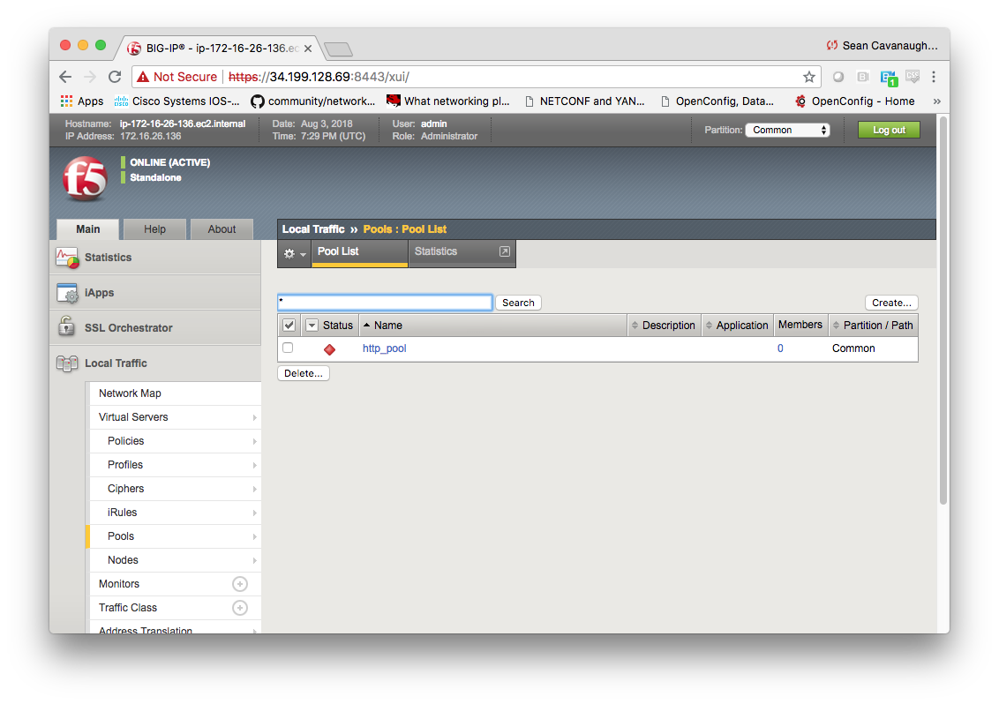

# Exercise 1.3 - Adding a load balancing pool

**Read this in other languages**:  [English](README.md),   [日本語](README.ja.md).

## Table of Contents

- [Objective](#objective)
- [Guide](#guide)
- [Playbook Output](#playbook-output)
- [Solution](#solution)
- [Verifying the Solution](#verifying-the-solution)

# Objective

Demonstrate use of the [BIG-IP pool module](https://docs.ansible.com/ansible/latest/modules/bigip_pool_module.html) to configure a load balancing pool in BIG-IP device.  A load balancing pool is a logical set of devices, such as web servers, that you group together to receive and process traffic.

# Guide

## Step 1:

Using your text editor of choice create a new file called `bigip-pool.yml`.

```
[student1@ansible ~]$ nano bigip-pool.yml
```

>`vim` and `nano` are available on the control node, as well as Visual Studio and Atom via RDP

## Step 2:

Enter the following play definition into `bigip-pool.yml`:

``` yaml
---
- name: BIG-IP SETUP
  hosts: lb
  connection: local
  gather_facts: false
```

- The `---` at the top of the file indicates that this is a YAML file.
- The `hosts: lb`,  indicates the play is run only on the lb group.  Technically there only one F5 device but if there were multiple they would be configured simultaneously.
- `connection: local` tells the Playbook to run locally (rather than SSHing to itself)
- `gather_facts: false` disables facts gathering.  We are not using any fact variables for this playbook.

Do not exit the editor yet.

## Step 3

Next, append the first `task` to above playbook. This task will use the `bigip_pool` module configure the two RHEL web servers as nodes on the BIG-IP F5 load balancer.

<!--  -->

``` yaml
  tasks:

  - name: CREATE POOL
    bigip_pool:
      provider:
        server: "{{private_ip}}"
        user: "{{ansible_user}}"
        password: "{{ansible_ssh_pass}}"
        server_port: 8443
        validate_certs: no
      name: "http_pool"
      lb_method: "round-robin"
      monitors: "/Common/http"
      monitor_type: "and_list"
```

<!--  -->

- `name: CREATE POOL` is a user defined description that will display in the terminal output.
- `bigip_pool:` tells the task which module to use.
- The `server: "{{private_ip}}"` parameter tells the module to connect to the F5 BIG-IP IP address, which is stored as a variable `private_ip` in inventory
- The `provider:` parameter is a group of connection details for the BIG-IP.
- The `user: "{{ansible_user}}"` parameter tells the module the username to login to the F5 BIG-IP device with
- The `password: "{{ansible_ssh_pass}}"` parameter tells the module the password to login to the F5 BIG-IP device with
- The `server_port: 8443` parameter tells the module the port to connect to the F5 BIG-IP device with
- The `name: "http_pool"` parameter tells the module to create a pool named http_pool
- The `lb_method: "round-robin"` parameter tells the module the load balancing method will be round-robin.  A full list of methods can be found on the documentation page for bigip_pool.
- The `monitors: "/Common/http"` parameter tells the module the that the http_pool will only look at http traffic.
- The `monitor_type: "and_list"` ensures that all monitors are checked.
- The `validate_certs: "no"` parameter tells the module to not validate SSL certificates.  This is just used for demonstration purposes since this is a lab.

Save the file and exit out of editor

## Step 4

Run the playbook - exit back into the command line of the control host and execute the following:

```
[student1@ansible ~]$ ansible-playbook bigip-pool.yml
```

# Playbook Output

The output will look as follows.

```yaml
[student1@ansible ~]$ ansible-playbook bigip-pool.yml

PLAY [BIG-IP SETUP] ************************************************************

TASK [CREATE POOL] *************************************************************
changed: [f5]

PLAY RECAP *********************************************************************
f5                         : ok=1    changed=1    unreachable=0    failed=0
```

# Solution

The finished Ansible Playbook is provided here for an Answer key.  Click here: [bigip-pool.yml](https://github.com/network-automation/linklight/blob/master/exercises/ansible_f5/1.3-add-pool/bigip-pool.yml).

# Verifying the Solution

Login to the F5 with your web browser to see what was configured.  Grab the IP information for the F5 load balancer from the lab_inventory/hosts file, and type it in like so: https://X.X.X.X:8443/

Login information for the BIG-IP:
- username: admin
- password: **provided by instructor, defaults to ansible**

The load balancer pool can be found by navigating the menu on the left.  Click on Local Traffic-> then click on Pools.


You have finished this exercise.  [Click here to return to the lab guide](../README.md)
