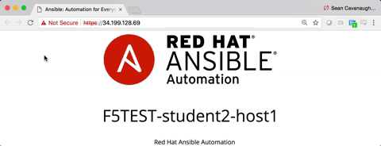

# 演習 1.5 - Virtual Server の追加

**Read this in other languages**:  [English](README),   [日本語](README.ja.md).

## 目次

- [目的](#目的)
- [解説](#解説)
- [Playbook の出力](#Playbookの出力)
- [解答](#解答)
- [確認](#確認)

# 目的

本演習では、[BIG-IP virtual server module](https://docs.ansible.com/ansible/latest/modules/bigip_virtual_server_module.html) を使って、BIG-IPにVirtual Server を設定します。Virtual Server とは、IPとポート番号の組み合わせです。

# 解説

## Step 1:

テキストエディタを使って、`bigip-virtual-server.yml` というファイルを新規作成します。

```
[student1@ansible ~]$ nano bigip-virtual-server.yml
```

>`vim` と `nano` はコントロールノード上で利用可能です。RDP経由でのVisual Studio と Atom も同様です。

## Step 2:

Ansible のプレイブックは **YAML** 形式のファイルです。YAMLは構造化されたフォーマットで、非常に読み易いものです。

以下の定義を `bigip-virtual-server.yml` に入力します :

``` yaml
---
- name: BIG-IP SETUP
  hosts: lb
  connection: local
  gather_facts: false
```

- このファイルの最初の `---` は、このファイルがYAMLであることを示します。
- `hosts: lb` はこのプレイブックが lb グループのみで実行されることを示しています。 本演習では、BIG-IP機器は１つだけですが、もし複数台が設定されている場合には同時に設定されます。
- `connection: local` で、このプレイブックが（自分自身にSSH接続をするのではなく）ローカル実行されることを指示しています。
- `gather_facts: false` で、FACTの収集を無効化します。このプレイブックではFACT変数を使用しません。  

## Step 3

次に、タスクを追加します。このタスクは、`bigip-virtual-server` モジュールを使用して、BIG-IP上にVirtual Server を設定します。


``` yaml
---
- name: BIG-IP SETUP
  hosts: lb
  connection: local
  gather_facts: false

  tasks:

  - name: ADD VIRTUAL SERVER
    bigip_virtual_server:
      name: "vip"
      destination: "{{private_ip}}"
      port: "443"
      enabled_vlans: "all"
      all_profiles: ['http','clientssl','oneconnect']
      pool: "http_pool"
      snat: "Automap"
      provider:
        server: "{{private_ip}}"
        user: "{{ansible_user}}"
        password: "{{ansible_ssh_pass}}"
        server_port: "8443"
        validate_certs: "no"
```



>プレイブックは一連のタスクから成ります。タスクとモジュールは1：1の関係性があります。モジュールは、Ansible API やansible / ansible-playbook から利用可能で、再利用可能なスタンドアロンスクリプトです。実行結果は、JSON文字列として標準出力へ出力されます。

- `name: ADD VIRTUAL SERVER` ：　ユーザーが定義する説明文です。これは実行時に端末に表示されることになります。
- `bigip_virtual_server:` ：　使用するモジュールを宣言しています。
- `server: "{{private_ip}}"` ：　接続先となるBIG-IPのIPアドレスを指定します。これはインベントリ内で `private_ip` として登録されているものです。
- `user: "{{ansible_user}}"` ：　BIG-IP へログインするユーザー名を指定します。
- `password: "{{ansible_ssh_pass}}"` ：　BIG-IPへログインする際のパスワードを指定します。
- `server_port: 8443` ：　BIG-IPへ接続する際のポート番号を指定します。
- `name: "vip"` ： vip という名前のVirtual Server を作成することを指定します。
- `destination"` ： Virtual Server にIPアドレスを指定します。
- `port` ： Virtual Server がリッスンするポート番号を指定します。
- `enabled_vlans` ： Virtual Server が有効化されるVLANを指定します。
- `all_profiles` ： Virtual Server に全てのプロファイルをアサインします。
- `pool` ： Virtual Server に紐づけられるプールを指定します。
- `snat` ： Source NAT の指定をします。本演習では、Automap を設定しています。これにより、後段のWebサーバーへ送られるトラフィック（パケット）の送信元IPはBIG-IP自身のIPとなります。
- `validate_certs: "no"` ： （あくまで演習用ラボなので）SSL証明書の検証を行わないように設定します。  

## Step 4

プレイブックの実行 - コントロールホストのコマンドラインで以下を実行します。


```
[student1@ansible ~]$ ansible-playbook bigip-virtual-server.yml
```

# Playbook の出力

```yaml
[student1@ansible]$ ansible-playbook bigip-virtual-server.yml

PLAY [BIG-IP SETUP]*************************************************************

TASK [ADD VIRTUAL SERVER] ******************************************************
changed: [f5]

PLAY RECAP *********************************************************************
f5                         : ok=1    changed=1    unreachable=0    failed=0
```

# 解答

完成形のAnsible Playbook はこちらから参照可能です。 [bigip-virtual-server.yml](./bigip-virtual-server.yml).

# 確認

ブラウザでBIG-IPへログインして設定されたものを確認してみましょう。lab_inventory/hosts ファイルからBIG-IPのIPアドレスを確認して、https://X.X.X.X:8443/ のようにアクセスします。

BIG-IP へのログイン情報:
- username: admin
- password: admin

Virtual Serverは画面左のメニューから辿ることで確認できます。**Local Traffic** -> **Virtual Server** とクリックします。以下のスクリーンショットを参考にしてください。


## Webサーバーの確認

それぞれのWebサーバー上ではApache HTTPD が実行されています。演習 1.1 から 1.5 までで、このWebサーバーからなるプールの負荷分散のセットアップが完了します。ブラウザで、BIG-IPのパブリックIPにアクセスします：

>ここでは、ポート番号は 8443ではなく 443 を指定します。 例： https://X.X.X.X:443/

ブラウザを再読み込みを行うたびに、**host1** と **host2** が入れかわり表示されるはずです。以下のアニメーションを参考にしてください。

>注：ブラウザの種類によっては、アニメーションが動かない可能性があります。

## もう一つの確認方法

ブラウザを使用する代わりに、コントロールノードのコマンドラインを使うことも可能です。`curl` コマンドを `--insecure` と `--silent` オプションをつけて、BIG-IPのパブリックIP:443 に対して実行します。出力結果を、割り当てられたstudent 番号（例：student5）を使って grep コマンドにかけることで確認しやすくなります。

```
[studentX@ansible ~]$ curl https://172.16.26.136:443 --insecure --silent | grep studentX
    <p>F5TEST-studentX-host1</p>
[studentX@ansible ~]$ curl https://172.16.26.136:443 --insecure --silent | grep studentX
    <p>F5TEST-studentX-host2</p>
[studentX@ansible ~]$ curl https://172.16.26.136:443 --insecure --silent | grep studentX
    <p>F5TEST-studentX-host1</p>
```


これで本演習は終わりです。[演習ガイドへ戻る](../README.ja.md.md)
