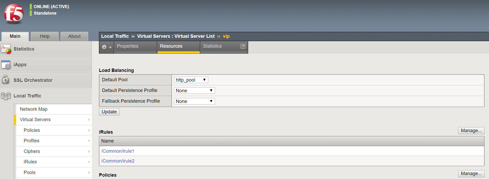

# 演習 1.6 - iRules の追加と Virtual Server へのアタッチ

**Read this in other languages**:  [English](README.md),   [日本語](README.ja.md).

## 目次

- [目的](#目的)
- [解説](#解説)
- [Playbook の出力](#Playbookの出力)
- [解答](#解答)
- [確認](#確認)

# 目的

本演習では、[BIG-IP irule module](https://docs.ansible.com/ansible/latest/modules/bigip_irule_module.html)を使って、iRulesをBIG-IPへ登録し、それをVirtual Server にアタッチします。

# 解説

## Step 1:

テキストエディタを使って、`bigip-irule.yml` というファイルを新規作成します。

```
[student1@ansible ~]$ nano bigip-irule.yml
```

>`vim` と `nano` はコントロールノード上で利用可能です。RDP経由でのVisual Studio と Atom も同様です。

## Step 2:

Ansible のプレイブックは **YAML** 形式のファイルです。YAMLは構造化されたフォーマットで、非常に読み易いものです。

以下の定義を `bigip-irule.yml` に記述します:

``` yaml
---
- name: BIG-IP SETUP
  hosts: lb
  connection: local
  gather_facts: false
```

- このファイルの最初の `---` は、このファイルがYAMLであることを示します。
- `hosts: lb` はこのプレイブックが lb グループのみで実行されることを示しています。 本演習では、BIG-IP機器は１つだけですが、もし複数台が設定されている場合には同時に設定されます。
- `connection: local` で、このプレイブックが（自分自身にSSH接続をするのではなく）ローカル実行されることを指示しています。
- `gather_facts: false` で、FACTの収集を無効化します。このプレイブックではFACT変数を使用しません。  

## Step 3

２つのダミーのiRules を作成します。それぞれ、'irule1' 'irule2' という名前にします。

```
[student1@ansible ~]$ nano irule1

when HTTP_REQUEST {
       log local0. "Accessing iRule1"
}

```
ファイルを保存します。

```
[student1@ansible ~]$ nano irule2

when HTTP_REQUEST {
       log local0. "Accessing iRule2"
}

```
ファイルを保存します。

## Step 4

次に、タスクを追加します。このタスクは、`bigip-irule` モジュールを使用して、BIG-IPにiRulesを登録します。


``` yaml
---
- name: BIG-IP SETUP
  hosts: lb
  connection: local
  gather_facts: false

  vars:
   irules: ['irule1','irule2']

  tasks:

  - name: ADD iRules
    bigip_irule:
      provider:
        server: "{{private_ip}}"
        user: "{{ansible_user}}"
        password: "{{ansible_ssh_pass}}"
        server_port: "8443"
        validate_certs: "no"
      module: "ltm"
      name: "{{item}}"
      content: "{{lookup('file','{{item}}')}}"
    loop: "{{irules}}"
```


>プレイブックは一連のタスクから成ります。タスクとモジュールは1：1の関係性があります。モジュールは、Ansible API やansible / ansible-playbook から利用可能で、再利用可能なスタンドアロンスクリプトです。実行結果は、JSON文字列として標準出力へ出力されます。

- 変数 `'irules'` ： ２つのiRules（つまり、'irule1'と'irule2'）を設定します。
- `name: ADD iRules` ：　ユーザーが定義する説明文です。これは実行時に端末に表示されることになります。
- `bigip_irule:` ：　使用するモジュールを宣言しています。
- `server: "{{private_ip}}"` ：　接続先となるBIG-IPのIPアドレスを指定します。これはインベントリ内で `private_ip` として登録されているものです。
- `user: "{{ansible_user}}"` ：　BIG-IP へログインするユーザー名を指定します。
- `password: "{{ansible_ssh_pass}}"` ：　BIG-IPへログインする際のパスワードを指定します。
- `server_port: 8443` ：　BIG-IPへ接続する際のポート番号を指定します。
- `module: ltm` ： iRulesがBIG-IPのどの機能で使用するかを指定します。本演習では ltm を指定します。
- `name: "{{item}}"` ：  'irule1'と 'irule2' という名前の iRules を登録することを指定します。
- `content: "{{lookup('file','{{item}}')}}" ` ： [lookup plugin](https://docs.ansible.com/ansible/latest/plugins/lookup.html)を使って、iRulesに追加するコンテンツを指定します。
- `validate_certs: "no"` ： （あくまで演習用ラボなので）SSL証明書の検証を行わないように設定します。
- `loop:` 与えられた iRules のリストに対してタスクを実行するように指定します。

## Step 5

次に、タスクを実行します。このタスクは `bigip_virtual_server` モジュールを使って、BIG-IP上のVirtual Server へiRules をアタッチします。


``` yaml
---
- name: BIG-IP SETUP
  hosts: lb
  connection: local
  gather_facts: false

  vars:
   irules: ['irule1','irule2']

  tasks:

  - name: ADD iRules
    bigip_irule:
      provider:
        server: "{{private_ip}}"
        user: "{{ansible_user}}"
        password: "{{ansible_ssh_pass}}"
        server_port: "8443"
        validate_certs: "no"
      module: "ltm"
      name: "{{item}}"
      content: "{{lookup('file','{{item}}')}}"
    loop: "{{irules}}"

  - name: ATTACH iRules TO EXISTING VIRTUAL SERVER
    bigip_virtual_server:
      provider:
        server: "{{private_ip}}"
        user: "{{ansible_user}}"
        password: "{{ansible_ssh_pass}}"
        server_port: "8443"
        validate_certs: "no"
      name: "vip"
      irules: "{{irules}}"
```



- `irules: "{{irules}}` ： Virtual ServerにアタッチするiRulesのリストです。 'irule1'と'irule2' となります。

参考：[BIG-IP virtual_Server module](https://docs.ansible.com/ansible/latest/modules/bigip_irule_module.html)
or [演習 1.5](./1.5-add-virtual-server/bigip-virtual-server.yml)

## Step 6

プレイブックの実行 - コントロールホストのコマンドラインで以下を実行します。

```
[student1@ansible ~]$ ansible-playbook bigip-irule.yml
```

# Playbook の出力

```yaml
[student1@ansible]$ ansible-playbook bigip-irule.yml

PLAY [BIG-IP SETUP] *********************************************************************************************************************************

TASK [ADD iRules] *********************************************************************************************************************************
changed: [f5] => (item=irule1)
changed: [f5] => (item=irule2)

TASK [ATTACH iRules TO VIRTUAL SERVER] **********************************************************************************************************************
changed: [f5]

PLAY RECAP *********************************************************************************************************************************
f5                         : ok=2    changed=2    unreachable=0    failed=0

```

# 解答

完成形のAnsible Playbook はこちらから参照可能です。  [bigip-irule.yml](./bigip-irule.yml).

# 確認

設定された **iRules と Virtual Server** を確認するために, ブラウザでBIG-IPへログインします。  

lab_inventory/hosts ファイルからBIG-IPのIPアドレスを確認して、https://X.X.X.X:8443/ のようにアクセスします。

BIG-IP へのログイン情報:
- username: admin
- password: admin

登録されたiRulesの一覧は、画面左のメニューから辿ることで確認できます。Local Traffic -> iRules -> iRules List とクリックします。

Virtual Server の詳細の確認は、Local Traffic-> Virtual Servers とクリックし 'resoruces' タブを参照することで、iRulesがVirtual Serverにアタッチされていることが確認できます。


これで本演習は終わりです。[演習ガイドへ戻る](../README.ja.md)
