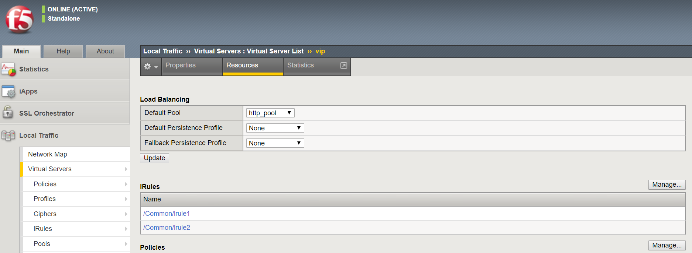

# Exercise 1.6: Using the bigip_irule module

**Read this in other languages**:  [English](README.md),   [日本語](README.ja.md).

## Table of Contents

- [Objective](#objective)
- [Guide](#guide)
- [Playbook Output](#playbook-output)
- [Solution](#solution)
- [Verifying the Solution](#verifying-the-solution)

# Objective

Demonstrate use of the [BIG-IP irule module](https://docs.ansible.com/ansible/latest/modules/bigip_irule_module.html) to add iRules to a BIG-IP and then attach the iRules to a virtual server.

# Guide

## Step 1:

Using your text editor of choice create a new file called `bigip-irule.yml`.

```
[student1@ansible ~]$ nano bigip-irule.yml
```

>`vim` and `nano` are available on the control node, as well as Visual Studio and Atom via RDP

## Step 2:

Ansible playbooks are **YAML** files. YAML is a structured encoding format that is also extremely human readable (unlike it's subset - the JSON format).

Enter the following play definition into `bigip-irule.yml`:

``` yaml
---
- name: BIG-IP SETUP
  hosts: lb
  connection: local
  gather_facts: false
```

- The `---` at the top of the file indicates that this is a YAML file.
- The `hosts: f5`,  indicates the play is run only on the F5 BIG-IP device
- `connection: local` tells the Playbook to run locally (rather than SSHing to itself)
- `gather_facts: no` disables facts gathering.  We are not using any fact variables for this playbook.

Save and Exit out of editor.

## Step 3

Create two dummy irules with the names 'irule1' and 'irule2'

```
[student1@ansible ~]$ nano irule1

when HTTP_REQUEST {
       log local0. "Accessing iRule1"
}

```
Save the file

```
[student1@ansible ~]$ nano irule2

when HTTP_REQUEST {
       log local0. "Accessing iRule2"
}

```
Save the file

## Step 4

Next, re-open `bigip-irule.yml` and add the `task`. This task will use the `bigip-irule` to add irules to the BIG-IP.


``` yaml
  vars:
   irules: ['irule1','irule2']

  tasks:

  - name: ADD iRules
    bigip_irule:
      provider:
        server: "{{private_ip}}"
        user: "{{ansible_user}}"
        password: "{{ansible_ssh_pass}}"
        server_port: 8443
        validate_certs: no
      module: "ltm"
      name: "{{item}}"
      content: "{{lookup('file','{{item}}')}}"
    with_items: "{{irules}}"
```



>A play is a list of tasks. Tasks and modules have a 1:1 correlation.  Ansible modules are reusable, standalone scripts that can be used by the Ansible API, or by the ansible or ansible-playbook programs. They return information to ansible by printing a JSON string to stdout before exiting.

- `A variable 'irules'` is a list defined with two irules => 'irule1' and irule2'
- `name: ADD iRules` is a user defined description that will display in the terminal output.
- `bigip_irule:` tells the task which module to use.
- The `server: "{{private_ip}}"` parameter tells the module to connect to the F5 BIG-IP IP address, which is stored as a variable `private_ip` in inventory
- The `provider:` parameter is a group of connection details for the BIG-IP.
- The `user: "{{ansible_user}}"` parameter tells the module the username to login to the F5 BIG-IP device with
- The `password: "{{ansible_ssh_pass}}"` parameter tells the module the password to login to the F5 BIG-IP device with
- The `server_port: 8443` parameter tells the module the port to connect to the F5 BIG-IP device with
- The `module: ltm` paramters tells the module which BIG-IP module(ltm) the iRule is for
- The `name: "{{item}}"` parameter tells the module to create an iRule with the name 'irule1' and 'irule2'
- The `content: "{{lookup('file','{{item}}')}}" ` parameter tells the module what content to add to the iRule using the [lookup plugin](https://docs.ansible.com/ansible/latest/plugins/lookup.html)
- The `validate_certs: "no"` parameter tells the module to not validate SSL certificates.  This is just used for demonstration purposes since this is a lab.
- `loop:` tells the task to loop over the provided list.  The list in this case is the list of iRules.

Do not exit the file yet.

## Step 5

Next, append the `task` to above playbook. This task will use the `bigip_virtual_server` to add attach the iRules to a Virtual Server on the BIG-IP.


``` yaml


  - name: ATTACH iRules TO VIRTUAL SERVER
    bigip_virtual_server:
      provider:
        server: "{{private_ip}}"
        user: "{{ansible_user}}"
        password: "{{ansible_ssh_pass}}"
        server_port: 8443
        validate_certs: no
      name: "vip"
      irules: "{{irules}}"
```



- `irules: "{{irules}}` is a list of irules to be attached to the virtual server 'irule1' and 'irule2'

Details of [BIG-IP virtual_Server module](https://docs.ansible.com/ansible/latest/modules/bigip_irule_module.html)
or reference [Exercise 1.5](https://github.com/network-automation/linklight/blob/master/exercises/ansible_f5/1.5-add-virtual-server/bigip-virtual-server.yml)

Save the file and exit out of editor.

## Step 6

Run the playbook - exit back into the command line of the control host and execute the following:

```
[student1@ansible ~]$ ansible-playbook bigip-irule.yml
```

# Playbook Output

```yaml
[student1@ansible]$ ansible-playbook bigip-irule.yml

PLAY [BIG-IP SETUP] *********************************************************************************************************************************

TASK [ADD iRules] *********************************************************************************************************************************
changed: [f5] => (item=irule1)
changed: [f5] => (item=irule2)

TASK [ATTACH iRules TO VIRTUAL SERVER] **********************************************************************************************************************
changed: [f5]

PLAY RECAP *********************************************************************************************************************************
f5                         : ok=2    changed=2    unreachable=0    failed=0

```

# Solution

The finished Ansible Playbook is provided here for an Answer key.  Click here: [bigip-irule.yml](https://github.com/network-automation/linklight/blob/master/exercises/ansible_f5/1.6-add-irules/bigip-irule.yml).

# Verifying the Solution

To see the configured **iRules and Virtual Server**, login to the F5 load balancer with your web browser.  

>Grab the IP information for the F5 load balancer from the `/home/studentX/networking_workshop/lab_inventory/hosts` file, and type it in like so: https://X.X.X.X:8443/

Login information for the BIG-IP:
- username: admin
- password: **provided by instructor** defaults to ansible

The list of iRules can be found by navigating the menu on the left. Click on Local Traffic-> iRules -> iRules List.

To view the Virtual Server click on Local Traffic-> Virtual Servers, click on the Virtual Server then click on the 'resoruces' tab and view the iRules attached to the Virtual Server


You have finished this exercise.  [Click here to return to the lab guide](../README.md)
