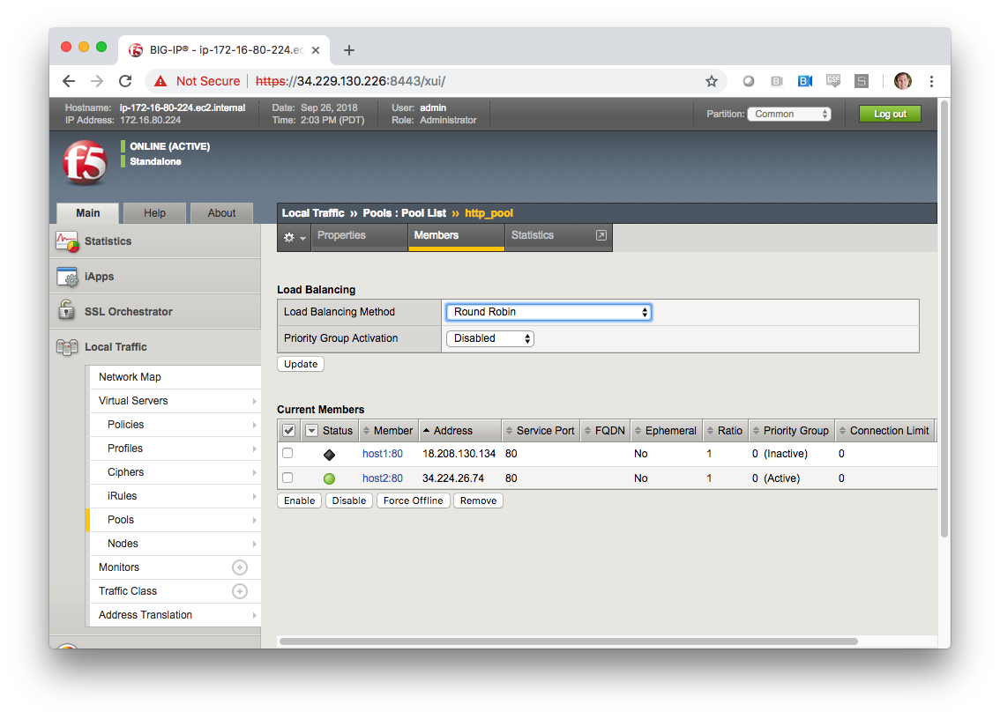

# Exercise 2.0 - Disabling a pool member

**Read this in other languages**:  [English](README.md),   [日本語](README.ja.md).

## Table of Contents

- [Objective](#objective)
- [Guide](#guide)
- [Playbook Output](#playbook-output)
- [Solution](#solution)

# Objective

For this last exercise instead of prescriptive step-by-step walkthrough a framework of objectives with hints for each step will be provided.  

Demonstrate the removal of a node from the pool.  Build a Playbook that:
  - Retrieve Facts from BIG-IP for the pools present on the BIG-IP (in our example only one pool is present)
  - Display pools available
  - Store the pool name as a fact
  - Display all the pool members that belong to the pool => IP and port information to the terminal window
  - Prompt the user to disable a particular member or disable all members of the pool
  - Force the appropriate pool members offline

# Guide

## Step 1:

Using your text editor of choice create a new file called `disable-pool-member.yml`.

<!--  -->
```
[student1@ansible ~]$ nano disable-pool-member.yml
```
<!--  -->

>`vim` and `nano` are available on the control node, as well as Visual Studio and Atom via RDP

## Step 2:

Enter the following play definition into `disable-pool-member.yml`:

<!--  -->
``` yaml
---

- name:  Disabling a pool member
  hosts: f5
  connection: local
  gather_facts: false

```
<!--  -->

## Step 3

Add a tasks section and then set a fact for the provider. Once you set the provider you can re-use this key in future tasks instead of giving the server/user/password/server_port and validate_certs info to each task.

<!--  -->
```
---
- name: "Disabling a pool member"
  hosts: lb
  gather_facts: false
  connection: local

  tasks:
  - name: Setup provider
    set_fact:
     provider:
      server: "{{private_ip}}"
      user: "{{ansible_user}}"
      password: "{{ansible_ssh_pass}}"
      server_port: "8443"
      validate_certs: "no"
```
<!--  -->

Now in the next task you can use provider as follows:

<!--  -->
```
bigip_device_info:
  provider: "{{provider}}"
  gather_subset:
  - ltm-pools
```
<!--  -->

You DO NOT need to pass the server_ip/user/password etc. for each module going forward

```
---
- name: "Disabling a pool member"
  hosts: lb
  gather_facts: false
  connection: local
```

Next, add a task for the objective listed below:

  - Retrieve Facts from BIG-IP for the subset ltm-pools

HINT: Try using the bigip_device_info module from <a href="../1.1-get-facts" style="color: #000000">Exercise 1.1</a>

## Step 5

Next, add a task for the objective listed below:

  - Display the pool information to the terminal window

HINT:
Find a way to `loop` on the output from the above step. Remember to also use the <a href="https://docs.ansible.com/ansible/latest/modules/debug_module.html" style="color: #000000">debug module</a>

## Step 6

Next, add a task for the objective listed below:

  - Store the pool name as a fact

HINT: An easy way to set fact variables within a Playbook dynamically is using the <a href="https://docs.ansible.com/ansible/latest/modules/set_fact_module.html" style="color: #000000">set_fact module</a></span>

## Step 7

Next, add a task for the objective listed below:

  - Display members belonging to the pool

HINT:
Remember to use the <a href="https://docs.ansible.com/ansible/latest/modules/debug_module.html" style="color: #000000">debug</a></span> and refer <a href="../1.4-add-pool-members">Exercise 1.4</a>

## Step 8

Next, add a task for the objective listed below:

  - Prompt the user to enter a Host:Port to disable a particular member or 'all' to disable all members

HINT:
Use the <a href="https://docs.ansible.com/ansible/latest/user_guide/playbooks_prompts.html" style="color: #000000">prompts</a> module</a></span>

## Step 9
Next, add a task for the objective listed below:

  - Read the prompt information and disable all members or a single member based on the input from the user

HINT:
Remember to use <a href="https://docs.ansible.com/ansible/latest/user_guide/playbooks_conditionals.html" style="color: #000000"> when conditions and loops</a> and [BIG-IP pool member module](https://docs.ansible.com/ansible/latest/modules/bigip_pool_member_module.html)

## Step 10
Run the playbook - exit back into the command line of the control host and execute the following:

```
[student1@ansible ~]$ ansible-playbook disable-pool-member.yml
```

# Playbook Output

The output will look as follows.

<!--  -->
```yaml
[student1@ansible ~]$ ansible-playbook disable-pool-member.yml

PLAY [Disabling a pool member] ******************************************************************************************************************************

TASK [Setup provider] *******************************************************************************************************************************
ok: [f5]

TASK [Query BIG-IP facts] ***********************************************************************************************************************************
changed: [f5]

TASK [Display Pools available] ******************************************************************************************************************************
ok: [f5] => (item=http_pool) => {
    "msg": "http_pool"
}

TASK [Store pool name in a variable] ************************************************************************************************************************
ok: [f5] => (item=None)
ok: [f5]

TASK [Show members belonging to pool http_pool] *************************************************************************************************************
ok: [f5] => (item=host1:80) => {
    "msg": "host1:80"
}
ok: [f5] => (item=host2:80) => {
    "msg": "host2:80"
}

TASK [pause] ************************************************************************************************************
[pause]
To disable a particular member enter member with format member_name:port
To disable all members of the pool enter 'all':
host1:80

TASK [Disable ALL pool members] ************************************************************************************************************************
skipping: [f5] => (item=host1:80)
skipping: [f5] => (item=host2:80)

TASK [Disable pool member host1:80] *************************************************************************************************************************
changed: [f5]

PLAY RECAP **************************************************************************************************************
f5                         : ok=7    changed=2    unreachable=0    failed=0
```
<!--  -->

# Solution
The solution will be provided by the instructor if you are stuck.  The GUI should show something similar to the following with a black diamond indicating the specified node was forced offline.



--
You have finished this exercise.  [Click here to return to the lab guide](../README.md)
