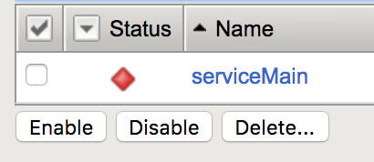
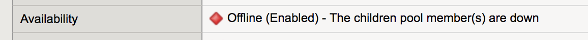
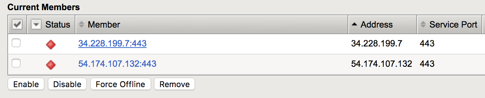

# 演習 3.1 - AS3 による変更運用

**Read this in other languages**:  [English](README.md),   [日本語](README.ja.md).

## 目次

- [目的](#目的)
- [解説](#解説)
- [Playbook の出力](#Playbookの出力)
- [解答](#解答)
- [確認](#確認)

# 目的

既存のWeb Application AS3テンプレートを変更します。既存のテンプレートには問題があり、serviceMainが赤色で表示されています。この問題を修正します。




# 解説

## Step 1:

問題を特定します。WebブラウザからF5にログインして、設定内容を確認します。

  1. `ServiceMain` をクリックして、ダウン状態となっている理由を確認します。
  2. テーブルの `Availability` フィールドを参照します。



  3. `Local Traffic` の` Pools` をクリックします。
  4. `app_pool` をクリックします。
  5. `Members` ボタンをクリックします。




原因はポート **443** です。2台のRHEL Webサーバはポート80のみで稼働するので、これがダウン状態の原因です。

## Step 2:

テキストエディタで新規ファイル `j2/as3_template.j2` を編集します:

>`vim` と`nano` がコントールノードで利用できます。もしくは RDP で接続して Visual Studio と Atom を利用することも可能です。

## Step 3:

ポート **443** をポート **80** に変更します。

この行を->


``` json
                "servicePort": 443,
```


以下のように変更します->


``` json
                "servicePort": 80,
```


## Step 4

Playbook の実行 - コマンドラインへ戻ったら以下のコマンドでPlaybookを実行してください:

```
[student1@ansible ~]$ ansible-playbook as3.yml
```

# Playbookの出力

以下は出力の例となります。


```yaml
[student1@ansible ~]$ ansible-playbook as3.yml

PLAY [Linklight AS3] ***********************************************************

TASK [Create AS3 JSON Body] ****************************************************
ok: [f5]

TASK [Push AS3] ****************************************************************
ok: [f5 -> localhost]

PLAY RECAP *********************************************************************
f5                         : ok=2    changed=0    unreachable=0    failed=0
```


# 解答

修正した Jinja2 テンプレートは [as3_template.j2](./j2/as3_template.j2) から参照できます。

# 確認

Webブラウザを使用してF5にログインし、設定内容を確認します。F5ロードバランサーのIP情報を `lab_inventory/hosts` ファイルから取得し、https://X.X.X.X:8443/のように入力します。


1. 左側のメニューにある `Local Traffic` をクリックします。
2. `Virtual Servers` をクリックします。
3. 右側の `Partition` という名前のドロップダウンメニューをクリックして、`WorkshopExample` を選択します。
4. 仮想サーバー `serviceMain` が表示されます。
5. この仮想サーバーは緑色（`Available (Enabled) - The virtual server is available`）で表示されます。
6. `app_pool` の `Pools` で、両方のWebサーバの `service_port` がポート **80** に設定されていることを確認します。

----

本演習は終了です。[Click here to return to the lab guide](../README.ja.md)
