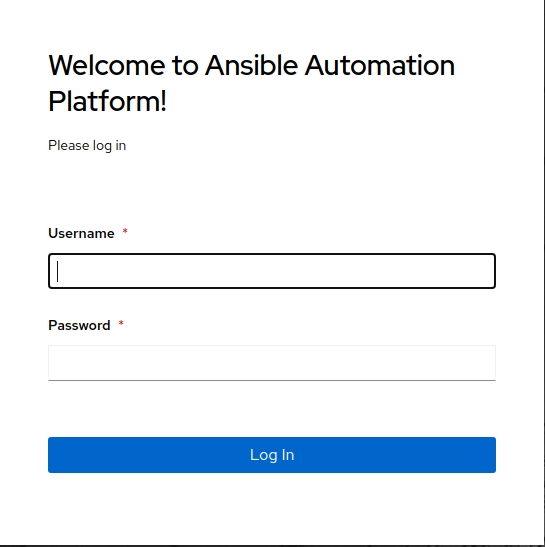
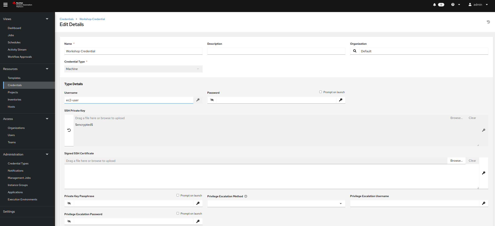
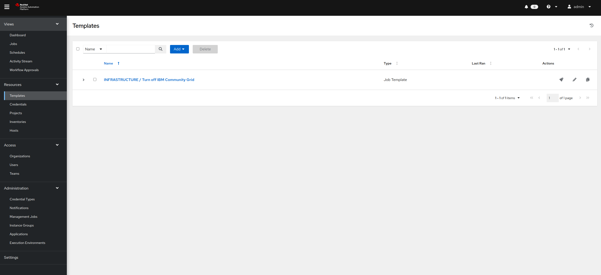

# 演習 4.0: Red Hat Ansible 自動コントローラーの調査

**他の言語でもお読みいただけます** : [English](README.md)、 [日本語](README.ja.md).

## 目次

- [目的](#objective)  - [ガイド](#guide)  - [重要なこと](#takeaways)  -
[完了](#complete)

# 目的

Ansible 自動コントローラーは Web
ベースのソリューションで、視覚的なダッシュボード、ロールベースのアクセス制御、ジョブスケジューリング、統合された通知、およびグラフィカルな在庫管理を使用して、IT
インフラストラクチャを一元化および制御することができます。Ansible 自動コントローラーには、Web UI に加えて、REST API および
CLI が含まれています。

このラボでは、ログインして、基本的な設定を実行します。この後のラボでこの設定を使用して、F5 BIG-IP デバイスに対して自動化タスクを実行します。この演習では、以下の項目について説明します。
- Ansible Automation Platform バージョンの判別
- 以下を見つけて理解:
  - **インベントリー**
  - **認証情報**
  - **プロジェクト**
  - **テンプレート**

# ガイド

## ステップ 1: Ansible Automation Platform へのログイン

Web ブラウザーを開き、Ansible コントロールノードの DNS 名を入力します

> たとえば、学習者に student1 ワークベンチが割り当てられ、そのワークショップ名が `durham-workshop` の場合、リンクは次のようになります。

    **https://student1.durham-workshop.rhdemo.io**

>このログイン情報は、クラスの開始時にインストラクターによって提供されます。

  - ユーザー名は `admin` -
パスワードはインストラクターから提供

ジョブダッシュボードにログインすると、以下に示すようにデフォルトのビューになります。  

1. ユーザーインターフェイスの右上にある **?** 情報ボタンをクリックし、続いて **About** をクリックします。

   

2. 次のようなウィンドウがポップアップ表示されます。

   

   Ansible 自動コントローラーのバージョンがここで提供されることに注意してください。

## ステップ 2: インベントリーの検証

Red Hat Ansible Controller がジョブを実行できるようにするには、インベントリーが必要です。インベントリーは、Ansible
インベントリーファイルと同じように、ジョブを起動できる一連のホストのコレクションです。さらに、Red Hat Ansible Controller
は、ServiceNow やInfoblox DDI などの既存の設定管理データベース (cmdb) を利用できます。

>Ansible Controller に関するインベントリーに関する情報は、[このドキュメント](https://docs.ansible.com/automation-controller/latest/html/userguide/inventories.html) を参照してください。

1. 左側のメニューバーの **RESOURCES** の下にある **Inventories** ボタンをクリックします。

   

2. **Inventories** セクションで `Workshop Inventory` をクリックします。

3. `Workshop Inventory` セクションの上部にある **HOSTS**
   ボタンをクリックします。ここで設定するホストが表示されます。いずれかのデバイスをクリックします。

4. ページ上部の `Workshop Inventory` リンクをクリックして、トップレベルのメニューに戻ります。

5. **GROUPS** をクリックします。ここでは、ホストのグループを設定できます。
   
   

## ステップ 3: ワークショッププロジェクトの検証

プロジェクトは、Ansible Playbook が Red Hat Ansible 自動コントローラーにインポートされる仕組みです。Playbook
および Playbook ディレクトリーを Ansible Tower サーバーのプロジェクトのベースパスに手動で配置するか、Controler
がサポートするソースコード管理 (SCM) システム (例: Git、Subversion、Mercurial 等) に Playbook
を配置することで、Playbook と Playbook ディレクトリーを管理できます。

> Controller のプロジェクトの詳細については、[ドキュメントを参照してください](https://docs.ansible.com/automation-controller/latest/html/userguide/projects.html)

1. 左側のメニューバーの **RESOURCES** の下にある **Projects** ボタンをクリックします。

   

2. **PROJECTS** セクションには、事前に設定されたプロジェクト `Ansible official demo project` が 1
   つあります。オブジェクトをクリックしてこれを開きます。

   このプロジェクトには `Git` がリストされていることに注意してください。これは、このプロジェクトが SCM に `Git` を使用していることを意味します。

   

3. `Ansible official demo project` セクションで、**SCM TYPE** ドロップダウンメニューをクリックします

   Git、Mercurial、Subversion が選択肢であることに注意してください。プロジェクトが引き続き正しく機能するように、選択を Git に戻します。

## ステップ 4: ワークションプの認証情報の検証

認証情報は、**Jobs**
をマシンに対して起動したり、インベントリーソースと同期したり、プロジェクトのコンテンツをバージョン管理システムからインポートしたりする際の認証用に、Red
Hat Ansible Automation Platform
によって使用されます。ワークショップでは、ネットワークデバイスへの認証に認証情報が必要です。

> 自動コントローラーの認証情報の詳細は、[ドキュメントを参照してください](https://docs.ansible.com/automation-controller/latest/html/userguide/credentials.html)。

1. 左側のメニューバーの **RESOURCES** の下にある **Credentials** ボタンをクリックします。

   

2. **CREDENTIALS** セクションには、2 つの事前に設定された認証情報 `Workshop Credential`
   があります。`Workshop Credential` をクリックします。

3. `Workshop Credential` で以下を確認します。
   
   - **CREDENTIAL TYPE** が `Machine` 認証情報である。
   - **USERNAME** が `ec2-user` に設定されている。
   - **PASSWORD** が `blank` である。この認証情報はパスワードの代わりにキーを使用します。
   - **SSH PRIVATE KEY** がすでに設定され、`ENCRYPTED` である。

   

## ステップ 5: ジョブテンプレートの検証

テンプレートまたはジョブテンプレートは、Ansible Playbook
の実行時に使用されるパラメーターを定義します。これらのパラメーターには、使用するプロジェクトやインベントリーなど、前述の要素が含まれます。さらに、ログレベルやプロセスフォークなどのパラメーターにより、Playbook
の実行をさらに細かく設定することができます。

1. 左側のメニューバーの **RESOURCES** セクションにある **Templates** ボタンをクリックします。

   

2. **TEMPLATES** セクションには、少なくとも 1 つ事前に設定されたジョブテンプレート `INFRASTRUCTURE / Turn
   off IBM Community Grid` があります。オブジェクトをクリックしてこれを開きます。

   

# 重要なこと

- Ansible には、Ansible Playbook
  を実行する対象としてのインベントリーが必要です。このインベントリーは、ユーザーがコマンドラインのみの Ansible
  プロジェクトで使用するものと同じです。
- Ansible 自動コントローラーは、`GitHub` を含む既存の SCM (ソースコード管理) と同期できます。
- Ansible 自動コントローラーは、SSH 秘密鍵やプレーンテキストパスワードなどの認証情報を保存および暗号化できます。Ansible
Automation Platform は、CyberArk や HashiCorp Vault
などの既存の認証情報ストレージシステムと同期することもできます - ジョブテンプレートは、Ansible Playbook
の実行時に使用されるパラメーターを定義します

# 完了

ラボ演習 4.0 を完了しました

これで、Ansible 自動コントローラーの使用を開始するために必要な認証情報、インベントリー、およびプロジェクトの 3
つのコンポーネントすべてを調べました。次の演習では、ジョブテンプレートを作成します。

[Click here to return to the Ansible Network Automation
Workshop](../README.md)
