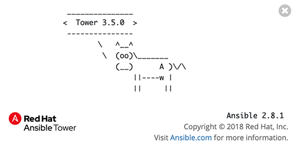

# 演習 4.0: Red Hat Ansible Tower環境の確認

**Read this in other languages**:  [English](README.md),   [日本語](README.ja.md).

## 目次
- [演習 4.0: Red Hat Ansible Tower環境の確認](#演習-4.0-Red-Hat-Ansible-Tower環境の確認)
  - [目次](#目次)
- [目的](#目的)
- [解説](#解説)
  - [Step 1: Ansible Tower にログイン](#Step-1-Ansible-Tower-にログイン)
  - [Step 2: Ansible Tower インベントリーの確認](#Step-2-Ansible-Tower-インベントリーの確認)
  - [Step 3: Ansible Tower プロジェクトの確認](#Step-3-Ansible-Tower-プロジェクトの確認)
  - [Step 4: Ansible Tower 認証情報の確認](#Step-4-Ansible-Tower-認証情報の確認)
  - [Step 5: Ansible Tower テンプレートの確認](#Step-5-Ansible-Tower-テンプレートの確認)
- [まとめ](#まとめ)
- [完了](#完了)

# 目的

Ansible Towerは、Ansibleの上で動作するWebベースのソリューションで、ソフトウェアの運用を簡素化しながら追加機能を提供します。

このラボでは、Towerにログインし基本的な構成を実行します。この基本的な構成は、後のラボで使用し、F5 BIG-IPに対して自動化タスクを実行します。この演習では次の内容を取り上げます:
- コントロールノードで実行されているAnsibleのバージョンの確認
- 検索と理解:
  - Ansible Tower **Inventories**
  - Ansible Tower **Credentials**
  - Ansible Tower **Projects**
  - Ansible Tower **Templates**

# 解説

## Step 1: Ansible Tower にログイン

Webブラウザーを開き、AnsibleコントロールノードのDNS名を入力します。

>たとえば、student1ワークベンチが割り当てられ、ワークショップ名が`durham-workshop`である場合は、次のようになります:

    **https://student1.durham-workshop.rhdemo.io**

>このログイン情報は、講師から提供されます。

- ユーザ名: `admin`
- パスワード: 講師から指示されたパスワード

ダッシュボードにログインすると、以下に示すようにデフォルトのビューになります。

1.  ユーザーインターフェースの右上にある **i** 情報ボタンをクリックします。

    

2.  次のようなウィンドウがポップアップします:

    

    ここでは、Ansible TowerバージョンとAnsible Engineバージョンの両方が提供されていることに注意してください。

## Step 2: Ansible Tower インベントリーの確認

Red Hat Ansible Towerがジョブを実行するには、インベントリーが必要です。インベントリは、Ansibleインベントリーファイルと同じように、ジョブを起動するホストのコレクションです。さらに、Red Hat Ansible Towerは、ServiceNowやInfoblox DDIなどの既存の構成管理データベース(cmdb)を利用できます。

>Ansible Towerに関するインベントリーの詳細については、 [こちらのドキュメントをご覧ください](https://docs.ansible.com/ansible-tower/latest/html/userguide/inventories.html)

1. 左側のメニューバーの **リソース** の下にある **インベントリー** ボタンをクリックします。

    

2. **インベントリー** の下にインベントリーがあります。  `Demo Inventory` をクリックしてください。

3. `Demo Inventory` の下にある **ホスト** ボタンをクリックします。ここには構成されたホストが表示されます。ホストの1つをクリックします。

4. ページ上部にある `Demo Inventory` をクリックし、トップレベルのメニューに戻ります。

5. **グループ** をクリックします。ここではホストのグループを設定できます。
       

## Step 3: Ansible Tower プロジェクトの確認

プロジェクトとは、Ansible PlaybookをRed Hat Ansible Towerにインポートする方法です。PlaybookとPlaybookディレクトリを管理するには、Ansible TowerサーバーのProject Base Pathに手動で配置するか、Git、Subversion、MercurialなどのTowerがサポートするソースコード管理（SCM）システムにPlaybookを配置します。

> Towerのプロジェクトの詳細については [こちらをご覧ください](https://docs.ansible.com/ansible-tower/latest/html/userguide/projects.html)

1. 左側のメニューバーの **リソース** の下にある **プロジェクト** ボタンをクリックします。

    

2. **PROJECTS** の下には準備されたプロジェクト、もしくは`Demo Project`があります。`Demo Project`をクリックしてください。

    `GIT`がこのプロジェクトにリストされていることに注意してください。これは、このプロジェクトがSCMに`Git`を使用していることを意味します。

3. `Demo Project`の下の **SCM タイプ** ドロップダウンメニューをクリックしてください。

    Git, Mercurial, Subversionが選択肢の一部であることに注意してください。選択をGitに戻し、プロジェクトが引き続き正しく機能するようにします。

## Step 4: Ansible Tower 認証情報の確認

認証情報は、マシンに対して **ジョブ** を起動するとき、インベントリーソースと同期するとき、およびバージョン管理システムからプロジェクトコンテンツをインポートするときに、Towerによって認証のために利用されます。ワークショップでは、ネットワークデバイスを認証するための資格情報が必要です。

> Ansible Towerに関する認証情報の詳細については、 [こちらのドキュメントをご覧ください](https://docs.ansible.com/ansible-tower/latest/html/userguide/credentials.html).

1. 左側のメニューバーの **リソース** の下にある **認証情報** ボタンをクリックします。

    

2. **認証情報** の下には、事前に構成された認証情報もしくは、`Demo Credential`があります。`Demo Credential`をクリックしてください。

3. `Demo Credential`の下で次のことを確認します:
    - **認証情報タイプ**: マシン
    - **ユーザー名**: `admin`
    - **パスワード**: 既に設定されており、**暗号化** されています
    - **SSH 秘密鍵**: 空白

## Step 5: Ansible Tower テンプレートの確認

テンプレートまたはジョブテンプレートは、Ansible Playbookを実行するときに使用されるパラメーターを定義します。これらのパラメーターには、使用するプロジェクトやインベントリーなど、前述の機能が含まれています。
さらに、ロギングレベルやプロセスフォークなどのパラメーターにより、Playbookの実行方法をさらに細かく設定できます。

1. 左側のメニューバーの **リソース** の下にある **テンプレート** ボタンをクリックします。

    

2. **テンプレート** の下には、事前構成されたテンプレートもしくは、`Demo Job Template`があります。`Demo Job Template`をクリックしてください。

# まとめ

- Ansible Towerは、Ansible Playbookを実行するためのインベントリーが必要です。このインベントリーは、コマンドラインのみのAnsibleプロジェクトでユーザーが使用するものと同じです
- Ansible Towerは、`GitHub`を含むSCM(source control management)と同期できます
- Ansible Towerは、SSH秘密鍵やプレーンテキストのパスワードを含む資格情報を保存および暗号化できます。Ansible Towerは、HashiCorpによるCyberArkやVaultなどの既存の認証情報ストレージシステムと同期することもできます
- Ansibleジョブテンプレートは、Ansible Playbookを実行するときに使用されるパラメーターを定義します

---

# 完了

演習 4.0を完了しました。

これで、Ansible Towerの使用を開始するために必要な3つのコンポーネントすべてを確認しました。インベントリー、プロジェクトおよび認証情報です。次の演習では、ジョブテンプレートを作成します。

[Ansible F5 Network Automation Workshopに戻るには、ここをクリックしてください](../README.ja.md)
