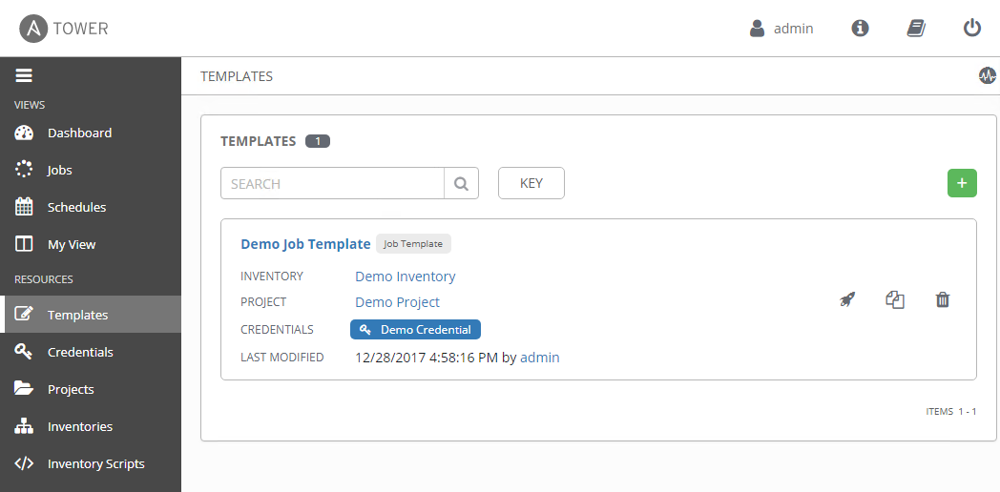

# Exercise 4.0: Explore Red Hat Ansible Tower

**Read this in other languages**:  [English](README.md),   [日本語](README.ja.md).

## Table of Contents
- [Exercise 4.0: Explore Red Hat Ansible Tower](#exercise-40-explore-red-hat-ansible-tower)
  - [Table of Contents](#table-of-contents)
- [Objective](#objective)
- [Guide](#guide)
  - [Step 1: Login to Ansible Tower](#step-1-login-to-ansible-tower)
  - [Step 2: Examine the Ansible Tower Inventory](#step-2-examine-the-ansible-tower-inventory)
  - [Step 3: Examine the Ansible Tower Workshop Project](#step-3-examine-the-ansible-tower-workshop-project)
  - [Step 4: Examine the Ansible Tower Workshop Credential](#step-4-examine-the-ansible-tower-workshop-credential)
  - [Step 5: Examine the Ansible Tower Template](#step-5-examine-the-ansible-tower-template)
- [Takeaways](#takeaways)
- [Complete](#complete)

# Objective

Ansible Tower is a web-based solution than runs on top of Ansible that provides additional functionality while simplifying the operations of the software.

In this lab, you will log in and perform some basic configurations that will be used in later labs to perform automation tasks against your F5 BIG-IP device.  This exercise will cover:
- Determining the Ansible version running on the control node
- Locating and understanding:
  - Ansible Tower **Inventories**
  - Ansible Tower **Credentials**
  - Ansible Tower **Projects**
  - Ansible Tower **Templates**

# Guide

## Step 1: Login to Ansible Tower

Open up your web browser and type in the Ansible control node's DNS name

>For example if the student was assigned the student1 workbench and the workshop name was `durham-workshop` the link would be:

    **https://student1.durham-workshop.rhdemo.io**

>This login information has been provided by the instructor at the beginning of class.

- The username will be `admin`
- password provided by instructor

After logging in the Job Dashboard will be the default view as shown below.

1.  Click on the **i** information button on the top right of the user interface.

    

2.  A window will pop up similar to the following:

    

    Take note that both the Ansible Tower version and the Ansible Engine version are provided here.

## Step 2: Examine the Ansible Tower Inventory

An inventory is required for Red Hat Ansible Tower to be able to run jobs.  An inventory is a collection of hosts against which jobs may be launched, the same as an Ansible inventory file. In addition, Red Hat Ansible Tower can make use of an existing configuration management data base (cmdb) such as ServiceNow or Infoblox DDI.

>More info on Inventories in respect to Ansible Tower can be found in the [documentation here](https://docs.ansible.com/ansible-tower/latest/html/userguide/inventories.html)

1. Click on the **Inventories** button under **RESOURCES** on the left menu bar.  

    

2. Under **Inventories** there will be inventories.  Click on the `Demo Inventory`.  

3. Under the `Demo Inventory`, click the **HOSTS** button at the top.  There will be hosts configured here.  Click on one of the devices.

4. Click on the `Demo Inventory` link at the top of the page to return the top level menu.

5. Click on **GROUPS**.  This is where you can configure Group of hosts
       

## Step 3: Examine the Ansible Tower Workshop Project

A project is how Ansible Playbooks are imported into Red Hat Ansible Tower.  You can manage playbooks and playbook directories by either placing them manually under the Project Base Path on your Ansible Tower server, or by placing your playbooks into a source code management (SCM) system supported by Tower, including Git, Subversion, and Mercurial etc.

> For more information on Projects in Tower, please [refer to the documentation](https://docs.ansible.com/ansible-tower/latest/html/userguide/projects.html)

1. Click on the **Projects** button under **RESOURCES** on the left menu bar.  

    

2. Under **PROJECTS** there will be one pre-configured projects, or `Demo Project`.  Click on the `Demo Project`.  

    Note that `Git` is listed for this project.  This means this project is using `Git` for SCM.

3. Under the `Demo Project` click the **SCM TYPE** drop down menu

    Note that Git, Mercurial and Subversion are some of the choices.  Return the choice to Git so that the Project continues to function correctly.

## Step 4: Examine the Ansible Tower Workshop Credential

Credentials are utilized by Tower for authentication when launching **Jobs** against machines, synchronizing with inventory sources, and importing project content from a version control system.  For the workshop we need a credential to authenticate to the network devices.

> For more information on Credentials in Tower please [refer to the documentation](https://docs.ansible.com/ansible-tower/latest/html/userguide/credentials.html).

1. Click on the **Credentials** button under **RESOURCES** on the left menu bar.  

    

2. Under **CREDENTIALS** there will be one pre-configured credential, or `Demo Credential`.  Click on the `Demo Credential`.  

3. Under the `Demo Credential` examine the following:
    - The **CREDENTIAL TYPE** is a **Machine** credential.  
    - The **USERNAME** is set to `admin`.
    - The **PASSWORD** is already configured, and is **ENCRYPTED**.
    - The **SSH PRIVATE KEY** is blank.

## Step 5: Examine the Ansible Tower Template

Templates or Job Templates define the parameters that will be used when executing an Ansible playbook. These parameters include previously mentioned features such as which project and inventory will be used.
Additionally, parameters such as logging level and process forks allow for additional granularity on how playbooks are ran.

1. Click on the **Templates** button under **RESOURCES** on the left menu bar.  

    

2. Under **TEMPLATES** there will be one pre-configured credential, or `Demo Job Template`.  Click on the `Demo Job Template`.  

# Takeaways

- Ansible Tower needs an inventory to execute Ansible Playbooks against.  This inventory is identical to what users would use with the command line only Ansible project.  
- Ansible Tower can sync to existing SCM (source control management) including `GitHub`.  
- Ansible Tower can store and encrypt credentials including SSH private keys and plain-text passwords.  Ansible Tower can also sync to existing credential storage systems such as CyberArk and Vault by HashiCorp
- Ansible Job Templates define the parameters that will be used when executing an Ansible playbook

---

# Complete

You have completed lab exercise 4.0

You have now examined all three components required to get started with Ansible Tower.  A credential, an inventory and a project.  In the next exercise we will create a job template.

[Click here to return to the Ansible Network Automation Workshop](../README.md)
