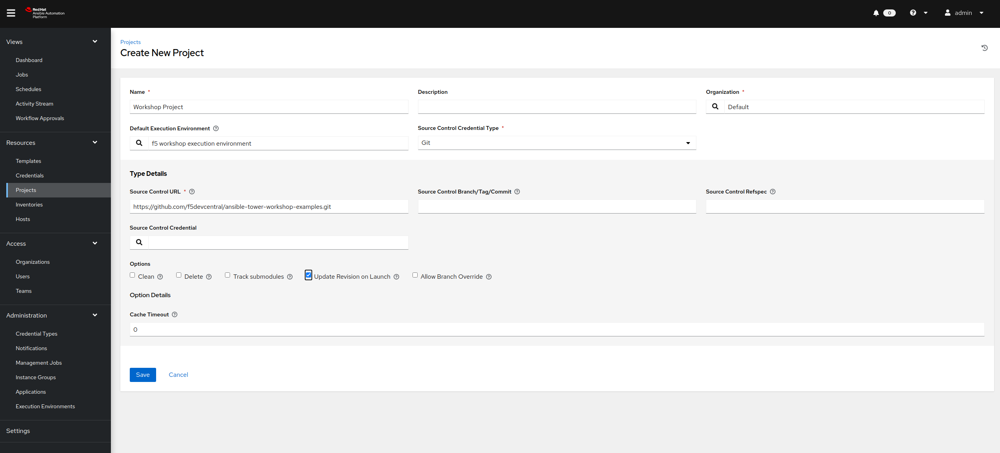

# 演習 4.1: 自動コントローラージョブテンプレートの作成

**他の言語でもお読みいただけます** : [English](README.md)、 [日本語](README.ja.md).

## 目次

- [目的](#objective)  - [ガイド](#guide)  - [重要なこと](#takeaways)  -
[完了](#complete)

# 目的

Red Hat Ansible 自動コントローラー向けの BIG-IP
仮想サーバー設定ジョブテンプレートについてを説明します。このジョブテンプレートは仮想サーバーとプールを作成し、2 つの Web
サーバーをプールに追加します。

Ansible 自動コントローラーで Ansible Playbook を実行するには、**ジョブテンプレート**
を作成する必要があります。**ジョブテンプレート** には以下が必要です。

- デバイスにログインするための **認証情報**。  - ジョブ実行の対象となる **インベントリー** - Ansible Playbook
が含まれる **プロジェクト**

# ガイド

## ステップ 1: プロジェクトの作成

1. Ansible Web UI で、左側のナビゲーションバーを使用して `RESOURCES` セクションの `Projects`
   リンクをクリックします。

2.  ボタンをクリックして、新規プロジェクトを作成します

3. 以下のようにプロジェクトパラメーターを入力し、`Save` をクリックします

   | Parameter | Value |
   |---|---|
   | NAME  | Workshop Project  |
   | ORGANIZATION | Default
   |  Default Execution Environment | f5 workshop execution environment |
   |  SCM TYPE |  Git |
   |  SCM URL |  https://github.com/f5devcentral/ansible-tower-workshop-examples.git |
   |  Update Revision on Launch |  ✓ |

**注記**: お使いの環境では、他にもプロジェクトが設定されている場合があります。各プロジェクトは、Ansible Playbook のリポジトリーを表しています。複数のプロジェクトがあっても全く問題ありません。



すべての Playbook
はhttps://github.com/f5devcentral/ansible-tower-workshop-examples で公開されており、各
Playbook の背景を把握することができます。

参照として、インポートされた Playbook の 1 つで、このラボで後ほど実行される Playbook を以下に示します。

**`create_vs.yml`**

``` yaml
---
- name: BIG-IP SETUP
  hosts: lb
  connection: local
  gather_facts: false
  
  collections:
    - f5networks.f5_modules
    
  tasks:
    - name: Setting up provider values
      set_fact:
       provider:
        server: "{{private_ip}}"
        server_port: "8443"
        validate_certs: "False"
  
    - name: CREATE NODES
      bigip_node:
        provider: "{{provider}}"
        host: "{{hostvars[item].ansible_host}}"
        name: "{{hostvars[item].inventory_hostname}}"
      loop: "{{ groups['web'] }}"

    - name: CREATE POOL
      bigip_pool:
        provider: "{{provider}}"
        name: "http_pool"
        lb_method: "round-robin"
        monitors: "/Common/http"
        monitor_type: "and_list"

    - name: ADD POOL MEMBERS
      bigip_pool_member:
        provider: "{{provider}}"
        state: "present"
        name: "{{hostvars[item].inventory_hostname}}"
        host: "{{hostvars[item].ansible_host}}"
        port: "80"
        pool: "http_pool"
      loop: "{{ groups['web'] }}"

    - name: ADD VIRTUAL SERVER
      bigip_virtual_server:
        provider: "{{provider}}"
        name: "vip"
        destination: "{{private_ip}}"
        port: "443"
        enabled_vlans: "all"
        all_profiles: ['http','clientssl','oneconnect']
        pool: "http_pool"
        snat: "Automap"

    - name: PRINT OUT WEB VIP FOR F5
      debug:
        msg: "The VIP (Virtual IP) is https://{{ansible_host}}"
```

## ステップ 2: BIGIP 認証情報の作成

ジョブを作成する前に、BIGIP に対して認証するために認証情報を作成する必要があります。

1. Web UI を開き、左側のナビゲーションバーを使用して `RESOURCES` セクションの `Credentials`
   リンクをクリックします。

   

2.  ボタンをクリックして、新規認証情報テンプレートを作成します

3. 以下のように、以下の認証情報テンプレートパラメーターでフィールドに入力します。

   | Parameter | Value |
   |---|---|
   | NAME  | BIGIP |
   | CREDENTIAL TYPE | Network |
   | USERNAME | admin |
   | PASSWORD |  |
   |

   **注記**: パスワードは、受講者のラボ情報が含まれる Web ページの Workbench Information セクションに記載されています。パスワードが不明な場合は、インストラクターにお尋ねください。

4. SAVE をクリックします

## ステップ 3: ジョブテンプレートの作成

1. Web UI を開き、左側のナビゲーションバーを使用して `RESOURCES` セクションの `Templates` リンクをクリックします。

   

2.  ボタンをクリックして、新しいジョブテンプレートを作成します

   >**`Workflow Template`** ではなく必ず **`Job Template`** を選択してください

3. 次のようにジョブテンプレートパラメータを入力します。

   | Parameter | Value |
   |---|---|
   | NAME  | create_vs |
   | JOB TYPE | Run |
   | INVENTORY | Workshop Inventory |
   | PROJECT | Workshop Project |
   | PLAYBOOK | create_vs.yml |
   | CREDENTIALS | BIGIP |
   |

   **CREDENTIAL TYPE** で `Network` を選択し、次に `BIGIP` を選択します。

   

   パラメータが入力されたジョブテンプレートのスクリーンショットを以下に示します。

   
      
4. 下にスクロールして、緑色の `SAVE` ボタンをクリックします。

## ステップ 4: ジョブテンプレートの起動

1. すべてのジョブテンプレートが一覧表示されている `Templates` ウィンドウに戻ります。

2. Launch ボタンをクリックして、`create_vs` ジョブテンプレートを起動します。

   

   起動ボタンをクリックすると、ジョブが起動します。このジョブは、**Job Details View** と呼ばれる新しいウィンドウで開きます。[コントローラージョブ](https://docs.ansible.com/automation-controller/latest/html/userguide/jobs.html) の詳細は、ドキュメントをご覧ください。

## ステップ 5: ジョブの詳細ビューの検証

**Standard Out ウィンドウ** が表示されます。


1. *Standard Out ウィンドウ** を調べます

   **Standard Out ウィンドウ** には、Ansible Playbook からの出力が表示されます。すべてのタスク出力は、コマンドラインに表示されるものと正確に一致します。
   
2. **Details タブ** を調べます

   **Details タブ** には、ジョブの開始と終了のタイムスタンプ、ジョブの種類 (チェックまたは実行)、ジョブを開始したユーザー、使用された Project と Ansible Playbook などの情報が表示されます。

   ジョブがまだ終了していない場合、**Details タブ** にはキャンセルボタン  があり、ジョブを停止するために使用できます。

3. **Standard Out pane** でタスクをクリックして、その特定のタスクからの構造化された出力を開きます。

   > **changed** または **ok** がある行をクリックします

   

## ステップ 6: ジョブウィンドウを調べます

実行済みまたは現在実行中の **ジョブテンプレート** は、**VIEWS --> Jobs** ウィンドウの下に表示されます。

1. 左側のメニューのジョブボタンをクリックします。

   

   ジョブリンクには、ジョブの一覧とそれらのステータスが表示 (正常に完了、失敗、またはアクティブ (実行中の) ジョブとして表示) されます。この画面から実行できるアクションには、特定のジョブの詳細および標準出力、ジョブの起動、またはジョブの削除が含まれます。

2. **`create_vs`** ジョブをクリックします

   

   **`create_vs`** ジョブは最新のものでした (より多くのジョブを起動していない場合に限る)。このジョブをクリックして、**Job Details View** に戻ります。Ansible 自動コントローラーは、開始されたすべてのジョブの履歴を保存します。

## ステップ 7: BIG-IP 仮想サーバーが作成されたことの確認

Web ブラウザーで F5 BIG-IP にログインし、設定された内容を確認します。BIG-IP のログイン情報は以下のとおりです。

- ユーザー名: admin - パスワード: インストラクターから提供、デフォルトは ansible

ロードバランサーの仮想サーバーは、左側のメニューからナビゲーションして探すことができます。**Local Traffic**
をクリックしてから、**Virtual Servers** をクリックします。以下のスクリーンショットを参照してください。


## ステップ 8: Web サーバーの確認

2 つの RHEL Web サーバーのそれぞれでは、すでに apache が実行されています。Web ブラウザーで F5 ロードバランサーのパブリック
IP を開きます。

>今回は、ポート 8443 の代わりに 443 を使用します (例: https://X.X.X.X:443/)

リフレッシュするたびに、BIG-IP は以下に示すように **node1** と **node2** の間でトラフィックの負荷分散を行います。

  

# 重要なこと

以下のことができるようになりました
 - ジョブテンプレートの作成して仮想サーバーをデプロイする
 - Ansible 自動コントローラー UI からジョブテンプレートを起動する
 - 仮想サーバーが正しく作成されたことを確認する
 - Web サーバーが稼働していることを確認する

# 完了

ラボ演習 4.1 を完了しました

[Click here to return to the Ansible Network Automation
Workshop](../README.md)
