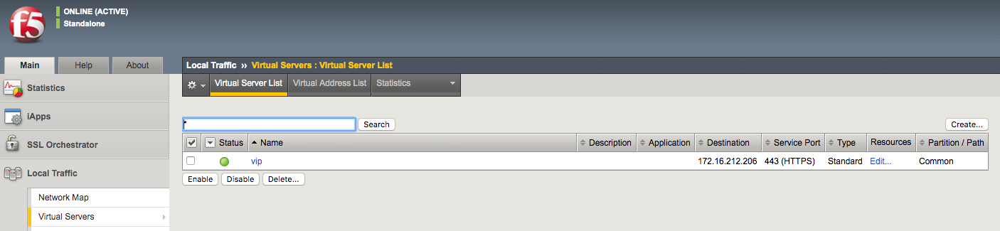

# 演習 4.1: Ansible Tower ジョブテンプレートの作成

**Read this in other languages**:  [English](README.md),   [日本語](README.ja.md).

## 目次
- [演習 4.1: Ansible Tower ジョブテンプレートの作成](#演習-4.1-Ansible-Tower-ジョブテンプレートの作成)
  - [目次](#目次)
- [目的](#目的)
- [解説](#解説)
  - [Step 1: 認証情報の作成](#Step-1-認証情報の作成)
  - [Step 2: インベントリの移行](#Step-2-インベントリの移行)
  - [Step 3: プロジェクトの作成](#Step-3-プロジェクトの作成)
  - [Step 4: ジョブテンプレートの作成](#Step-4-ジョブテンプレートの作成)
  - [Step 5: ジョブテンプレートの起動](#Step-5-ジョブテンプレートの起動)
  - [Step 6: ジョブ詳細表示の確認](#Step-6-ジョブ詳細表示の確認)
  - [Step 7: ジョブウインドウの確認](#Step-7-ジョブウインドウの確認)
  - [Step 8: BIG-IP 仮想サーバー作成確認](#Step-8-BIG-IP-仮想サーバー作成確認)
  - [Step 9: Webサーバの確認](#Step-9-Webサーバの確認)
- [まとめ](#まとめ)
- [完了](#完了)

# 目的

Red Hat Ansible TowerのBIG-IP仮想サーバー構成ジョブテンプレートをデモします。このジョブテンプレートは、仮想サーバーとプールを作成し、2つのWebサーバーをプールに追加します。

Ansible TowerでAnsible Playbookを実行するには、**ジョブテンプレート** を作成する必要があります。**ジョブテンプレート** には以下が必要です:

 - デバイスにログインするための **認証情報**
 - ジョブを実行するための **インベントリー**
 - Playbookが含まれる **プロジェクト**

# 解説
## Step 1: 認証情報の作成
1. Ansible web UIで、左側のメニューバーから **認証情報** セクションに移動します。

2. 緑色のボタンをクリックして、新しく`Workshop Credential`の認証情報を作成します。

3. 以下の通りにパラメータを入力し、**保存** をクリックします。 

    | パラメータ     | 値                   |
    |----------------|----------------------|
    | 名前           |  Workshop Credential |
    | 認証情報タイプ |  Network             |
    | ユーザ名       |  admin               |
    | パスワード     |  ansible             |

> Note: BIG-IP のパスワードはインストラクターに確認してください。デフォルトはansibleです。

  

## Step 2: インベントリの移行
> **Note:** : ここでは、Ansible Towerコントロールノードからインベントリーファイルを移行する1つの方法を紹介します。

1. Ansible web UIで、左側のメニューバーから **インベントリー** セクションに移動します。

2. 緑色のボタンをクリックして、新しく空の`Workshop Inventory`を作成します。

3. SSH経由でAnsible Towerコントロールノードにログインします。(これは、Ansible TowerがインストールされているLinuxマシンです)ここでもSSH資格情報が必要です。

4. Ansibleインベントリーを表すフラットファイルを見つけます。以下のように awx-manage inventory_import コマンドを実行します。
   ```
   cd ~/networking-workshop/lab_inventory/
   sudo awx-manage inventory_import --source=hosts --inventory-name="Workshop Inventory"
   ```
5. これで、Web UIを介してログインすると、`Workshop Inventory`インベントリーの下にすべてのホストが表示されます。
  

6. 新しくインポートしたインベントリーで、**グループ** ボタンをクリックします。
  

7. `lb`グループをクリックし, **ホスト** ボタンをクリックします。すると`f5`のホストが表示されます。
`f5`インベントリー内のBIG-IPホストには、それぞれの値を持つ変数が割り当てられています。Playbookは、ラボの後半でこれらのインベントリーの変数を参照します。
  

8. インベントリーに戻るには、上の`Workshop Inventory`をクリックし、**グループ** ボタンをクリックします。  
   `web`グループをクリックし、**ホスト** ボタンをクリックします。`node1`と`node2`の2つのホストが見えるでしょう。
   `node1`をクリックすると、それに割り当てられた変数とそれぞれの値が表示されます。
   

## Step 3: プロジェクトの作成
1. Ansible web UIで、左側のメニューバーから **プロジェクト** セクションに移動します。

2. 緑色のボタンをクリックして、新しいプロジェクトを作成します。

3. 以下の通りにパラメータを入力し、**保存** をクリックします。

    | パラメータ             | 値                                                                  |
    |------------------------|---------------------------------------------------------------------|
    | 名前                   | Workshop Project                                                    |
    | SCM タイプ             | Git                                                                 |
    | SCM URL                | https://github.com/f5devcentral/ansible-tower-workshop-examples.git |
    | 起動時のリビジョン更新 | ✓                                                                   |


全てのPlaybookは左のリンクより取得できます: https://github.com/f5devcentral/ansible-tower-workshop-examples 各Playbookの背後にあるものを確認できます。

参考までに、これはインポートされた、このラボの後半で実行されるPlaybookの1つです。

**`create_vs.yml`**

``` yaml
---
- name: BIG-IP SETUP
  hosts: lb
  connection: local
  gather_facts: false

  tasks:
    - name: Setting up provider values
      set_fact:
       provider:
        server: "{{private_ip}}"
        server_port: "8443"
        validate_certs: "False"

    - name: CREATE NODES
      bigip_node:
        provider: "{{provider}}"
        host: "{{hostvars[item].ansible_host}}"
        name: "{{hostvars[item].inventory_hostname}}"
      loop: "{{ groups['web'] }}"

    - name: CREATE POOL
      bigip_pool:
        provider: "{{provider}}"
        name: "http_pool"
        lb_method: "round-robin"
        monitors: "/Common/http"
        monitor_type: "and_list"

    - name: ADD POOL MEMBERS
      bigip_pool_member:
        provider: "{{provider}}"
        state: "present"
        name: "{{hostvars[item].inventory_hostname}}"
        host: "{{hostvars[item].ansible_host}}"
        port: "80"
        pool: "http_pool"
      loop: "{{ groups['web'] }}"

    - name: ADD VIRTUAL SERVER
      bigip_virtual_server:
        provider: "{{provider}}"
        name: "vip"
        destination: "{{private_ip}}"
        port: "443"
        enabled_vlans: "all"
        all_profiles: ['http','clientssl','oneconnect']
        pool: "http_pool"
        snat: "Automap"

    - name: PRINT OUT WEB VIP FOR F5
      debug:
        msg: "The VIP (Virtual IP) is https://{{ansible_host}}"
```

## Step 4: ジョブテンプレートの作成

1. Ansible web UIで、左側のメニューバーから **テンプレート** セクションに移動します。

    

2. 緑色のボタンをクリックし、新しい **ジョブテンプレート** を作成します。

    > **`ジョブテンプレート`** を選択してください。**`ワークフローテンプレート`** を選択しないでください。

3. 以下の通りにパラメータを入力します:

    | パラメータ     | 値                  |
    |----------------|---------------------|
    | 名前           | create_vs           |
    | ジョブタイプ   | 実行                |
    | インベントリー | Workshop Inventory  |
    | プロジェクト   | Workshop Project    |
    | Playbook       | create_vs.yml       |
    | 認証情報       | Workshop Credential |

    **認証情報タイプ** から **ネットワーク** を選択し、`Workshop Credential` を選択します:
    


    以下は、パラメーターが入力されたジョブテンプレートのスクリーンショットです:

    

4. 下にスクロールして、緑色の **保存** ボタンをクリックします。

## Step 5: ジョブテンプレートの起動

1. 全てのテンプレートが一覧表示されている **テンプレート** ウインドウに戻ります。

2. ロケットボタンを押して、`create_vs`を起動します。

    

    ロケットボタンをクリックすると、ジョブが起動します。**ジョブ詳細表示** という新しいウインドウを開き確認します。[Tower Jobs](https://docs.ansible.com/ansible-tower/latest/html/userguide/jobs.html)の詳細については、ドキュメントをご覧ください。

## Step 6: ジョブ詳細表示の確認

左側には **詳細ペイン** があり、右側には **標準出力ペイン** があります。


1.  **詳細ペイン**を確認します。

    **詳細ペイン**は、ジョブの開始と終了時のタイムスタンプのような情報や、ジョブの種類(チェックや実行)、ジョブを起動したユーザ、プロジェクトや Ansible Playbook等のような情報を提供します。

    ジョブがまだ終了していない場合、**詳細ペイン** にはキャンセルボタンがあり、ジョブを停止するために使用することができます。

2.  **標準出力ペイン** を確認します。

    **標準出力ペイン** は、Ansible Playbookの出力を表示します。全てのTaskの出力は、コマンドラインの出力と全く同じです。

3.  **出力の展開**をクリックします。

    これにより、**標準出力ペイン**が拡張され、ウインドウ全体が表示されます。

4.  **標準出力ペイン** の中からTaskをクリックし、特定のTaskから構造化された出力を開きます。

    > 任意の行をクリックし、**changed**もしくは**ok**をクリックします。

    

## Step 7: ジョブウインドウの確認

実行完了もしくは実行中の **ジョブテンプレート** は **ビュー -> ジョブ** ウインドウに表示されます。

1. Ansible web UIで、左側のメニューバーから **ジョブ** セクションに移動します。

    

    ジョブウインドウには、ジョブのリストとそのステータスが表示され、正常に完了したか失敗したか、またはアクティブな（実行中の）ジョブが表示されます。この画面から実行できるアクションには、特定のジョブの詳細と標準出力の表示、ジョブの再起動、ジョブの削除などがあります。

2. **`create_vs`** ジョブをクリックします。

    

    **`create_vs`** のジョブは最新です。(他のジョブを起動していなければ) このジョブをクリックし、**ジョブ詳細表示**に移動します。Ansible Towerは起動されたすべてのジョブの履歴を保存します。

## Step 8: BIG-IP 仮想サーバー作成確認

WebブラウザーでF5 BIG-IPにログインして、構成内容を確認します。  
BIG-IPのログイン情報:

- username: admin
- password: インストラクターから提供されます。デフォルトはansibleです。

左側のメニューに、Virtual Servers を見つけることができます。**Local Traffic**をクリックし、**Virtual Servers**をクリックします。以下のスクリーンショットをご覧ください。


## Step 9: Webサーバの確認

２つのRHEL Webサーバは、それぞれ既にApacheが起動しています。WebブラウザーからF5ロードバランサーのパブリックIPアドレスを開きます。

>今回は8443の代わりに443を使用します。例: https://X.X.X.X:443/

以下に示すように、更新するたびに、BIG-IPはnode1とnode2間のトラフィックの負荷を分散します:


# まとめ

デモに成功しました！
 - 仮想サーバーを展開するためのジョブテンプレートの作成
 - Ansible Tower UIからのジョブテンプレートの起動
 - 仮想サーバーが正しく作成されていることを確認
 - Webサーバーが稼働中であることを確認

---

# 完了

演習4.1を完了しました。

[Ansible F5 Network Automation Workshopに戻るには、ここをクリックしてください](../README.ja.md)
