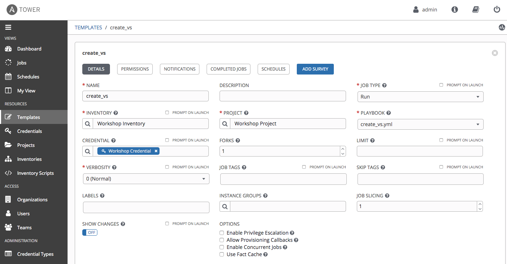
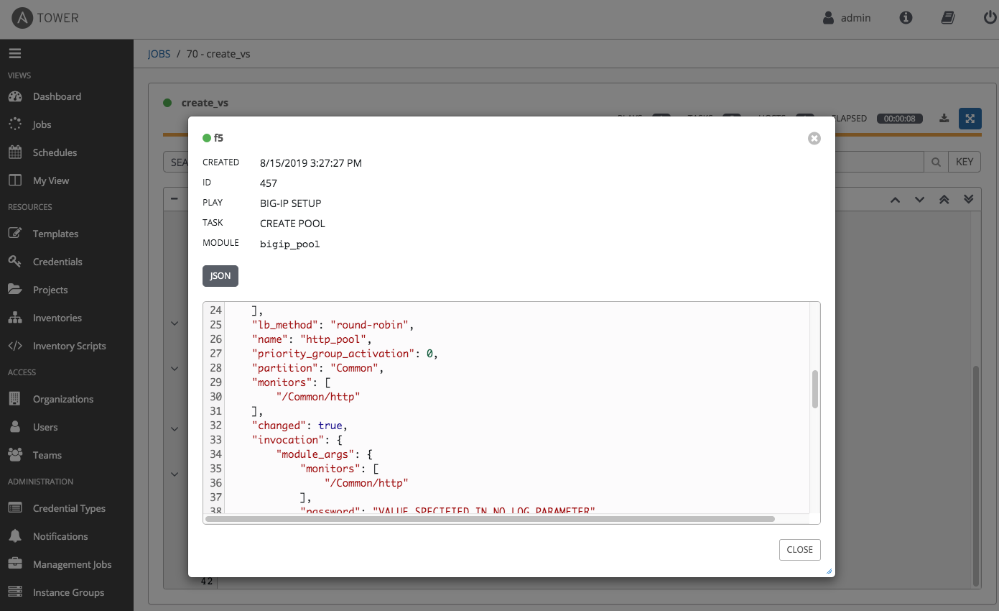
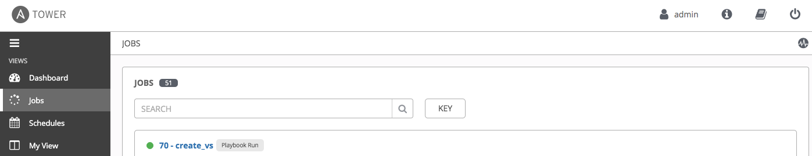
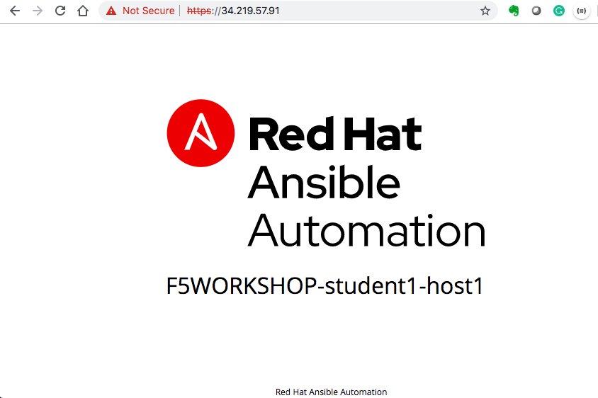

# Exercise 4.1: Creating a Tower Job Template

**Read this in other languages**:  [English](README.md),   [日本語](README.ja.md).

## Table of Contents
- [Exercise 4.1: Creating a Tower Job Template](#exercise-41-creating-a-tower-job-template)
  - [Table of Contents](#table-of-contents)
- [Objective](#objective)
- [Guide](#guide)
  - [Step 1: Create a Credential](#step-1-create-a-credential)
  - [Step 2: Migrate an Inventory](#step-2-migrate-an-inventory)
  - [Step 3: Create a Project](#step-3-create-a-project)
  - [Step 4: Create a Job Template](#step-4-create-a-job-template)
  - [Step 5: Launch the Job Template](#step-5-launch-the-job-template)
  - [Step 6: Examine the Job Details View](#step-6-examine-the-job-details-view)
  - [Step 7: Examine the Jobs window](#step-7-examine-the-jobs-window)
  - [Step 8: Verify the BIG-IP Virtual Server was created](#step-8-verify-the-big-ip-virtual-server-was-created)
  - [Step 9: Verifying the web servers](#step-9-verifying-the-web-servers)
- [Takeaways](#takeaways)
- [Complete](#complete)

# Objective

Demonstrate a BIG-IP Virtual Server configuration job template for Red Hat Ansible Tower.  This job template will create a virtual server, a pool, and add two web servers to the pool .

To run an Ansible Playbook in Ansible Tower, we need to create a **Job Template**.  A **Job Template** requires:
 - A **Credential** to login to devices.
 - An **Inventory** to run the job against
 - A **Project** which contains Ansible Playbooks

# Guide
## Step 1: Create a Credential
1. In the Ansible web UI, navigate to the `Credentials` section using the left navigation bar.

2. Click on the green  button to create a new Credential: `Workshop Credential`

3. Fill out the credential parameters as follows, and click `Save`

    | Parameter | Value |
    |---|---|
    | Name | `Workshop Credential`|
    | Credential type: | `Network` |
    | Username| `admin`|
    | Password| `ansible`|

> Note: double check BIG-IP password provided by instructor defaults to ansible

  

## Step 2: Migrate an Inventory
> **Note:** Here we just showcase one way to migrate an inventory file from the Ansible Tower control node (awx-manage)

1. In the Ansible web UI, navigate to the `Inventories` section using the left navigation bar.

2. Click on the green  button to create an empty inventory `Workshop Inventory`.

3. Login via SSH to your Ansible Tower control node (This is the Linux machine that has Ansible Tower installed on). The SSH credentials needed again here.
4. Locate the flat-file that represents your Ansible inventory. Run the awx-manage inventory_import command like this
   ```
   cd ~/f5-workshop/lab_inventory/
   sudo awx-manage inventory_import --source=hosts --inventory-name="Workshop Inventory"
   ```
5. Now when you login via the WebUI you will see all the hosts under the inventory `Workshop Inventory`
  

6. In your newly imported inventory, click on the button labeled `GROUPS`.
  

7. Click on the Group `lb`, and then click on the button labeled `HOSTS`, you will see the host `f5`.
The BIG-IP host `f5` in the inventory will have variables assigned to it with the respective values. Our playbook will refer to these inventory variables later in the lab.
  

8. Click on `Workshop Inventory` on the top to return to inventory\
   then click on the button labeled `GROUPS`. \
   Click on the Group `web`, and then click on the button labeled `Hosts`. You will see two hosts: `node1` and `node2`. \
   Click on `node1`, and you will see the variables assigned to it with the respective values.
   

## Step 3: Create a Project
1. In the Ansible web UI, navigate to the `Projects` section using the left navigation bar.

2. Click on the green  button to create a new project

3. Fill out the project parameters as follows, and click `Save`

    | Parameter | Value |
    |---|---|
    | Name  | Workshop Project  |
    |  SCM Type |  Git |
    |  SCM URL |  https://github.com/f5devcentral/ansible-tower-workshop-examples.git |
    |  Update Revision on Launch |  ✓ |


All the playbooks are availabe at https://github.com/f5devcentral/ansible-tower-workshop-examples, and you may take a look at what's behind each playbook.

For reference, here is one of the playbooks that was imported and  will be executed later in this lab.

**`create_vs.yml`**

``` yaml
---
- name: BIG-IP SETUP
  hosts: lb
  connection: local
  gather_facts: false

  tasks:
    - name: Setting up provider values
      set_fact:
       provider:
        server: "{{private_ip}}"
        server_port: "8443"
        validate_certs: "False"

    - name: CREATE NODES
      bigip_node:
        provider: "{{provider}}"
        host: "{{hostvars[item].ansible_host}}"
        name: "{{hostvars[item].inventory_hostname}}"
      loop: "{{ groups['web'] }}"

    - name: CREATE POOL
      bigip_pool:
        provider: "{{provider}}"
        name: "http_pool"
        lb_method: "round-robin"
        monitors: "/Common/http"
        monitor_type: "and_list"

    - name: ADD POOL MEMBERS
      bigip_pool_member:
        provider: "{{provider}}"
        state: "present"
        name: "{{hostvars[item].inventory_hostname}}"
        host: "{{hostvars[item].ansible_host}}"
        port: "80"
        pool: "http_pool"
      loop: "{{ groups['web'] }}"

    - name: ADD VIRTUAL SERVER
      bigip_virtual_server:
        provider: "{{provider}}"
        name: "vip"
        destination: "{{private_ip}}"
        port: "443"
        enabled_vlans: "all"
        all_profiles: ['http','clientssl','oneconnect']
        pool: "http_pool"
        snat: "Automap"

    - name: PRINT OUT WEB VIP FOR F5
      debug:
        msg: "The VIP (Virtual IP) is https://{{ansible_host}}"
```

## Step 4: Create a Job Template

1.  Open the web UI and click on the `Templates` link on the left menu.

    

2. Click on the green  button to create a new job template

    >Make sure to select **`Job Template`** and not **`Workflow Template`**

3. Fill out the job template parameters as follows:

    | Parameter | Value |
    |---|---|
    | Name  | create_vs	  |
    |  Job Type |  Run |
    |  Inventory |  Workshop Inventory |
    |  Project |  Workshop Project |
    |  Playbook |  create_vs.yml |
    |  Credential |  Workshop Credential  |

    From the **CREDENTIAL TYPE** select `Network`, then seletct `Workshop Credential`:
    


    Here is a screenshot of the job template with parameters filled out:

    

4. Scroll down and click the green `save` button.


## Step 5: Launch the Job Template

1. Navigate back to the `Templates` window, where all Job Templates are listed.

2. Launch the `create_vs` Job Template by clicking the Rocket button.

    

    When the rocket button is clicked this will launch the job.  The job will open in a new window called the **Job Details View**.  More info about [Tower Jobs](https://docs.ansible.com/ansible-tower/latest/html/userguide/jobs.html) can be found in the documentation.

## Step 6: Examine the Job Details View

On the left side there is a **DETAILS** pane, on the right side there is the **Standard Out pane**.


1.  Examine the **Details pane**    

    The **Details pane** will provide information such as the timestamp for when the job started and finished, the job type (Check or Run), the user that launched the job, which Project and Ansible Playbook were used and more.

    If the Job has not finished yet, the **Details Pane** will have a cancel button  that can be used to stop the Job.

2.  Examine the **Standard Out pane**

    The **Standard Out pane** will display the output from the Ansible Playbook.  Every task output will match exactly what would be seen on the command line.

3.  Click on the **Expand Output** button 

    This will expand the **Standard Out pane** to take the entirety of the window.

4.  Click on a task in the **Standard Out pane** to open up structured output from that particular task.

    > Click on any line where there is a **changed** or **ok**

    

## Step 7: Examine the Jobs window

Any **Job Template** that has been run or is currently running will show up under the **Views -> Jobs** window.

1. Click the Jobs button the left menu.

    

    The Jobs link displays a list of jobs and their status–shown as completed successfully or failed, or as an active (running) job. Actions you can take from this screen include viewing the details and standard output of a particular job, relaunch jobs, or remove jobs.

2. Click on the **`create_vs`** Job

    

    The **`create_vs`** job was the most recent (unless you have been launching more jobs).  Click on this job to return to the **Job Details View**.  Ansible Tower will save the history of every job launched.

## Step 8: Verify the BIG-IP Virtual Server was created

Login to the F5 BIG-IP with your web browser to see what was configured.
Login information for the BIG-IP:

- username: admin
- password: provided by instructor defaults to ansible

The load balancer virtual server can be found by navigating the menu on the left.  Click on **Local Traffic**. then click on **Virtual Servers**.  See the screenshot below:


## Step 9: Verifying the web servers

Each of the two RHEL web servers actually already has apache running. Open up the public IP of the F5 load balancer in your web browser:

>This time use port 443 instead of 8443, e.g. https://X.X.X.X:443/

Each time you refresh, BIG-IP will load balance the traffic between **node1** and **node2**, as shown below:



# Takeaways

You have successfully demonstrated
 - Creating a Job Template to deploy a Virtual Server
 - Launching a Job Template from the Ansible Tower UI
 - Verifying the Virtual Server is correctly created
 - Veryfying the web server is up and running

---

# Complete

You have completed lab exercise 4.1

[Click here to return to the Ansible Network Automation Workshop](../README.md)
