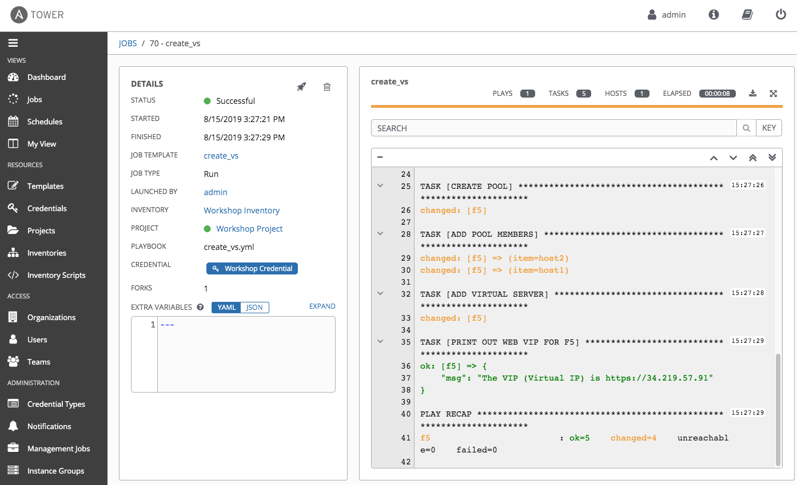

# Exercise 4.1: Creating an Automation Controller Job Template

**Read this in other languages**:  [English](README.md),   [日本語](README.ja.md).

## Table of Contents

- [Objective](#objective)
- [Guide](#guide)
- [Takeaways](#takeaways)
- [Complete](#complete)

# Objective

Demonstrate a BIG-IP Virtual Server configuration job template for Red Hat Ansible Automation Controller.  This job template will create a virtual server, a pool, and add two web servers to the pool .

To run an Ansible Playbook in Ansible Automation Conrtoller, we need to create a **Job Template**.  A **Job Template** requires:

- A **Credential** to login to devices.
- An **Inventory** to run the job against
- A **Project** which contains Ansible Playbooks

# Guide

## Step 1: Create a Project

1. In the Ansible web UI, click on the `Projects` link under the `RESOURCES` section using the left navigation bar.

2. Click on the  button to create a new project

3. Fill out the project parameters as follows, and click `Save`

   | Parameter | Value |
   |---|---|
   | NAME  | Workshop Project  |
   | ORGANIZATION | Default
   |  Default Execution Environment | f5 workshop execution environment |
   |  SCM TYPE |  Git |
   |  SCM URL |  https://github.com/f5devcentral/ansible-tower-workshop-examples.git |
   |  Update Revision on Launch |  ✓ |

**NOTE**: There may be additional projects setup in your environment. Each project represents a repository of Ansible Playbooks. It is completly normal to have multiple projects.


All the playbooks are availabe at https://github.com/f5devcentral/ansible-tower-workshop-examples, and you may take a look at what's behind each playbook.

For reference, here is one of the playbooks that was imported and  will be executed later in this lab.

**`create_vs.yml`**

``` yaml
---
- name: BIG-IP SETUP
  hosts: lb
  connection: local
  gather_facts: false
  
  collections:
    - f5networks.f5_modules
    
  tasks:
    - name: Setting up provider values
      set_fact:
       provider:
        server: "{{private_ip}}"
        server_port: "8443"
        validate_certs: "False"
  
    - name: CREATE NODES
      bigip_node:
        provider: "{{provider}}"
        host: "{{hostvars[item].ansible_host}}"
        name: "{{hostvars[item].inventory_hostname}}"
      loop: "{{ groups['web'] }}"

    - name: CREATE POOL
      bigip_pool:
        provider: "{{provider}}"
        name: "http_pool"
        lb_method: "round-robin"
        monitors: "/Common/http"
        monitor_type: "and_list"

    - name: ADD POOL MEMBERS
      bigip_pool_member:
        provider: "{{provider}}"
        state: "present"
        name: "{{hostvars[item].inventory_hostname}}"
        host: "{{hostvars[item].ansible_host}}"
        port: "80"
        pool: "http_pool"
      loop: "{{ groups['web'] }}"

    - name: ADD VIRTUAL SERVER
      bigip_virtual_server:
        provider: "{{provider}}"
        name: "vip"
        destination: "{{private_ip}}"
        port: "443"
        enabled_vlans: "all"
        all_profiles: ['http','clientssl','oneconnect']
        pool: "http_pool"
        snat: "Automap"

    - name: PRINT OUT WEB VIP FOR F5
      debug:
        msg: "The VIP (Virtual IP) is https://{{ansible_host}}"
```

## Step 2: Create BIGIP Credentials

Before we can create a job we must create the credentials to authenticate to BIGIP.

1. Open the web UI and click on the `Credentials` link under the `RESOURCES` section using the left navigation bar.

   

2. Click on the  button to create a new credentials template.

3. Fill out the fields with the following credentials template parameters as follows:

   | Parameter | Value |
   |---|---|
   | NAME  | BIGIP |
   | CREDENTIAL TYPE | Network |
   | USERNAME | admin |
   | PASSWORD |  |
   |

   **NOTE**: The password can be found in the Workbench Information section of the webpage that contains your student lab information. If you're unsure of the password please ask the instructor for help.

4. Click SAVE

## Step 3: Create a Job Template

1. Open the web UI and click on the `Templates` link under the `RESOURCES` section using the left navigation bar.

   

2. Click on the  button to create a new job template

   >Make sure to select **`Job Template`** and not **`Workflow Template`**

3. Fill out the job template parameters as follows:

   | Parameter | Value |
   |---|---|
   | NAME  | create_vs |
   | JOB TYPE | Run |
   | INVENTORY | Workshop Inventory |
   | PROJECT | Workshop Project |
   | PLAYBOOK | create_vs.yml |
   | CREDENTIALS | BIGIP |
   |

   From the **CREDENTIAL TYPE** select `Network`, then seletct `BIGIP`:

   

   Here is a screenshot of the job template with parameters filled out:

   
      
4. Scroll down and click the green `SAVE` button.

## Step 4: Launch the Job Template

1. Navigate back to the `Templates` window, where all Job Templates are listed.

2. Launch the `create_vs` Job Template by clicking the Launch Button.

   

   When the launch button is clicked this will launch the job. The job will open in a new window called the **Job Details View**. More info about [Controller Jobs](https://docs.ansible.com/automation-controller/latest/html/userguide/jobs.html) can be found in the documentation.

## Step 5: Examine the Job Details View

What you will see is the **Standard Out pane**.



1. Examine the **Standard Out pane**

   The **Standard Out pane** will display the output from the Ansible Playbook.  Every task output will match exactly what would be seen on the command line.
   
2. Examine the **Details tab**    

   The **Details tab** will provide information such as the timestamp for when the job started and finished, the job type (Check or Run), the user that launched the job, which Project and Ansible Playbook were used and more.

   If the Job has not finished yet, the **Details tab** will have a cancel button  that can be used to stop the Job.

3. Click on a task in the **Standard Out pane** to open up structured output from that particular task.

   > Click on any line where there is a **changed** or **ok**

   

## Step 6: Examine the Jobs window

Any **Job Template** that has been run or is currently running will show up under the **VIEWS --> Jobs** window.

1. Click the Jobs button the left menu.

   

   The Jobs link displays a list of jobs and their status–shown as completed successfully or failed, or as an active (running) job. Actions you can take from this screen include viewing the details and standard output of a particular job, relaunch jobs, or remove jobs.

2. Click on the **`create_vs`** Job

   

   The **`create_vs`** job was the most recent (unless you have been launching more jobs).  Click on this job to return to the **Job Details View**.  Ansible Automation Controller will save the history of every job launched.

## Step 7: Verify the BIG-IP Virtual Server was created

Login to the F5 BIG-IP with your web browser to see what was configured.
Login information for the BIG-IP:

- username: admin
- password: provided by instructor defaults to ansible

The load balancer virtual server can be found by navigating the menu on the left.  Click on **Local Traffic** then **Virtual Servers**. See the screenshot below:


## Step 8: Verifying the web servers

Each of the two RHEL web servers actually already has apache running. Open up the public IP of the F5 load balancer in your web browser:

>This time use port 443 instead of 8443, e.g. https://X.X.X.X:443/

Each time you refresh, BIG-IP will load balance the traffic between **node1** and **node2**, as shown below:


# Takeaways

You have successfully demonstrated
 - Creating a Job Template to deploy a Virtual Server
 - Launching a Job Template from the Ansible Automation Controller UI
 - Verifying the Virtual Server is correctly created
 - Veryfying the web server is up and running

# Complete

You have completed lab exercise 4.1

[Click here to return to the Ansible Network Automation Workshop](../README.md)
