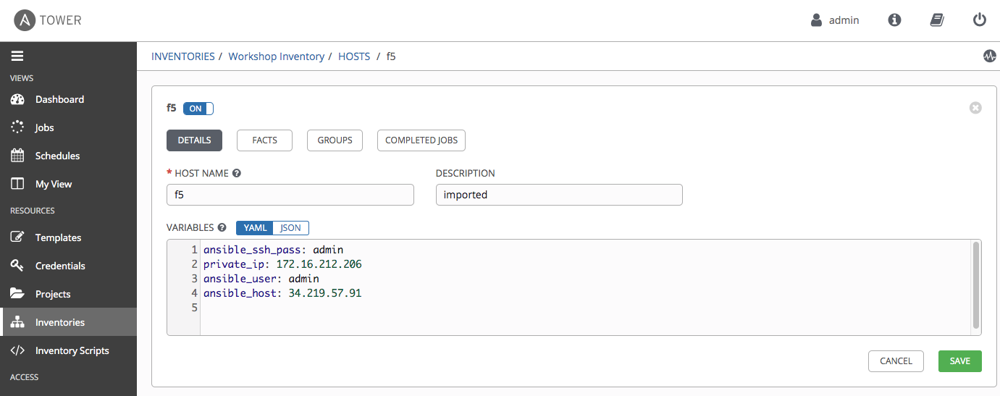

# Exercise 4.1: Creating a Tower Job Template

## Table of Contents

- [Exercise 4.1: Creating a Tower Job Template](#exercise-41-creating-a-tower-job-template)
  - [Table of Contents](#table-of-contents)
- [Objective](#objective)
- [Guide](#guide)
  - [Step 1: Create a Credential](#step-1-create-a-credential)
  - [Step 2: Create an Inventory](#step-2-create-an-inventory)
  - [Step 3: Create a Project](#step-3-create-a-project)
  - [Step 1: Create a Job Template](#step-1-create-a-job-template)
  - [Step 2: Launch the Job Template](#step-2-launch-the-job-template)
  - [Step 3: Examine the Job Details View](#step-3-examine-the-job-details-view)
  - [Step 4: Examine the Jobs window](#step-4-examine-the-jobs-window)
  - [Step 5: Verify the BIG-IP pool was created](#step-5-verify-the-big-ip-pool-was-created)
- [Takeaways](#takeaways)
- [Complete](#complete)

# Objective

Demonstrate a network backup configuration job template for Red Hat Ansible Tower.  This job template will save the running configuration from all four routers and store them under /tmp/backup on the control node with a timestamp.

To run an Ansible Playbook in Ansible Tower we need to create a **Job Template**.  A **Job Template** requires:
 - An **Inventory** to run the job against
 - A **Credential** to login to devices.
 - A **Project** which contains Ansible Playbooks

# Guide
## Step 1: Create a Credential
1. In the Ansible web UI, navigate to the :guilabel:`Credentials` section using the left navigation bar.

2. Click on the green  button to create a new Credential

3. Fill out the credential parameters as follows, and click `Save`


## Step 2: Create an Inventory
1. In the Ansible web UI, navigate to the :guilabel:`Inventories` section using the left navigation bar.

2. Click on the green  button to create a new Inventory

3. Fill out the inventory parameters as follows, and click `Save`


4. In your newly created inventory, click on the button labeled :guilabel:`Groups`.
5. Click on the green  button and fill in the following information

In this case, all of our BIG-IP devices will share the same username and password. Populate the variables section as shown below.


6. In the newly created Group, click on the button labeled :guilabel:`Hosts`.
7. Click on the green  button  and then :guilabel:`New Host`. Fill in the following information

Each BIG-IP host in the inventory will have a ``bigip_server`` variable assigned to it with the value being the device's management IP address.
Fill in the ``bigip_server`` variable with your lab's F5-A mgmt address as shown below:


## Step 3: Create a Project
1. In the Ansible web UI, navigate to the :guilabel:`Projects` section using the left navigation bar.
2. Click on the green  button to create a new project
3. Fill out the project parameters as follows, and click `Save`

    | Parameter | Value |
    |---|---|
    | Name  | Workshop Project  |
    |  SCM Type |  Git |
    |  SCM URL |  https://github.com/ericzji/lab-4.2-example.git |
    |  Update Revision on Launch |  ✓ |


For reference, here is one playbook that were imported and that will be executed later this lab.

**create_pool.yml**

``` yaml
- hosts: bigip_devices
  connection: local
  tasks:
  - name: Add Webserver A
    bigip_node:
       server: "{{ bigip_server }}"
       user: "{{ bigip_username }}"
       password: "{{ bigip_password }}"
       name: "10.128.20.104"
       host: "10.128.20.104"
       validate_certs: False
- name: Add Webserver B
  bigip_node:
    server: "{{ bigip_server }}"
    user: "{{ bigip_username }}"
    password: "{{ bigip_password }}"
    name: "10.128.20.105"
    host: "10.128.20.105"
    validate_certs: False
- name: Create Webserver Pool
  bigip_pool:
    server: "{{ bigip_server }}"
    user: "{{ bigip_username }}"
    password: "{{ bigip_password }}"
    name: "ansible_webserver_pool"
    lb_method: "round-robin"
    monitors:
    - http
    - tcp
    monitor_type: and_list
    validate_certs: False
- name: Add Webserver A to Webserver Pool
  bigip_pool_member:
    server: "{{ bigip_server }}"
    user: "{{ bigip_username }}"
    password: "{{ bigip_password }}"
    pool: "ansible_webserver_pool"
    host: "10.128.20.104"
    port: 80
    validate_certs: False
- name: Add Webserver A to Webserver Pool
  bigip_pool_member:
    server: "{{ bigip_server }}"
    user: "{{ bigip_username }}"
    password: "{{ bigip_password }}"
    pool: "ansible_webserver_pool"
    host: "10.128.20.105"
    port: 80
    validate_certs: False
```

## Step 1: Create a Job Template

1.  Open the web UI and click on the `Templates` link on the left menu.

    

2. Click on the green  button to create a new job template

    >Make sure to select `Job Template` and not `Workflow Template`)

3. Fill out the job template parameters as follows:

    | Parameter | Value |
    |---|---|
    | Name  | create_pool	  |
    |  Job Type |  Run |
    |  Inventory |  Workshop Inventory |
    |  Project |  Workshop Project |
    |  Playbook |  create_pool.yml |
    |  Credential |  Workshop Credential |


    Here is a screenshot of the job template parameters filled out.

    

4. Scroll down and click the green `save` button.


## Step 2: Launch the Job Template

1. Navigate back to the `Templates` window, where all Job Templates are listed.

2. Launch the `Backup network configurations` Job Template by clicking the Rocket button.

    

    When the rocket button is clicked this will launch the job.  The job will open in a new window called the **Job Details View**.  More info about [Tower Jobs](https://docs.ansible.com/ansible-tower/latest/html/userguide/jobs.html) can be found in the documentation.

## Step 3: Examine the Job Details View

On the left side there is a **Details pane** on the right side there is the **Standard Out pane**.


1.  Examine the **Details pane**    

    The **Details pane** will information such as the timestamp for when the job started and finished, the job type (Check or Run), the user that launched the job, which Project and Ansible Playbook were used and more.

    If the Job has not finished yet, the **Details Pane** will have a cancel button  that can be used to stop the Job.

2.  Examine the **Standard Out pane**

    The **Standard Out pane** will display the output from the Ansible Playbook.  Every task output will match exactly what would be seen on the command line.

3.  Click on the **Expand Output** button 

    This will expand the **Standard Out pane** to take the entirety of the window.

4.  Click on a task in the **Standard Out pane** to open up structured output from that particular task.

    > Click on any line where there is a **changed** or **ok**

    

## Step 4: Examine the Jobs window

Any **Job Template** that has been run or is currently running will show up under the **Jobs** window.

1. Click the Jobs button the left menu.

    

    The Jobs link displays a list of jobs and their status–shown as completed successfully or failed, or as an active (running) job. Actions you can take from this screen include viewing the details and standard output of a particular job, relaunch jobs, or remove jobs.

2. Click on the **Backup network configurations** Job

    

    The **Backup network configurations** job was the most recent (unless you have been launching more jobs).  Click on this job to return to the **Job Details View**.  Ansible Tower will save the history of every job launched.

## Step 5: Verify the BIG-IP pool was created

Login to the F5 with your web browser to see what was configured.
Login information for the BIG-IP:

- username: admin
- password: provided by instructor defaults to ansible
  
The pool will now show two members. Click on Local Traffic-> then click on Pools. Click on `ansible_webserver_pool` to get more granular information. Click on the Members tab in the middle to list all the Members. 


# Takeaways

You have successfully demonstrated
 - Creating a Job Template for backing up network configurations
 - Launching a Job Template from the Ansible Tower UI
 - Verifying the backups are correctly stored

---

# Complete

You have completed lab exercise 6

[Click here to return to the Ansible Network Automation Workshop](../README.md)
