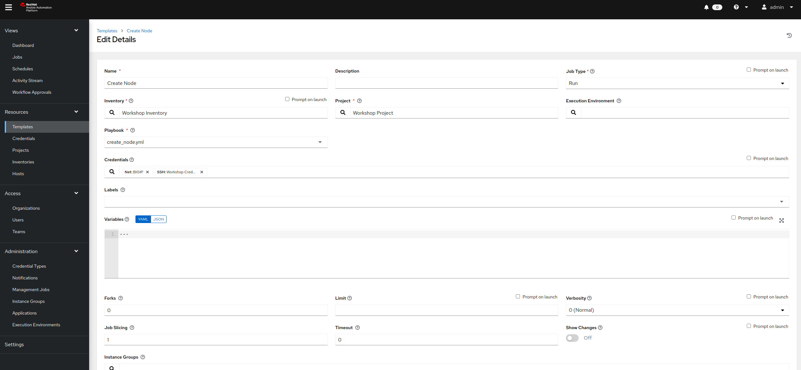
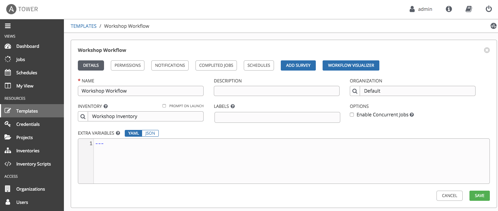
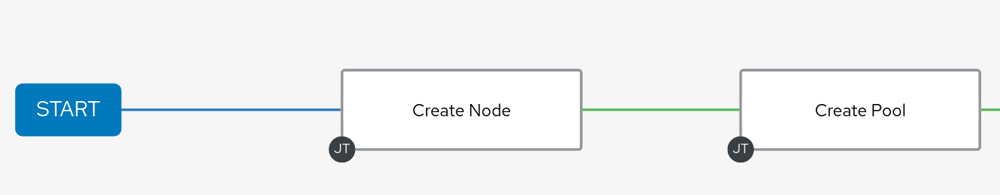
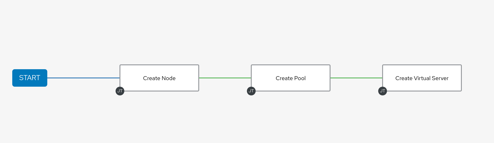
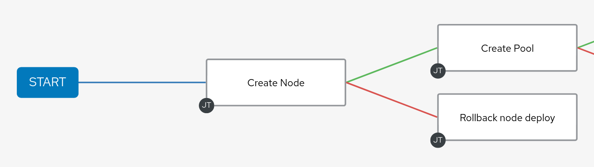
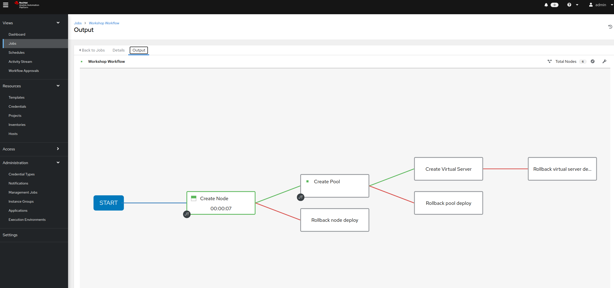
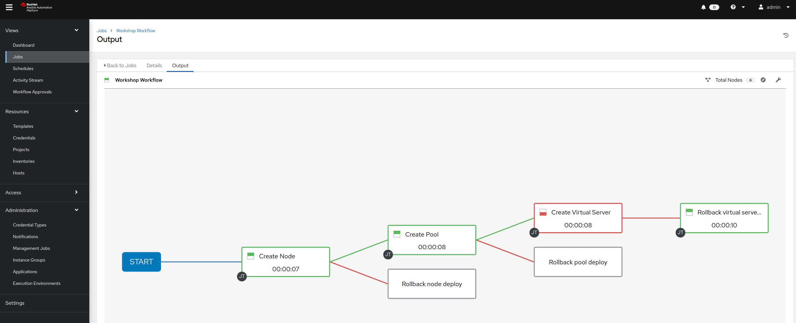

# 演習 4.2: ワークフローの作成

**他の言語でもお読みいただけます** : [English](README.md)、 [日本語](README.ja.md).

## 目次

- [目的](#objective)  - [ガイド](#guide)  - [重要なこと](#takeaways)  -
[完了](#complete)

# 目的

F5 BIG-IP での [Ansible
自動コントローラーワークフロー](https://docs.ansible.com/automation-controller/latest/html/userguide/workflows.html)
の使用方法を説明します。ワークフローを使用すると、インベントリー、プレイブック、またはパーミッションを共有する場合と共有しない場合がある、一連の異なるジョブテンプレート
(またはワークフローテンプレート) を構成できます。

この演習では、ワークフローを使用して、**create_vs** ジョブテンプレートと同じことを実現します。同時に、各ジョブに障害処理を追加します。

# ガイド

## ステップ 1: ジョブテンプレートの準備

`Lab 4.1` で学習した内容に従って、それぞれの Playbook で以下のジョブテンプレートを作成します。

| Job template Name | Playbook | |---|---| | Create node | create_node.yml |
| Create pool | create_pool.yml | | Create virtual server |
create_virtualserver.yml | | Rollback node deploy | rollback_node_deploy.yml
| | Rollback pool deploy | rollback_pool_deploy.yml | | Rollback virtual
server deploy | rollback_vs_deploy.yml | |

上記とは別に、、上記の各テンプレートに `Lab 4.1` と同じテンプレートパラメーターを使用します。

| Parameter | Value | |---|---| | NAME | | | JOB TYPE | Run | | INVENTORY |
Workshop Inventory | | PROJECT | Workshop Project | | PLAYBOOK | | |
CREDENTIAL | BIGIP | |

以下は、**Create node** のテンプレートの例です。

## ステップ 2: ワークフローテンプレートの作成

1. 左側のメニューの **Templates** リンクをクリックします。

2.  ボタンをクリックし、**Workflow Template** を選択します。

3. 次のようにフォームに記入します。

   | Parameter | Value |
   |---|---|
   | NAME | Workshop Workflow |
   | ORGANIZATION | Default |
   | INVENTORY | Workshop Inventory |
   |

4. **`Save`** ボタンをクリックします

   

## ステップ 3: ワークフロービジュアライザー

1. **SAVE** をクリックすると、**ワークフロービジュアライザー**が自動的に開きます。そうでない場合は、青い
   **ワークフロービジュアライザー** ボタンをクリックしてください。

2. デフォルトでは、緑色の **START** ボタンのみが表示されます。**START** ボタンをクリックします。

3. **ADD A NODE** ウィンドウが右側に表示されます。直前の手順で作成した `Create node`
   ジョブテンプレート（あるいは、自分で付けた名前のテンプレート）を選択します。

   

   `Create node` ジョブテンプレートがノードとなりました。ジョブまたはワークフローテンプレートは、ノードと呼ばれるグラフのような構造を使って相互に連携します。これらのノードには、ジョブ、プロジェクト同期、またはインベントリー同期などが含まれます。ジョブテンプレートは異なるワークフローの一部となることも、同じワークフローで複数回使用することもできます。グラフ構造のコピーは、ワークフローの起動時にワークフロージョブに保存されます。

4. 緑の **SELECT** ボタンをクリックします。

   

## ステップ 4: *Create pool* ジョブテンプレートの追加

1. **`Create node`** ノードにカーソルを合わせ、**+** 記号をクリックします。**ADD A NODE** が再び表示されます。

2. **`Create pool`** ジョブテンプレートを選択します。**Run type** という左側のナビゲーターメニューオプションから
   **On Success** を選択します。

3. **SAVE** ボタンをクリックします。

   

## ステップ 5: *Create virtual server* ジョブテンプレートの追加

1. **`Create pool`** ノードにカーソルを合わせ、**+** 記号をクリックします。**ADD A NODE** が再び表示されます。

2. **`Create virtual server`** ジョブテンプレートを選択します。**Run type**
   という左側のナビゲーターメニューオプションから **On Success** を選択します。

3. **SAVE** ボタンをクリックします。
   
   

## ステップ 6: *Rollback node deploy* テンプレート

1. **Create node** ノードにカーソルを合わせ、**+** 記号をクリックします。**ADD A NODE** が再び表示されます。

2. **Rollback node deploy** ジョブテンプレートを選択します。**Run type**
   という左側のナビゲーターメニューオプションから **On Failure** を選択します。

3. **SAVE** ボタンをクリックします。

   

## ステップ 7: *Rollback pool deploy* テンプレート

1. **Create pool** ノードにカーソルを合わせ、**+** 記号をクリックします。**ADD A NODE** が再び表示されます。

2. **Rollback pool deploy** ジョブテンプレートを選択します。**Run type**
   という左側のナビゲーターメニューオプションから **On Failure** を選択します。

3. **SAVE** ボタンをクリックします。

   

## ステップ 8: *Rollback virtual server* テンプレート

1. **Create virtual server** ノードにカーソルを合わせ、**+** 記号をクリックします。**ADD A NODE**
   が再び表示されます。

2. **Rollback virtual server deploy** ジョブテンプレートを選択します。**Run type**
   という左側のナビゲーターメニューオプションから **On Failure** を選択します。

3. **SAVE** ボタンをクリックします。

   

4. 緑の **SAVE** ボタンをクリックします。

## ステップ 9: ワークフローの実行

1. **Templates** ウィンドウに戻ります

2. Launch ボタンをクリックして、**Workshop Workflow** ワークフローテンプレートを起動します。

   

   ワークフロージョブ中はいつでも、ノードをクリックしてステータスを確認することにより、個々のジョブテンプレートを選択できます。

## ステップ 10: エラー処理

次に、ロールバックが実行されるワークフローの失敗したジョブテンプレートを表示します。

1. 左側のメニューの `Templates` リンクをクリックします。

   

2. テンプレート `Create virtual server` を選択します。

3. PLAYBOOK を `create_virtualserver.yml` から `create_virtualserver_error.yml`
   に変更します。

   `create_virtualserver_error.yml` Playbook は仮想サーバーを設定しますが、存在しないプール `http_pool_error` をアタッチしようとします。そのため、仮想サーバーの追加に失敗し、`Rollback virtual server deploy` ノードがトリガーされます。

4. 下にスクロールして、`save` ボタンをクリックします。

5. **Templates** ウィンドウに戻り、ロケットをクリックして、再度 **Workshop Workflow**
   ワークフローテンプレートを起動します。

   

6. Web ブラウザーで F5 BIG-IP にログインし、設定された内容を確認します。

   **Local Traffic** をクリックし、続いて **Virtual Servers**、**Pools**、および **Nodes** をクリックします。`Rollback virtual server deploy` が起動して、すべての BIG-IP 設定が削除されたことがわかります。

## ステップ 11: クリーンアップ

最後に、設定を元に戻し、次のラボに備えます。

1. 左側のメニューの **Templates** リンクをクリックします。テンプレート `Create virtual server` を選択します。

2. PLAYBOOK を変更して `create_virtualserver.yml` に戻します。

3. 下にスクロールして、緑色の `save` ボタンをクリックします。

4. **Templates** ウィンドウに戻り、ロケットをクリックして、再度 **Workshop Workflow** テンプレートを起動します。
5. BIGIP MGMT GUI で、仮想サーバーが作成されたことを確認します。

# 重要なこと

以下を行いました。

- ノード、プール、および仮想サーバーを作成するワークフローテンプレートを作成しました -
ワークフローを堅牢にし、いずれかのジョブテンプレートが失敗した場合は、デプロイメントをロールバックするようにしました -
ワークフローテンプレートを起動し、**VISUALIZER** を調べました。

# 完了

ラボ演習 4.2 を完了しました

[Click here to return to the Ansible Network Automation
Workshop](../README.md)
