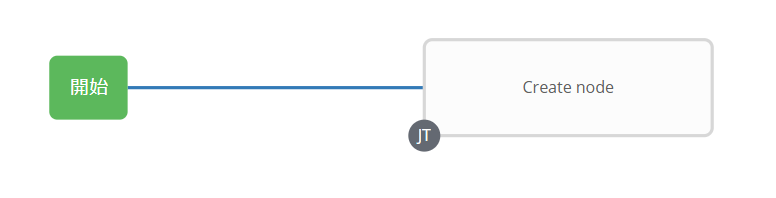
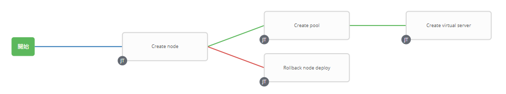

# 演習 4.2: ワークフローの作成

**Read this in other languages**:  [English](README.md),   [日本語](README.ja.md).

## 目次
- [演習 4.2: ワークフローの作成](#演習-4.2-ワークフローの作成)
  - [目次](#目次)
- [目的](#目的)
- [解説](#解説)
  - [Step 1: ジョブテンプレートの準備](#Step-1-ジョブテンプレートの準備)
  - [Step 2: ワークフローテンプレートの作成](#Step-2-ワークフローテンプレートの作成)
  - [Step 3: ワークフロービジュアライザー](#Step-3-ワークフロービジュアライザー)
  - [Step 4: Create nodeジョブテンプレートの追加](#Step-4-Create-nodeジョブテンプレートの追加)
  - [Step 5: Create poolジョブテンプレートの追加](#Step-5-Create-poolジョブテンプレートの追加)
  - [Step 6: Create virtual serverジョブテンプレートの追加](#Step-6-Create-virtual-serverジョブテンプレートの追加)
  - [Step 7: Rollback node deployジョブテンプレートの追加](#Step-7-Rollback-node-deployジョブテンプレートの追加)
  - [Step 8: Rollback pool deployジョブテンプレートの追加](#Step-8-Rollback-pool-deployジョブテンプレートの追加)
  - [Step 9: Rollback virtual serverジョブテンプレートの追加](#Step-9-Rollback-virtual-serverジョブテンプレートの追加)
  - [Step 10: ワークフローの実行](#Step-10-ワークフローの実行)
  - [Step 11: エラー処理](#Step-11-エラー処理)
- [まとめ](#まとめ)
- [完了](#完了)

# 目的

F5 BIG-IPの[Ansible Tower ワークフロー](https://docs.ansible.com/ansible-tower/latest/html/userguide/workflows.html)の使用方法を示します。ワークフローを使用すると、インベントリー、Playbook、または権限を共有する場合と共有しない場合がある一連の異なるジョブテンプレート(またはワークフローテンプレート)を構成できます。

この演習では、ワークフローを使用して **create_vs** ジョブテンプレートと同じことを実現すると同時に、各ジョブに失敗処理を追加します。

# 解説

## Step 1: ジョブテンプレートの準備

`演習 4.1` から学んだことに従い、それぞれのプレイブックを使用して次のジョブテンプレートを作成します。

| ジョブテンプレート名           | Playbook                 |
|--------------------------------|--------------------------|
| Create node                    | create_node.yml          |
| Create pool                    | create_pool.yml          |
| Create virtual server          | create_virtualserver.yml |  
| Rollback node deploy           | rollback_node_deploy.yml |  
| Rollback pool deploy           | rollback_pool_deploy.yml |
| Rollback virtual server deploy | rollback_vs_deploy.yml   |

上記とは別に、上記のテンプレートそれぞれについて、`演習 4.1`と同じテンプレートパラメータを使用します。

| パラメータ     | 値                  |
|----------------|---------------------|
| 名前           |                     |
| ジョブタイプ   | 実行                |
| インベントリー | Workshop Inventory  |
| プロジェクト   | Workshop Project    |
| Playbook       |                     |
| 認証情報       | Workshop Credential |

**Create node** ジョブテンプレートの例を次に示します。

## Step 2: ワークフローテンプレートの作成

1. 左側のメニューバーから **テンプレート** セクションに移動します。

2. 緑色のボタンをクリックし、**ワークフローテンプレート** を選択します。

3. 以下の通りにパラメータを入力します。

| パラメータ     | 値                 |
|----------------|--------------------|
| 名前           | Workshop Workflow  |
| 組織           | Default            |
| インベントリー | Workshop Inventory |

4. **保存** ボタンをクリックします。

## Step 3: ワークフロービジュアライザー

1. **保存** をクリックすると、**ワークフロービジュアライザー** が自動的に開きます。もし開かない場合には、青い **ワークフロービジュアライザー** ボタンをクリックします。

2. デフォルトでは緑色の **開始** ボタンだけが表示されています。**開始** ボタンをクリックします。

3. 右側に **ノードの追加** が表示されます。前の手順で作成した`Create node`ジョブテンプレートを選択します。(あなたが名前を付けたものであれば何でも)

   

   `Create node`ジョブテンプレートがノードになりました。ジョブまたはワークフローテンプレートは、ノードと呼ばれるグラフのような構造を使用してリンクされます。これらのノードは、ジョブ、プロジェクトの同期、またはインベントリに同期することができます。テンプレートは、異なるワークフローの一部にしたり、同じワークフローで複数回使用することもできます。ワークフローを起動すると、グラフ構造のコピーがワークフロージョブに保存されます。

## Step 4: *Create node*ジョブテンプレートの追加

1. **`Create node`** ジョブテンプレートを選択します。実行オプションは、**常時** を使用します。緑色の **選択** ボタンをクリックします。

    

## Step 5: *Create pool*ジョブテンプレートの追加

1. **`Create node`** ノードにカーソルを合わせ、緑色の **+** 記号をクリックします。**ノードの追加** が再び表示されます。

2. **`Create pool`** ジョブテンプレートを選択します。**実行** パラメータは、ドロップダウンメニューから **成功時** を選択します。

3. 緑色の **選択** ボタンをクリックします。

   

## Step 6: *Create virtual server*ジョブテンプレートの追加

1. **`Create pool`** ノードにカーソルを合わせ、緑色の **+** 記号をクリックします。**ノードの追加** が再び表示されます。

2. **`Create virtual server`** ジョブテンプレートを選択します。**実行** パラメータは、ドロップダウンメニューから **成功時** を選択します。

3. 緑色の **選択** ボタンをクリックします。
   
   

## Step 7: *Rollback node deploy*ジョブテンプレートの追加

1. **`Create node`** ノードにカーソルを合わせ、緑色の **+** 記号をクリックします。**ノードの追加** が再び表示されます。

2. **`Rollback node deploy`** ジョブテンプレートを選択します。**実行** パラメータは、ドロップダウンメニューから **障害発生時** を選択します。

3. 緑色の **選択** ボタンをクリックします。

   

## Step 8: *Rollback pool deploy*ジョブテンプレートの追加

1. **`Create pool`** ノードにカーソルを合わせ、緑色の **+** 記号をクリックします。**ノードの追加** が再び表示されます。

2. **`Rollback pool deploy`** ジョブテンプレートを選択します。**実行** パラメータは、ドロップダウンメニューから **障害発生時** を選択します。

3. 緑色の **選択** ボタンをクリックします。

   

## Step 9: *Rollback virtual server*ジョブテンプレートの追加

1. **`Create virtual server`** ノードにカーソルを合わせ、緑色の **+** 記号をクリックします。**ノードの追加** が再び表示されます。

2. **`Rollback virtual server deploy`** ジョブテンプレートを選択します。**実行** パラメータは、ドロップダウンメニューから **障害発生時** を選択します。

3. 緑色の **選択** ボタンをクリックします。

   

4. 緑色の **保存** ボタンをクリックします。

## Step 10: ワークフローの実行

1. **テンプレート** ウインドウに戻ります。

2. ロケットをクリックし、**`Workshop Workflow`** ワークフローテンプレートを起動します。

   

    ワークフロージョブの実行中はいつでも、個々のノードをクリックして、ステータスを確認できます。

## Step 11: エラー処理

次に、ロールバックが実行されるワークフローの失敗したジョブテンプレートを示します。

1. 左側のメニューバーから **テンプレート** をクリックします。

    

2. `Create virtual server`テンプレートを選択します。

3. Playbookを`create_virtualserver.yml`から`create_virtualserver_error.yml`へ変更します。

`create_virtualserver_error.yml`のPlaybookは`http_pool_error`プールに仮想サーバを追加しようとしますが、`http_pool_error`は存在しません。したがって、仮想サーバの追加は失敗し、`Rollback virtual server deploy`ノードがトリガーされます。

4. 下にスクロールし、緑色の **保存** ボタンをクリックします。

5. **テンプレート**ウインドウに戻り、ロケットをクリックし **`Workshop Workflow`** ワークフローテンプレートを再び起動します。

    

6. WebブラウザーからF5 BIG-IPにログインし、構成内容を確認します。

**Local Traffic**をクリックし、**Virtual Servers**をクリックします。`Rollback virtual server deploy`がキックされ、全てのBIG-IPの構成が削除されています。**Pools** および **Nodes** も同様に削除されているはずです。

最後に構成を元に戻し、次の実習に備えます:

7. 左側のメニューバーから **テンプレート** をクリックします。`Create virtual server`テンプレートを選択します。

8. Playbookを`create_virtualserver.yml`に戻します。

9. 下にスクロールし、緑色の **保存** ボタンをクリックします。

10. **Templates**ウインドウに戻り、ロケットをクリックし **Workshop Workflow** ワークフローテンプレートを再び起動します。

# まとめ

あなたは学習しました
 - ノード、プール、および仮想サーバーを作成するワークフローテンプレートを作成しました
 - ワークフローを堅牢にし、いずれかのジョブテンプレートが失敗した場合、ロールバックしました
 - ワークフローテンプレートを起動し、**ワークフロービジュアライザー**を確認しました

---

# 完了

演習 4.2を完了しました。

[Ansible F5 Network Automation Workshopに戻るには、ここをクリックしてください](../README.ja.md)
