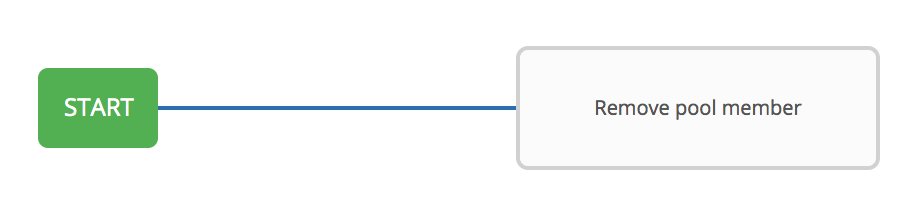
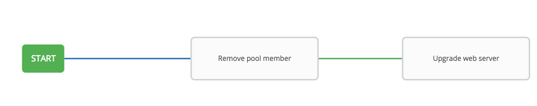
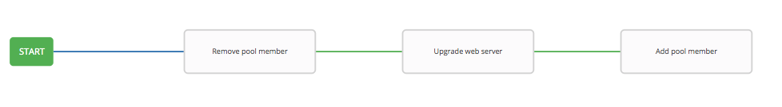
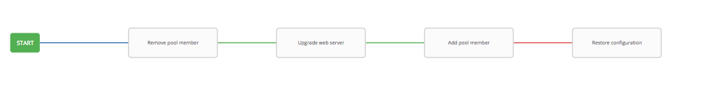

# Exercise 4.2: Creating a Workflow

## Table of Contents

- [Exercise 4.2: Creating a Workflow](#exercise-42-creating-a-workflow)
  - [Table of Contents](#table-of-contents)
- [Objective](#objective)
- [Guide](#guide)
  - [Step 1: Create a Workflow Template](#step-1-create-a-workflow-template)
  - [Step 2: The Workflow Visualizer](#step-2-the-workflow-visualizer)
  - [Step 3: Remove pool member Job Template](#step-3-remove-pool-member-job-template)
  - [Step 4: Upgrade web server Template](#step-4-upgrade-web-server-template)
  - [Step 5: Add back pool member Template](#step-5-add-back-pool-member-template)
  - [Step 5: Restore configuration Template](#step-5-restore-configuration-template)
  - [Step 6: Create a converged link](#step-6-create-a-converged-link)
  - [Step 7: Run the Workflow](#step-7-run-the-workflow)
- [Takeaways](#takeaways)
- [Complete](#complete)

# Objective

Demonstrate the use of [Ansible Tower workflow](https://docs.ansible.com/ansible-tower/latest/html/userguide/workflows.html) for F5 BIG-IP.  Workflows allow you to configure a sequence of disparate job templates (or workflow templates) that may or may not share inventory, playbooks, or permissions.

For this exercise we will ...

# Guide

## Step 1: Create a Workflow Template

1. Click on the **Templates** link on the left menu.  

2. Click on the green **+** button. Select the **Workflow Template**.  

3. Fill out the the form as follows:

| Parameter | Value |
|---|---|
| Name  | Workshop Workflow  |
|  Organization |  Default |
|  Inventory |  Workshop Inventory |

4. Click on the **Save** button

## Step 2: The Workflow Visualizer

1. When you click the **SAVE** the **WORKFLOW VISUALIZER** should automatically open.  If not click on the blue **WORKFLOW VISUALIZER** button.  

2. By default only a green **START** button will appear.  Click on the **START** button.  

3. The **ADD A TEMPLATE** window will appear on the right.  Select the *creat_vs* Job Template that was created in previous lab(whatever you named it!).

   

   The `create_vs` job template is now a node.  Job or workflow templates are linked together using a graph-like structure called nodes. These nodes can be jobs, project syncs, or inventory syncs. A template can be part of different workflows or used multiple times in the same workflow. A copy of the graph structure is saved to a workflow job when you launch the workflow.

## Step 3: Remove pool member Job Template

1.  Select the **Remove pool member** Job Template.  Use the drop down box to select run.  Click the green **SELECT** button.

    

## Step 4: Upgrade web server Template

1.  Hover over the **Remove pool member** node and click the green **+** symbol.  The **ADD A TEMPLATE** will appear again.

2. Select the **Upgrade web server** job template.  For the **Run** parameter select **On Success** from the drop down menu.  

   

## Step 5: Add back pool member Template

1.  Hover over the **Remove pool member** node and click the green **+** symbol.  The **ADD A TEMPLATE** will appear again.

2. Select the **Add pool member** job template.  For the **Run** parameter select **On Success** from the drop down menu.  

   

## Step 5: Restore configuration Template

1.  Hover over the **Add pool member** node and click the green **+** symbol.  The **ADD A TEMPLATE** will appear again.

2. Select the **Restore Configuration** job template.  For the **Run** parameter select **On Failure** from the drop down menu.  
3. Click the green **SELECT** button.  

   

## Step 6: Create a converged link

## Step 7: Run the Workflow

1. Return to the **Templates** window

2. Click the rocket ship to launch the **Workshop Workflow** workflow template.

   

    At any time during the workflow job you can select an individual job template by clicking on the node to see the status.

# Takeaways

You have
 - created a workflow template that removes a pool memeber, upgrade web server, and add server back to the pool
 - made the workflow robust, if either job template fails it will restore the configuration
 - launched the workflow template and explored the **VISUALIZER**

---

# Complete

You have completed lab exercise 9

[Click here to return to the Ansible Network Automation Workshop](../README.md)
