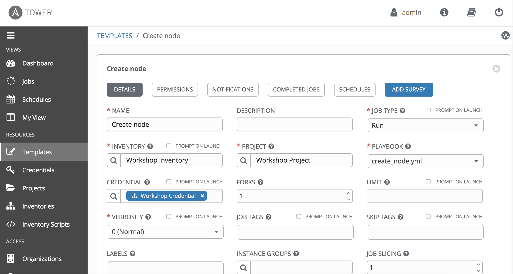
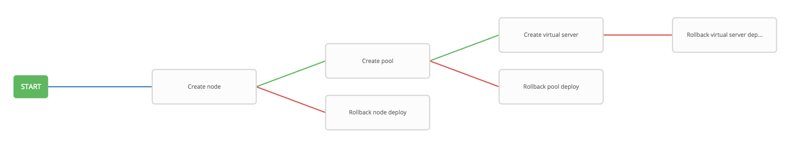

# Exercise 4.2: Creating a Workflow

**Read this in other languages**:  [English](README.md),   [日本語](README.ja.md).

## Table of Contents

- [Objective](#objective)
- [Guide](#guide)
- [Takeaways](#takeaways)
- [Complete](#complete)

# Objective

Demonstrate the use of [Ansible Tower workflow](https://docs.ansible.com/ansible-tower/latest/html/userguide/workflows.html) for F5 BIG-IP.  Workflows allow you to configure a sequence of disparate job templates (or workflow templates) that may or may not share inventory, playbooks, or permissions.

For this exercise we will use workflow to achieve the same as the **create_vs** job template, while at the same time adding failure handling for each job.

# Guide

## Step 1: Prepare Job Templates

Following what we learned from `Lab 4.1`, create the following job templates with the respective playbook:

| Job template Name | Playbook |
|---|---|
| Create node | create_node.yml |
| Create pool | create_pool.yml |
| Create virtual server | create_virtualserver.yml |
| Rollback node deploy | rollback_node_deploy.yml |
| Rollback pool deploy | rollback_pool_deploy.yml |
| Rollback virtual server deploy | rollback_vs_deploy.yml |
|

Apart from above, we use the same template parameters as `Lab 4.1` for each of the above templates,:

| Parameter | Value |
|---|---|
| NAME  | |
| JOB TYPE | Run |
| INVENTORY | Workshop Inventory |
| PROJECT | Workshop Project |
| PLAYBOOK | |
| CREDENTIAL | BIGIP |
|

Here is the template example of **Create node**:

## Step 2: Create a Workflow Template

1. Click on the **Templates** link on the left menu.  

2. Click on the green  button and select the **Workflow Template**.

3. Fill out the form as follows:

   | Parameter | Value |
   |---|---|
   | NAME | Workshop Workflow |
   | ORGANIZATION | Default |
   | INVENTORY | Workshop Inventory |
   |

4. Click on the **`Save`** button

   

## Step 3: The Workflow Visualizer

1. When you click the **SAVE** the **WORKFLOW VISUALIZER** should automatically open. If not, click on the blue **WORKFLOW VISUALIZER** button.  

2. By default only a green **START** button will appear. Click on the **START** button.  

3. The **ADD A NODE** window will appear on the right. Select the `Create node` Job Template that was created in previous step (or whatever you named it!).

   

   The `Create node` job template is now a node. Job or workflow templates are linked together using a graph-like structure called nodes. These nodes can be jobs, project syncs, or inventory syncs. A template can be part of different workflows or used multiple times in the same workflow. A copy of the graph structure is saved to a workflow job when you launch the workflow.

4. Click the green **SELECT** button.

   

## Step 4: Add *Create pool* Job Template

1. Hover over the **`Create node`** node and click the green **+** symbol. The **ADD A NODE** will appear again.

2. Select the **`Create pool`** job template. For the **Run** parameter select **On Success** from the drop down menu.  

3. Click the green **SELECT** button.

   

## Step 5: Add *Create virtual server* Job Template

1. Hover over the **`Create pool`**  node and click the green **+** symbol.  The **ADD A NODE** will appear again.

2. Select the **`Create virtual server`** job template.  For the **Run** parameter select **On Success** from the drop down menu.  

3. Click the green **SELECT** button.
   
   

## Step 6: *Rollback node deploy* Template

1. Hover over the **Create node** node and click the green **+** symbol.  The **ADD A NODE** will appear again.

2. Select the **Rollback node deploy** job template.  For the **Run** parameter select **On Failure** from the drop down menu.  

3. Click the green **SELECT** button.  

   

## Step 7: *Rollback pool deploy* Template

1. Hover over the **Create pool** node and click the green **+** symbol.  The **ADD A NODE** will appear again.

2. Select the **Rollback pool deploy** job template.  For the **Run** parameter select **On Failure** from the drop down menu.  

3. Click the green **SELECT** button.  

   

## Step 8: *Rollback virtual server* Template

1. Hover over the **Create virtual server** node and click the green **+** symbol.  The **ADD A NODE** will appear again.

2. Select the **Rollback virtual server deploy** job template.  For the **Run** parameter select **On Failure** from the drop down menu.  

3. Click the green **SELECT** button.  

   

4. Click the green **SAVE** button.  

## Step 9: Run the Workflow

1. Return to the **Templates** window

2. Click the rocket ship to launch the **Workshop Workflow** workflow template.

   

   At any time during the workflow job you can select an individual job template by clicking on the node to see the status.

## Step 10: Error Handling

Next, we will show a failed job template for the workflow, where a rollback is performed.

1. Click on the `Templates` link on the left menu.

   

2. Select template `Create virtual server`

3. Change the PLAYBOOK from `create_virtualserver.yml` to `create_virtualserver_error.yml`

   The `create_virtualserver_error.yml` playbook will configure the Virtual Server, but tries to attach a pool `http_pool_error` which does not exist. Therefore, the addition of virtual server will fail, and the `Rollback virtual server deploy` node will be triggered.

4. Scroll down and click the green `save` button.

5. Return to the **Templates** window, click the rocket ship to launch the **Workshop Workflow** workflow template again.

   

6. Login to the F5 BIG-IP with your web browser to see what was configured.

   Click on **Local Traffic** then **Virtual Servers**, **Pools**, and **Nodes**. You should see that `Rollback virtual server deploy`  kicked in and removed all BIG-IP configuration.

## Step 11: Clean Up

Finally, we revert the configuration, and make it ready for next lab:

1. Click on the **Templates** link on the left menu. Select template `Create virtual server`

2. Change the PLAYBOOK back to `create_virtualserver.yml` 

3. Scroll down and click the green `save` button.

4. Return to the **Templates** window, click the rocket ship to launch the **Workshop Workflow** template again.
5. Validate the Virtual Server was created via the BIGIP MGMT GUI.

# Takeaways

You have

- Created a workflow template that create node, a pool, and virtual server
- Made the workflow robust, if either job template fails it will rollback the deployment
- Launched the workflow template and explored the **VISUALIZER**

# Complete

You have completed lab exercise 4.2

[Click here to return to the Ansible Network Automation Workshop](../README.md)
