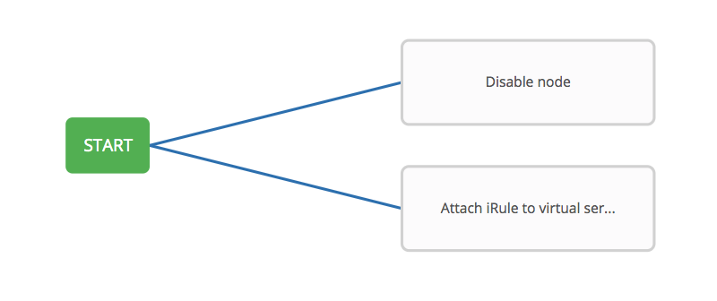
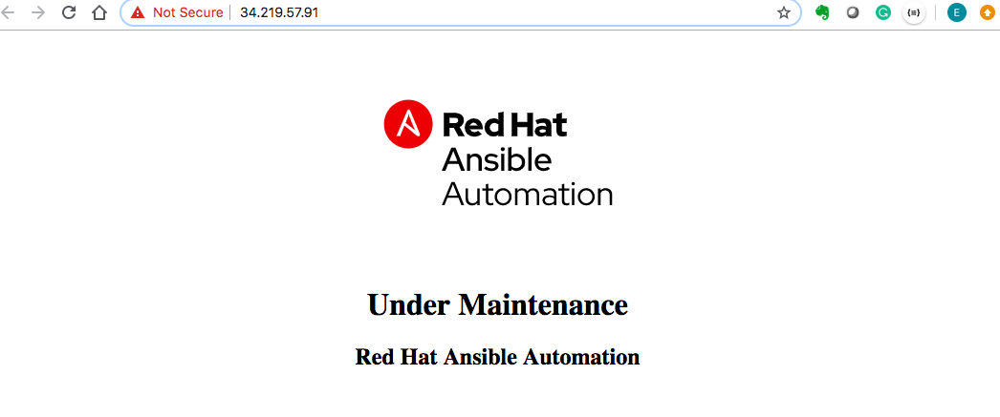

# 演習 4.3: ノードメンテナンスワークフローの作成

**他の言語でもお読みいただけます** : [English](README.md)、 [日本語](README.ja.md).

## 目次

- [目的](#objective)  - [ガイド](#guide)  - [重要なこと](#takeaways)  -
[完了](#complete)

# 目的

F5 BIG-IP 向けのもう 1 つの [Ansible
自動コントローラーワークフロー](https://docs.ansible.com/automation-controller/latest/html/userguide/workflows.html)
のユースケースを説明します。

この演習では、サーバーパッチ管理のワークフローを作成します。まずプールメンバーを無効にし、ノードにパッチを適用し、続いてノードを有効にします。並行して、iRule
を仮想サーバーにアタッチして、サーバーがメンテナンス状態にあるときにユーザーに対応します。

# ガイド

## ステップ 1: ジョブテンプレートの準備

以前のラボと同様に、`Lab 4.1` に従って以下のテンプレートを作成する必要があります。

| NAME | Playbook | |---|---| | Disable node | disable_node.yml | | Enable
node | enable_node.yml | | Patch server | patch_server.yml | | Attach iRule
| attach_irule.yml | | Detach iRule | detach_irule.yml | |

`Patch server` を除き、ここでも上記の各テンプレートに `Lab 4.1`
と同じテンプレートパラメーターを使用します。このテンプレートは認証情報 `Workshop Credential` を使用し、他のすべてのテンプレートは
`BIGIP` を使用します。

| Parameter | Value | |---|---| | NAME | | | JOB TYPE | Run | | INVENTORY |
Workshop Inventory | | PROJECT | Workshop Project | | PLAYBOOK | | |
CREDENTIALS | | |

以下は、設定されたテンプレートの例です。

## ステップ 2: ワークフローテンプレートの作成

1. 左側のメニューの **Templates** リンクをクリックします。

2.  ボタンをクリックします。**Workflow Template**
   を選択します。

3. 次のようにフォームに記入します。

   | Parameter | Value |
   |---|---|
   | NAME | Node maintenance workflow |
   | ORGANIZATION | Default |
   | INVENTORY | Workshop Inventory |
   |

   

4. **Save** ボタンをクリックします

## ステップ 3: ワークフロービジュアライザー

1. **SAVE** ボタンをクリックすると、**WORKFLOW VISUALIZER** が自動的に開きます。開かない場合は、青い
   **WORKFLOW VISUALIZER** ボタンをクリックしてください。

2. デフォルトでは、緑色の **START** ボタンのみが表示されます。**START** ボタンをクリックします。

3. **ADD A NODE** ウィンドウが右側に表示されます。

## ステップ 4: ノードテンプレートの無効化

1. **Disable node** ジョブテンプレートを選択します。ドロップダウンボックスを使用して run を選択します。**Run type**
   という左のナビゲーターメニューオプションから **Always** を選択します。
2. **Save** ボタンをクリックします。

   

## ステップ 5: iRule テンプレートのアタッチ

1. **START** ボタンを再度クリックします。**ADD A NODE** が再び表示されます。

2. **Attach iRule** ジョブテンプレートを選択します。**Run type** という左側のナビゲーターメニューオプションから
   **Always** を選択します。

3. **Save** ボタンをクリックします。

   

## ステップ 6: サーバーテンプレートへのパッチ適用

1. **Disable node** ノードにカーソルを合わせ、**+** 記号をクリックします。**ADD A NODE** が再び表示されます。

2. **Patch server** ジョブテンプレートを選択します。**Run type** という左側のナビゲーターメニューオプションから
   **On Success** を選択します。

3. **Save** ボタンをクリックします。

   

## ステップ 7: ノードテンプレートの有効化

1. **Patch server** ノードにカーソルを合わせ、**+** 記号をクリックします。**ADD A NODE** が再び表示されます。

2. **Enable node** ジョブテンプレートを選択します。**Run type** という左側のナビゲーターメニューオプションから **On
   Success** を選択します。

3. **Save** ボタンをクリックします。

   

## ステップ 8: iRule テンプレートのデタッチ

1. **Enable node** ノードにカーソルを合わせ、**+** 記号をクリックします。**ADD A NODE** が再び表示されます。

2. **Detach iRule** ジョブテンプレートを選択します。**Run type** という左側のナビゲーターメニューオプションから
   **On Success** を選択します。

3. **Save** ボタンをクリックします。

   

## ステップ 9: コンバージドリンクの作成

最後に、コンバージェンスリンクを作成します。これにより、並行して実行されているジョブが収束できるようになります。言い換えると、両方のジョブが終了すると、`Detach
iRule` ノードがトリガーされます。

1. `Attach iRule to virtual server` ノードにカーソルを合わせ、チェーンのマークをクリックします。

2. 次に、既存の `Detach iRule` をクリックします。ADD LINK ウィンドウが表示されます。RUN パラメーターに Always
   を選択します。

   

3. 再度 **SAVE** ボタンをクリックしてワークフローを保存します。

## ステップ 10: ワークフローの実行

1. **Templates** ウィンドウに戻ります

2. 起動ボタンをクリックして、**Node maintenance workflow** テンプレートを起動します。

   

   ワークフロージョブ中はいつでも、ノードをクリックしてステータスを確認することにより、個々のジョブテンプレートを選択できます。

3. iRule が仮想サーバーにアタッチされていると、サーバーのメンテナンス中ユーザーはメンテナンスのページを受け取ります。

   

# 重要なこと

以下を行いました。

- プールメンバーを無効にし、Web サーバーをアップグレードし、サーバーをプールに戻すワークフローテンプレートを作成しました -
サーバーのパッチ処理中ユーザーがメンテナンスのページを受け取るように、iRule を仮想サーバーにアタッチしました -
ワークフローテンプレートを起動し、**VISUALIZER** を調べました

# 完了

ラボ演習 4.3 を完了しました

[Click here to return to the Ansible Network Automation
Workshop](../README.md)
