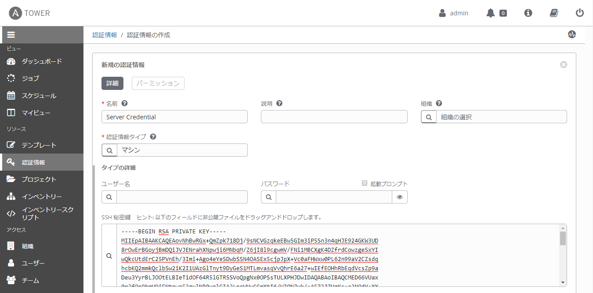
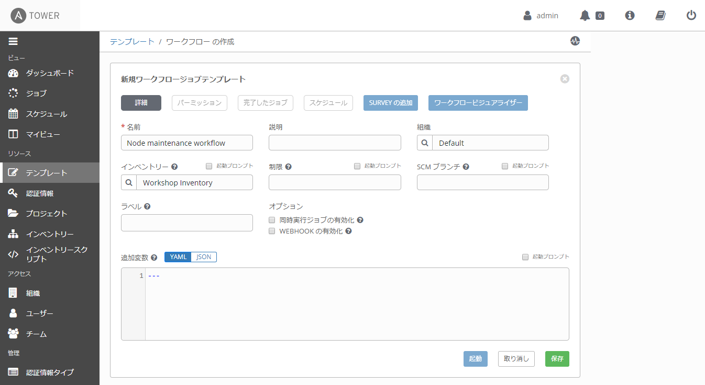
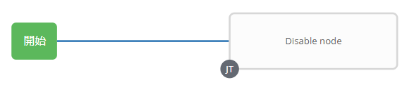
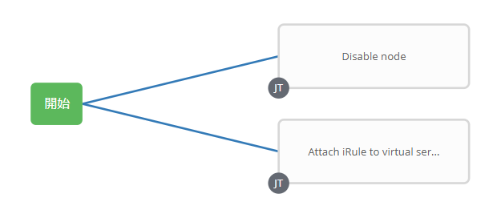
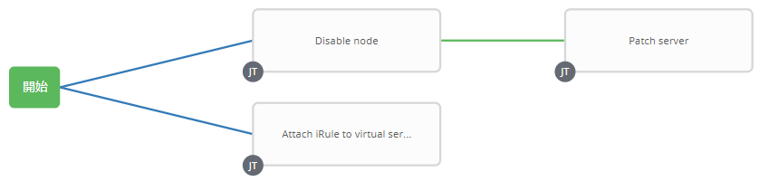
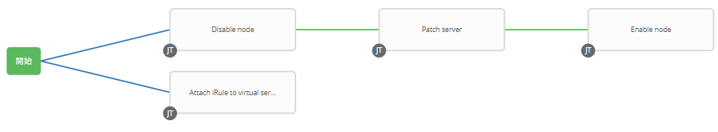
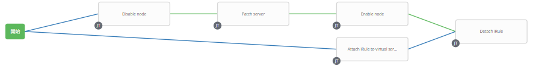

# 演習 4.3: ノードメンテナンスワークフローの作成

**Read this in other languages**:  [English](README.md),   [日本語](README.ja.md).

## 目次

- [演習 4.3: ノードメンテナンスワークフローの作成](#演習-4.3-ノードメンテナンスワークフローの作成)
  - [目次](#目次)
- [目的](#目的)
- [解説](#解説)
  - [Step 1: ジョブテンプレートの準備](#Step-1-ジョブテンプレートの準備)
    - [サーバー資格情報の作成](#サーバー資格情報の作成)
    - [ジョブテンプレートの作成](#ジョブテンプレートの作成)
  - [Step 2: ワークフローテンプレートの作成](#Step-2-ワークフローテンプレートの作成)
  - [Step 3: ワークフロービジュアライザー](#Step-3-ワークフロービジュアライザー)
  - [Step 4: Disable nodeジョブテンプレートの追加](#Step-4-Disable-nodeジョブテンプレートの追加)
  - [Step 5: Attach iRule to virtual serverジョブテンプレートの追加](#Step-5-Attach-iRule-to-virtual-serverジョブテンプレートの追加)
  - [Step 6: Patch serverジョブテンプレートの追加](#Step-6-Patch-serverジョブテンプレートの追加)
  - [Step 7: Enable nodeジョブテンプレートの追加](#Step-7-Enable-nodeジョブテンプレートの追加)
  - [Step 8: Detach iRuleジョブテンプレートの追加](#Step-8-Detach-iRuleジョブテンプレートの追加)
  - [Step 9: コンバージドリンクの作成](#Step-9-コンバージドリンクの作成)
  - [Step 10: ワークフローの実行](#Step-10-ワークフローの実行)
- [まとめ](#まとめ)
- [完了](#完了)

# 目的

F5 BIG-IPの[Ansible Tower ワークフロー](https://docs.ansible.com/ansible-tower/latest/html/userguide/workflows.html)のユースケースを示します。

この演習では、サーバーのパッチ管理のワークフローを作成します。最初にプールメンバーを無効にし、ノードにパッチを適用してから、ノードを有効にします。同時に、iRuleを仮想サーバーに接続して、サーバーがメンテナンス中であることをユーザーに応答します。

# 解説

## Step 1: ジョブテンプレートの準備

### サーバー資格情報の作成
テンプレートを作成する前に、1つのジョブ(`Patch server`)でサーバにアクセスするために、事前にもう1つの資格情報`Server credential`を作成する必要があります。
   
| パラメータ     | 値                |
|----------------|-------------------|
| 名前           | Server Credential |
| 認証情報タイプ |  マシン           |

この資格情報には、**SSH 秘密鍵** を使用します。Ansibleサーバから秘密鍵を取得し、出力をコピーし **SSH 秘密鍵** ボックスに貼り付け、**保存** をクリックします。
```
[student1@ansible ~]$ cat ~/.ssh/aws-private.pem
```

  


### ジョブテンプレートの作成
以前の`演習 4.1`と同様に、以下のテンプレートを準備する必要があります:

| ジョブテンプレート名           | Playbook         |
|--------------------------------|------------------|
| Disable node                   | disable_node.yml |
| Enable node                    | enable_node.yml  |
| Patch server                   | patch_server.yml |  
| Attach iRule to virtual server | attach_irule.yml |  
| Detach iRule                   | detach_irule.yml |

ここでも、**認証情報** のパラメータを除いて、`演習 4.1`と同じく上記の各テンプレートに同じパラメータを使用します。

**認証情報** については、`Patch server`テンプレートは`Server Credential`を使用し、他の全てのテンプレートは`Workshop Credential`を使用します。

| パラメータ     | 値                  |
|----------------|---------------------|
| 名前           |                     |
| ジョブタイプ   | 実行                |
| インベントリー | Workshop Inventory  |
| プロジェクト   | Workshop Project    |
| Playbook       |                     |
| 認証情報       | Workshop Credential |

設定されたテンプレートの一例を次に示します。


## Step 2: ワークフローテンプレートの作成

1. 左側のメニューバーから **テンプレート** をクリックします。

2. 緑色のボタンをクリックして、新しく **ワークフローテンプレート**を作成します。

3. 以下の通りにパラメータを入力します。

| パラメータ     | 値                        |
|----------------|---------------------------|
| 名前           | Node maintenance workflow |
| 組織           | Default                   |
| インベントリー | Workshop Inventory        |

4. **保存** ボタンをクリックします。



## Step 3: ワークフロービジュアライザー

1. **保存** ボタンをクリックすると、**ワークフロービジュアライザー** が自動的に開きます。もしそうでない場合、青い **ワークフロービジュアライザー** ボタンをクリックします。

2. デフォルトでは、緑色の **開始** ボタンのみが表示されます。**開始** ボタンクリックします。

3. 右側に **ノードの追加** が表示されます。

## Step 4: *Disable node*ジョブテンプレートの追加

1.  **`Disable node`** ジョブテンプレートを選択します。実行オプションは、`常時`を使用します。緑色の **選択** ボタンをクリックします。

    

## Step 5: *Attach iRule to virtual server*ジョブテンプレートの追加

1. もう一度 **開始** ボタンをクリックします。**ノードの追加** が再び表示されます。

2. **`Attach iRule to virtual server`** ジョブテンプレートを選択します。**実行** パラメータは、ドロップダウンメニューから **常時** を選択します。

3. 緑色の **選択** ボタンをクリックします。

   

## Step 6: *Patch server*ジョブテンプレートの追加

1. **`Disable node`** ノードにカーソルを合わせ、緑色の **+** 記号をクリックします。**ノードの追加** が再び表示されます。

2. **`Patch server`** ジョブテンプレートを選択します。**実行** パラメータは、ドロップダウンメニューから **成功時** を選択します。

3. 緑色の **選択** ボタンをクリックします。

   

## Step 7: *Enable node*ジョブテンプレートの追加

1. **`Patch server`** ノードにカーソルを合わせ、緑色の **+** 記号をクリックします。**ノードの追加** が再び表示されます。

2. **`Enable node`** ジョブテンプレートを選択します。**実行** パラメータは、ドロップダウンメニューから **成功時** を選択します。

3. 緑色の **選択** ボタンをクリックします。

   

## Step 8: *Detach iRule*ジョブテンプレートの追加

1. **`Enable node`** ノードにカーソルを合わせ、緑色の **+** 記号をクリックします。**ノードの追加** が再び表示されます。

2. **`Detach iRule`** ジョブテンプレートを選択します。**実行** パラメータは、ドロップダウンメニューから **成功時** を選択します。

3. 緑色の **選択** ボタンをクリックします。

   

## Step 9: コンバージドリンクの作成

最後に、並行して実行されているジョブを収束できるようにするリンクを作成します。つまり、両方のジョブが完了すると、`Detach iRule`ノードがトリガーされます。

1. **`Attach iRule to virtual server`** ノードの上にカーソルを置き、青いチェーン記号をクリックします。

2. 次に、**Detach iRule** をクリックします。リンクの追加ウィンドウが表示されます。**実行** パラメータには、**常時** を選択します。


3. 緑色の **保存** ボタンをクリックします。

## Step 10: ワークフローの実行

1. **テンプレート** ウインドウに戻ります。

2. ロケットをクリックし、**`Node maintenance workflow`** ワークフローテンプレートを起動します。

   

    ワークフロージョブの実行中はいつでも、ノードをクリックして個々のジョブテンプレートを選択し、ステータスを確認できます。

仮想サーバーにiRuleをアタッチすると、サーバーのメンテナンス時にメンテナンスページが表示されます。
   

# まとめ

あなたは学習しました

 - プールメンバーを無効にし、Webサーバーをアップグレードし、サーバーをプールに戻すワークフローテンプレートを作成しました
 - iRuleを仮想サーバーに接続し、ユーザーはサーバーのパッチ中にメンテナンスページが表示されます
 - ワークフローテンプレートを起動し、**ワークフロービジュアライザー**を確認しました

---

# 完了

演習 4.3を完了しました。

[Ansible F5 Network Automation Workshopに戻るには、ここをクリックしてください](../README.ja.md)
