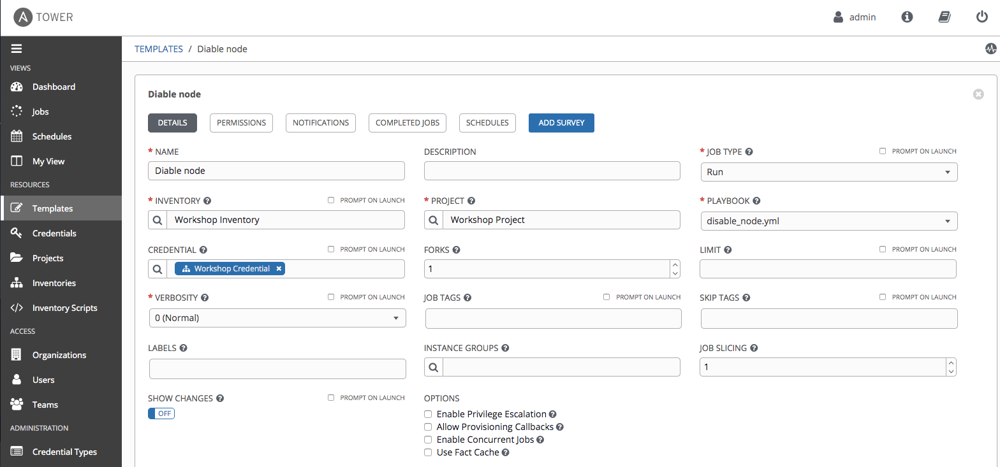
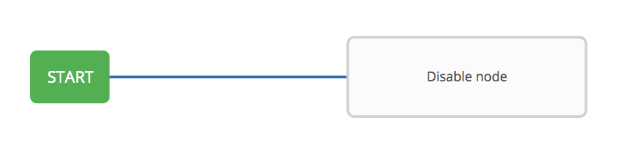
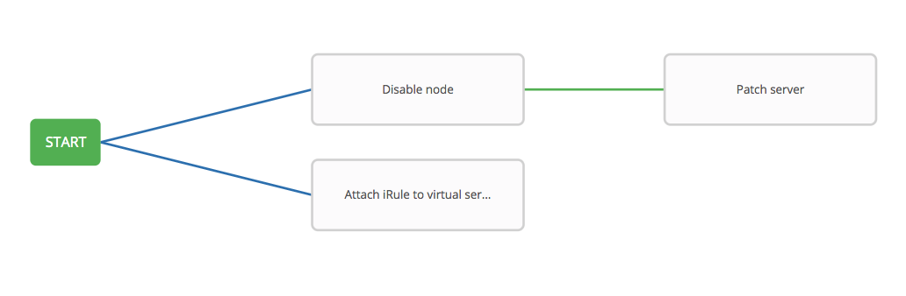
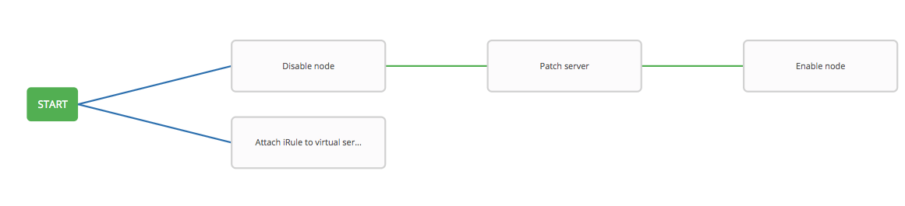

# Exercise 4.3: Creating Node Maintenance Workflow

**Read this in other languages**:  [English](README.md),   [日本語](README.ja.md).

## Table of Contents

- [Exercise 4.3: Creating Node Maintenance Workflow](#exercise-43-creating-node-maintenance-workflow)
  - [Table of Contents](#table-of-contents)
- [Objective](#objective)
- [Guide](#guide)
  - [Step 1: Prepare Job Templates](#step-1-prepare-job-templates)
    - [Create Server Credential](#create-server-credential)
    - [Create Job Templates](#create-job-templates)
  - [Step 2: Create a Workflow Template](#step-2-create-a-workflow-template)
  - [Step 3: The Workflow Visualizer](#step-3-the-workflow-visualizer)
  - [Step 4: Disable node Job Template](#step-4-disable-node-job-template)
  - [Step 5: Attach iRule to virtual server Template](#step-5-attach-irule-to-virtual-server-template)
  - [Step 6: Patch server Template](#step-6-patch-server-template)
  - [Step 7: Enable node Template](#step-7-enable-node-template)
  - [Step 8: Detach iRule Template](#step-8-detach-irule-template)
  - [Step 9: Create a converged link](#step-9-create-a-converged-link)
  - [Step 10: Run the Workflow](#step-10-run-the-workflow)
- [Takeaways](#takeaways)
- [Complete](#complete)

# Objective

Demonstrate anothe use case of [Ansible Tower workflow](https://docs.ansible.com/ansible-tower/latest/html/userguide/workflows.html) for F5 BIG-IP.

For this exercise, we will create a workflow for server patch management, first to disable the pool members, patch the nodes, and then enable the nodes. In parallel, we also attach an iRule to virtual server, to respond to the users when servers are under maintenance.

# Guide

## Step 1: Prepare Job Templates

### Create Server Credential
Before creating templates, you should create one more credential `Server credential` beforehand, to be utilized by one of the jobs (`Patch server`) to access servers.

| Parameter | Value |
|---|---|
|Name | Server Credential |
| Credential type: | `Machine` |

For this credential, we use the **SSH private key** instead. Get the private key from Ansible server, copy the output and paste in the **SSH PRIVATE KEY** box, and click SAVE.
```
[student1@ansible ~]$ cat ~/.ssh/aws-private.pem
```

  


### Create Job Templates
Similar to the previous lab, we would need to prepare the following templates by following `Lab 4.1`:

| Job template Name | Playbook |
|---|---|
| Disable node            | disable_node.yml     |
| Enable node            | enable_node.yml    |
| Patch server            | patch_server.yml     |  
| Attach iRule to virtual server            | attach_irule.yml     |  
| Detach iRule             | detach_irule.yml    |

Again, we use the same template parameters as `Lab 4.1` for each of the above templates, except the parameter of `CREDENTAUL`.

For `CREDENTAUL`, the `Patch server` template will use credential `server credential`, and  all other templates will be using `Workshop Credential`

| Parameter | Value |
|---|---|
| Name  | 	  |
|  Job Type |  Run |
|  Inventory |  Workshop Inventory |
|  Project |  Workshop Project |
|  Playbook |   |
|  Credential |  Workshop Credential  |

Here is one example of the templates configured:



## Step 2: Create a Workflow Template

1. Click on the **Templates** link on the left menu.  

2. Click on the green  button. Select the **Workflow Template**.  

3. Fill out the the form as follows:

| Parameter | Value |
|---|---|
| Name  | Node maintenance workflow  |
|  Organization |  Default |
|  Inventory |  Workshop Inventory |

4. Click on the **Save** button


## Step 3: The Workflow Visualizer

1. When you click the **SAVE**, the **WORKFLOW VISUALIZER** should automatically open.  If not click on the blue **WORKFLOW VISUALIZER** button.  

2. By default only a green **START** button will appear.  Click on the **START** button.  

3. The **ADD A TEMPLATE** window will appear on the right.  

## Step 4: Disable node Job Template

1.  Select the **Disable node** Job Template.  Use the drop down box to select run.  Click the green **SELECT** button.

    

## Step 5: Attach iRule to virtual server Template

1. Click on the **START** button, again.  The **ADD A TEMPLATE** will appear again.

2. Select the **Attach iRule to virtual server** job template.  For the **Run** parameter select **Always** from the drop down menu.  

3. Click the green **SELECT** button.

   

## Step 6: Patch server Template

1. Hover over the **Disable node** node and click the green **+** symbol.  The **ADD A TEMPLATE** will appear again.

2. Select the **Patch server** job template.  For the **Run** parameter select **On Success** from the drop down menu.  

3. Click the green **SELECT** button.

   

## Step 7: Enable node Template

1. Hover over the **Patch server** node and click the green **+** symbol.  The **ADD A TEMPLATE** will appear again.

2. Select the **Enable node** job template.  For the **Run** parameter select **On Success** from the drop down menu.  

3. Click the green **SELECT** button.

   

## Step 8: Detach iRule Template

1. Hover over the **Enable node** node and click the green **+** symbol.  The **ADD A TEMPLATE** will appear again.

2. Select the **Detach iRule** job template.  For the **Run** parameter select **On Success** from the drop down menu.  

3. Click the green **SELECT** button.

   

## Step 9: Create a converged link

Lastly, we create a covergence link, which allows the jobs running in parallel to converge. In another word, when both jobs finish, `Detach iRule` node will trigger.

1. Hover over the `Attach iRule to virtual server` node and click the blue chain symbol.

2. Now, click on the existing `Detach iRule`. An ADD LINK window will appear. For the RUN parameter choose Always.


## Step 10: Run the Workflow

1. Return to the **Templates** window

2. Click the rocket ship to launch the **Node maintenance workflow** workflow template.

   

    At any time during the workflow job you can select an individual job template by clicking on the node to see the status.

3. Click the green **SAVE** button.

With iRule attached to virtual server, user will receive a maintenance page during the server maintenance:
   


# Takeaways

You have
 - created a workflow template that disables pool memebers, upgrade web servers, and add servers back to the pool
 - attached iRule to virtual server, and user will get maintenance page during server patch
 - launched the workflow template and explored the **VISUALIZER**

---

# Complete

You have completed lab exercise 4.3

[Click here to return to the Ansible Network Automation Workshop](../README.md)
