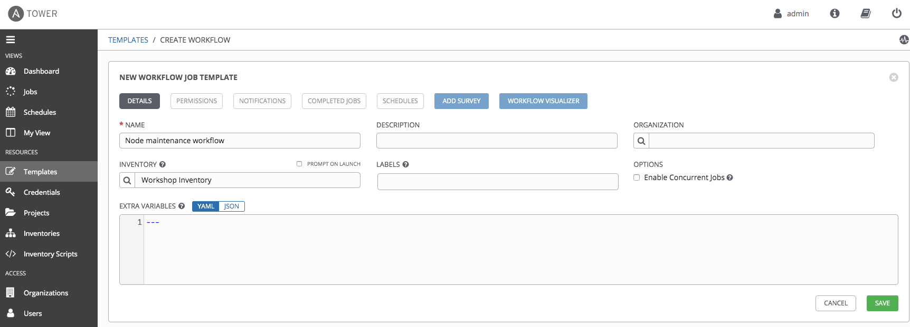

# Exercise 4.2: Creating a Workflow

## Table of Contents

- [Exercise 4.2: Creating a Workflow](#exercise-42-creating-a-workflow)
  - [Table of Contents](#table-of-contents)
- [Objective](#objective)
- [Guide](#guide)
  - [Step 0: Prepare Job Templates](#step-0-prepare-job-templates)
  - [Step 1: Create a Workflow Template](#step-1-create-a-workflow-template)
  - [Step 2: The Workflow Visualizer](#step-2-the-workflow-visualizer)
  - [Step 3: Disable node Job Template](#step-3-disable-node-job-template)
  - [Step 4: Attach iRule to virtual server Template](#step-4-attach-irule-to-virtual-server-template)
  - [Step 4: Patch server Template](#step-4-patch-server-template)
  - [Step 5: Enable node Template](#step-5-enable-node-template)
  - [Step 6: Detach iRule Template](#step-6-detach-irule-template)
  - [Step 6: Create a converged link](#step-6-create-a-converged-link)
  - [Step 7: Run the Workflow](#step-7-run-the-workflow)
- [Takeaways](#takeaways)
- [Complete](#complete)

# Objective

Demonstrate anothe use case of [Ansible Tower workflow](https://docs.ansible.com/ansible-tower/latest/html/userguide/workflows.html) for F5 BIG-IP. 

For this exercise we will ...

# Guide

## Step 0: Prepare Job Templates

Create the following templates by following `Lab 4.2`:
* Disable node
* Enable node
* Patch server
* Attach iRule to virtual server
* Detach iRule 

Here is one example of the templates:

**TODO: add server credetial**

## Step 1: Create a Workflow Template

1. Click on the **Templates** link on the left menu.  

2. Click on the green **+** button. Select the **Workflow Template**.  

3. Fill out the the form as follows:

| Parameter | Value |
|---|---|
| Name  | Node maintenance workflow  |
|  Organization |  Default |
|  Inventory |  Workshop Inventory |

4. Click on the **Save** button

## Step 2: The Workflow Visualizer

1. When you click the **SAVE** the **WORKFLOW VISUALIZER** should automatically open.  If not click on the blue **WORKFLOW VISUALIZER** button.  

2. By default only a green **START** button will appear.  Click on the **START** button.  

3. The **ADD A TEMPLATE** window will appear on the right.  

## Step 3: Disable node Job Template

1.  Select the **Disable node** Job Template.  Use the drop down box to select run.  Click the green **SELECT** button.

    

## Step 4: Attach iRule to virtual server Template

1.  Click on the **START** button, again.  The **ADD A TEMPLATE** will appear again.

2. Select the **Attach iRule to virtual server** job template.  For the **Run** parameter select **On Success** from the drop down menu.  
3. Click the green **SELECT** button.

   

## Step 4: Patch server Template

1.  Hover over the **Disable node** node and click the green **+** symbol.  The **ADD A TEMPLATE** will appear again.
2. Select the **Attach iRule to virtual server** job template.  For the **Run** parameter select **On Success** from the drop down menu.  
3. Click the green **SELECT** button.

   

## Step 5: Enable node Template

1.  Hover over the **Patch server** node and click the green **+** symbol.  The **ADD A TEMPLATE** will appear again.

2. Select the **Enable node** job template.  For the **Run** parameter select **On Success** from the drop down menu.  
3. Click the green **SELECT** button.

   

## Step 6: Detach iRule Template

1.  Hover over the **Enable node** node and click the green **+** symbol.  The **ADD A TEMPLATE** will appear again.
2. Select the **Detach iRule** job template.  For the **Run** parameter select **On Success** from the drop down menu.  
3. Click the green **SELECT** button.

   

## Step 6: Create a converged link

## Step 7: Run the Workflow

1. Return to the **Templates** window

2. Click the rocket ship to launch the **Workshop Workflow** workflow template.

   

    At any time during the workflow job you can select an individual job template by clicking on the node to see the status.

With iRule attached to virtual server, maintenance page during the server maintenance:
   

# Takeaways

You have
 - created a workflow template that removes a pool memeber, upgrade web server, and add server back to the pool
 - made the workflow robust, if either job template fails it will restore the configuration
 - launched the workflow template and explored the **VISUALIZER**

---

# Complete

You have completed lab exercise 9

[Click here to return to the Ansible Network Automation Workshop](../README.md)
