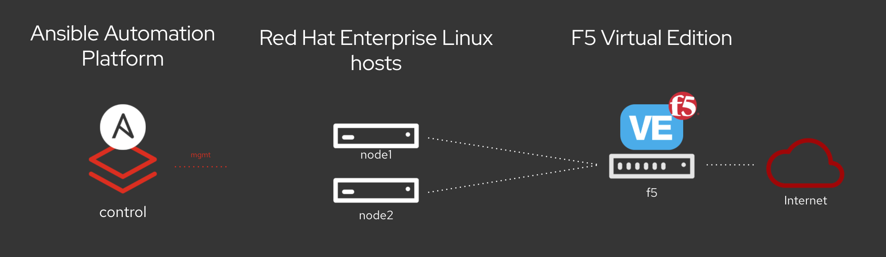

# Ansible F5 ネットワーク設定ワークショップ

**これは Ansible Automation Platform 2 のドキュメントです**

このコンテンツは、F5 BIG-IP での Ansible
の機能を効果的に説明するための多目的ツールキットです。ここでは、インストラクターによる講義、ハンズオン、または自己ペースの演習など、さまざまな形式でワークショップトレーニングが提供されます。

**他の言語でもお読みいただけます**:  [English](README.md)、 [日本語](README.ja.md)

This is the documentation for Ansible Automation Platform 1.2.  If you are
looking for Ansible Automation Platform 2, please go to
[http://aap2.demoredhat.com/](http://aap2.demoredhat.com/).

## プレゼンテーション
プレゼンテーションの資料が必要ですか? ここから入手いただけます:
[Ansible F5 WorkshopDeck](../../decks/ansible_f5.pdf)

## 図

BIG-IP のログイン情報: - ユーザー名: admin - パスワード: **インストラクターから提供**

## セクション 1 - Ansible F5 の基本演習

 - [演習 1.0 - ラボ環境の調査](1.0-explore)
 - [演習 1.1 - Ansible を使用した F5 BIG-IP からのデータ収集](1.1-get-facts)
 - [演習 1.2 - F5 BIG-IP へのノードの追加](1.2-add-node)
 - [演習 1.3 - ロードバランシングプールの追加](1.3-add-pool)
 - [演習 1.4 - プールへのメンバーの追加](1.4-add-pool-members)
 - [演習 1.5 - 仮想サーバーの追加](1.5-add-virtual-server)
 - [演習 1.6 - 仮想サーバーへの iRule の追加とアタッチ](1.6-add-irules)
 - [演習 1.7 - 実行中の設定の保存](1.7-save-running-config)

## セクション 2 - Ansible F5 の操作/高度な演習

 - [演習 2.0 - プールメンバーの無効化](2.0-disable-pool-member)
 - [演習 2.1 - F5 BIG-IP 設定の削除](2.1-delete-configuration)
 - [演習 2.2 - エラー処理](2.2-error-handling)

## セクション 3 - Ansible F5 AS3 の演習

 - [演習 3.0 - AS3 の概要](3.0-as3-intro)
 - [演習 3.1 - AS3 での操作変更](3.1-as3-change)
 - [演習 3.2 - Web アプリケーションの削除](3.2-as3-delete)

## セクション 4 - Ansible コントローラー F5 の演習

 - [演習 4.0 - Ansible 自動コントローラーの調査](4.0-explore-tower)
 - [演習 4.1 - Ansible 自動コントローラージョブテンプレートの作成](4.1-tower-job-template)
 - [演習 4.2 - Ansible 自動コントローラーワークフローの作成](4.2-tower-workflow)
 - [演習 4.3 - ノードメンテナンスワークフローの作成](4.3-tower-workflow2)

### ワークショップに関する議論を開始する、または質問を投稿するには、以下のリンクを使用してください。
  - **https://devcentral.f5.com/questions/f5-ansible-automation-discussion-63579**

---

