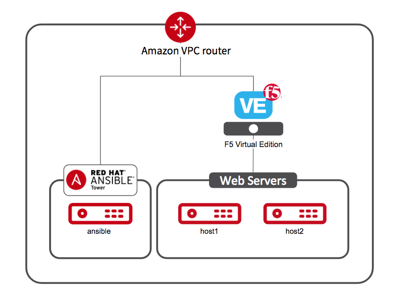

# Ansible Linklight - F5 Networking Workshop

This content is a multi-purpose toolkit for effectively demonstrating Ansible's capabilities on F5 BIG-IP by providing  workshop training in various forms -- instructor-led, hands-on or self-paced.

**Read this in other languages**:  [English](README.md),   [日本語](README.ja.md).

## Presentation
Want the Presentation Deck?  Its right here:
[Ansible F5 Workshop Deck](../../decks/ansible_f5.pdf)

## Diagram

Login information for the BIG-IP:
- username: admin
- password: **provided by instructor** (default is ansible)

## Section 1 - Ansible F5 Basic Exercises

 - [Exercise 1.0 - Exploring the lab environment](1.0-explore)  
 - [Exercise 1.1 - Using Ansible to gather data from F5 BIG-IP](1.1-get-facts)  
 - [Exercise 1.2 - Adding nodes to F5 BIG-IP](1.2-add-node)  
 - [Exercise 1.3 - Adding a load balancing pool](1.3-add-pool)  
 - [Exercise 1.4 - Adding members to a pool](1.4-add-pool-members)  
 - [Exercise 1.5 - Adding a virtual server](1.5-add-virtual-server)  
 - [Exercise 1.6 - Adding and attaching an iRule to a virtual server](1.6-add-irules)
 - [Exercise 1.7 - Save the running configuration](1.7-save-running-config)

## Section 2 - Ansible F5 Operational/Advanced Exercises

 - [Exercise 2.0 - Disabling a pool member](2.0-disable-pool-member)
 - [Exercise 2.1 - Deleting F5 BIG-IP Configuration](2.1-delete-configuration)  
 - [Exercise 2.2 - Error Handling](2.2-error-handling)  

## Section 3 - Ansible F5 AS3 Exercises

 - [Exercise 3.0 - Intro to AS3](3.0-as3-intro)  
 - [Exercise 3.1 - Operational Change with AS3](3.1-as3-change)
 - [Exercise 3.2 - Deleting a Web Application](3.2-as3-delete)

## Section 4 - Ansible Tower F5  Exercises

 - [Exercise 4.0 - Explore the Ansible Tower](4.0-explore-tower)  
 - [Exercise 4.1 - Create an Ansible Tower job template](4.1-tower-job-template)
 - [Exercise 4.2 - Create an Ansible Tower Workflow](4.2-tower-workflow)
 - [Exercise 4.3 - Create a node maintenance Workflow](4.3-tower-workflow2)

### To start a discussion or to post a question related to the workshop use link:
  - **https://devcentral.f5.com/questions/f5-ansible-automation-discussion-63579**

---

