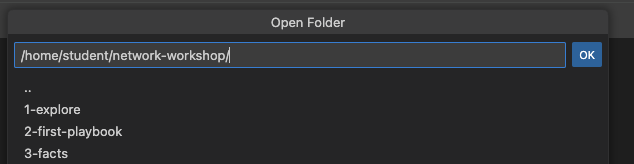
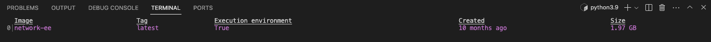
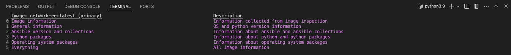
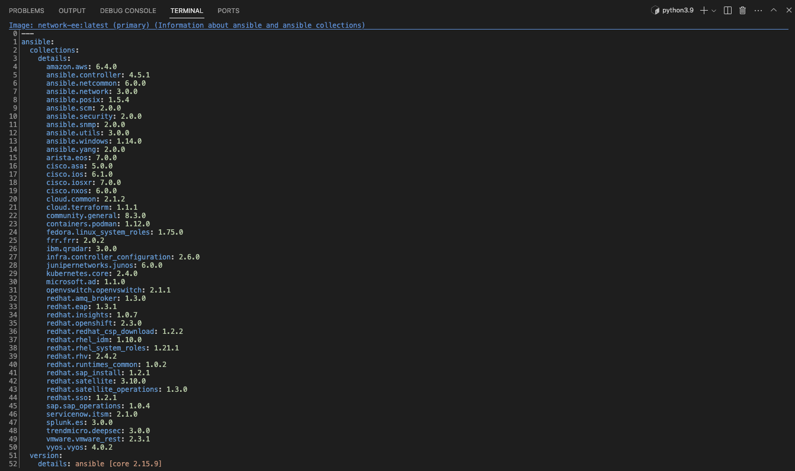
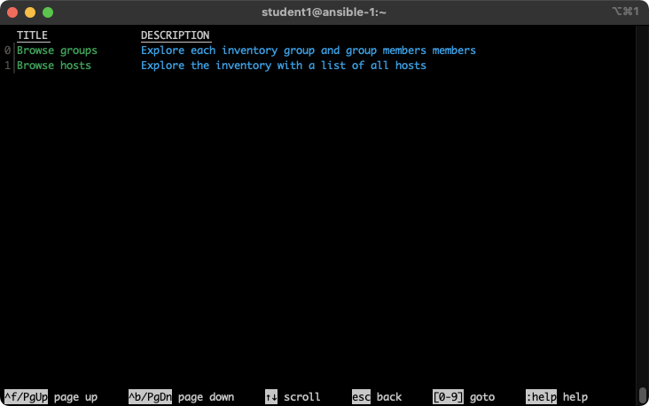

# Ejercicio 1 - Explorando el entorno de laboratorio

**Leálo en otros idiomas**:  [English](README.md),   [日本語](README.ja.md),  [Español](README.es.md).

## Índice

* [Objetivo](#objetivo)
* [Diagrama](#diagrama)
* [Guía](#guía)
   * [Paso 1 - Connectar vía VS Code](#paso-1---connectar-vía-vs-code)
   * [Paso 2 - Usando la Terminal](#paso-2---usando-la-terminal)
   * [Paso 3 - Examinando los Entornos de Ejecución](#paso-3---examinando-los-entornos-de-ejecución)
   * [Paso 4 - Examinando la configuración de ansible-navigator](#paso-4---examinando-la-configuración-de-ansible-navigator)
   * [Paso 5 - Examinando el inventario](#paso-5---examinando-el-inventario)
   * [Paso 6 - Comprendiendo el inventario](#paso-6---comprendiendo-el-inventario)
   * [Paso 7 - Usando ansible-navigator para explorar el inventario](#paso-7---usando-ansible-navigator-para-explorar-el-inventario)
   * [Paso 8 - Connectándose a dispositivos de red](#paso-8---connectándose-a-dispositivos-de-red)
* [Completado](#complete)

## Objetivo

Explorar y comprender el entorno de laboratorio.

Estos primeros ejercicios de laboratorio consistirán en explorar las utilidades de línea de comando de Ansible Automation Platform.
Esto incluye:

- [ansible-navigator](https://github.com/ansible/ansible-navigator) - una utilidad de línea de comando e interfaz de usuario basado en texto (TUI) para ejecutar y desarrollar contenido de automatización de Ansible.
- [ansible-core](https://docs.ansible.com/core.html) - el ejecutable que provee el marco, lenguaje y funciones que componen Ansible Automation Platform. También incluye varias utilidades de línea de comandos como `ansible`, `ansible-playbook` y `ansible-doc`.  Ansible Core actúa como el puente entre la comunidad upstream y los contenidos open source y gratuítos de Ansible además de conectarlo con la oferta empresarial de automatización downstream de Red Hat, el producto Ansible Automation Platform.
- [Entornos de Ejecución](https://docs.ansible.com/automation-controller/latest/html/userguide/execution_environments.html) - no cubiertos específicamente en este taller puesto que el entorno de Ansible Execution Environments ya está incluído en todas las colecciones soportadas de Red Hat que comprenden todas las colecciones de red utilizadas en este taller. Los Entornos de Ejecución son imágenes de contenedores que pueden ser usadas como ejecuciones de Ansible.
- [ansible-builder](https://github.com/ansible/ansible-builder) - como el anterior, no cubierto específicamente en este taller, `ansible-builder` es una utilidad de línea de comando para automatizar el proceso de creación de Entornos de Ejecución.

Si necesitaás más informacion sobre los nuevos componentes de Ansible Automation Platform, añáde esta página [https://red.ht/AAP-20](https://red.ht/AAP-20) a tus marcadores.

> Chatea con nosotros
>
> Antes de comenzar, por favor, únete a nosotros en slack <a href="https://join.slack.com/t/ansiblenetwork/shared_invite/zt-3zeqmhhx-zuID9uJqbbpZ2KdVeTwvzw">Haz click aquí para unirte al canal de slack ansiblenetwork</a>. Esto te permitirá chatear con otros ingeniero de automatización de redes y obtener ayuda una vez concluídos los talleres. Si el enlace no funcionase, por favor envíanos un email a <a href="mailto:ansible-network@redhat.com">Ansible Technical Marketing</a></th>


## Diagrama


## Guía

### Paso 1 - Connectar vía VS Code

<table>
<thead>
  <tr>
    <th> Se recomienda el uso de Visual Studio Code para completar los ejercicios. Visual Studio Code provee:
    <ul>
    <li>Un explorador de ficheros</li>
    <li>Un editor de texto con sintaxis resaltada</li>
    <li>Una terminal embebida</li>
    </ul>
    El acceso directo por SSH está disponible como backup, o si Visual Studio Code no fuera suficiente para el estudiante.  Aquí hay un pequeño vídeo de YouTube (en inglés) en caso de necesitar más claridad: <a href="https://youtu.be/Y_Gx4ZBfcuk">Ansible Workshops - Accessing your workbench environment</a>.
</th>
</tr>
</thead>
</table>

- Conéctate a Visual Studio Code desde la página inicial del taller (provista por el instructor). La password se provee bajo el enlace de WebUI.

  

- Introduce la contraseña que se te ha provisto para poder ingresar.

  

- Abre el directorio `network-workshop` en Visual Studio Code:

  

- Haz click en el finchero `playbook.yml` para ver el contenido.

  

### Paso 2 - Usando la Terminal

- Abre una terminal en Visual Studio Code:

  

Navega hasta el directorio `network-workshop` en la terminal del nodo de control de Ansible.

```bash
[student@ansible-1 ~]$ cd ~/network-workshop/
[student@ansible-1 network-workshop]$ pwd
/home/student/network-workshop
[student@ansible-1 network-workshop]$
```

* `~` - la tilde en este contexto es un atajo para el directorio, ej. `/home/student`
* `cd` - comando de Linux para cambiar de directorio.
* `pwd` - comando de Linux para mostrar el directorio de trabajo. Con esto, se mostrará el `path` completo al directorio de trabajo actual.

### Paso 3 - Examinando los Entornos de Ejecución

Ejecuta el comando `ansible-navigator` con el argumento `images` para ver los entornos de ejecución configurados en el nodo de control:

```bash
$ ansible-navigator images
```




> Nota
>
> La salida mostrada puede diferir de la anteriomente mostrada

Este comando da información sobre todos los Entornos de Ejecución actualmente instalados (EE para abreviar). Investiga un EE pulsando el número correspondiente. Por ejemplo, pulsando **0** con el ejemplo anterior, abrirá el EE `network-ee`:



Seleccionar `2` para `Ansible version and collections` mostrará todas las Colecciones de Ansible (Ansible Collections) instaladas para ese EE en particular, y la versión de `ansible-core`:



### Paso 4 - Examinando la configuración de ansible-navigator

Ejecuta tanto Visual Studio Code como el comando `cat` para ver el contenido del fichero `ansible-navigator.yml`. El fichero se encuentra en el directorio home:

```bash
$ cat ~/.ansible-navigator.yml
---
ansible-navigator:
  ansible:
    inventories:
    - /home/student/lab_inventory/hosts

  execution-environment:
    image: quay.io/acme_corp/network-ee:latest
    enabled: true
    container-engine: podman
    pull-policy: missing
    volume-mounts:
    - src: "/etc/ansible/"
      dest: "/etc/ansible/"
```

Fíjate en los siguientes parámetros del fichero `ansible-navigator.yml`:

* `inventories`: muestra la ubicación del inventario de ansible actualmente en uso.
* `execution-environment`: dónde está configurado el entorno de ejecución por defecto.

Para ver un listado completo con todas las opciones configurables, consulta la [documentación](https://ansible-navigator.readthedocs.io/en/latest/settings/)

### Paso 5 - Examinando el inventario

El alcance de un `play` dentro de un `playbook` está limitado a los grupos de máquinas declarados en el **inventario** de Ansible. Ansible sorpota múltiples tipos de [inventarios](http://docs.ansible.com/ansible/latest/intro_inventory.html). Un inventario puede ser un simple fichero en claro con una colección de máquinas definidas en él o un script dinámico (que potencialmente consulte a un backend CMDB) que genere una lista de dispositivos contra los que ejecutar el playbook.

En este ejercicio trabajarás con un inventario basado en fichero en formato **ini**. Usa tanto Visual Studio Code o el comando `cat` para ver el contenido del fichero `~/lab_inventory/hosts`.

```bash
$ cat ~/lab_inventory/hosts
```

```bash
[all:vars]
ansible_ssh_private_key_file=~/.ssh/aws-private.pem

[routers:children]
cisco
juniper
arista

[cisco]
rtr1 ansible_host=18.222.121.247 private_ip=172.16.129.86
[arista]
rtr2 ansible_host=18.188.194.126 private_ip=172.17.158.197
rtr4 ansible_host=18.221.5.35 private_ip=172.17.8.111
[juniper]
rtr3 ansible_host=3.14.132.20 private_ip=172.16.73.175

[cisco:vars]
ansible_user=ec2-user
ansible_network_os=ios
ansible_connection=network_cli

[juniper:vars]
ansible_user=ec2-user
ansible_network_os=junos
ansible_connection=netconf

[arista:vars]
ansible_user=ec2-user
ansible_network_os=eos
ansible_connection=network_cli
ansible_become=true
ansible_become_method=enable

[dc1]
rtr1
rtr3

[dc2]
rtr2
rtr4

[control]
ansible ansible_host=13.58.149.157 ansible_user=student private_ip=172.16.240.184
```

### Paso 6 - Comprendiendo el inventario

En la salida anterior, cada `[ ]` define un grupo. Por ejemplo, `[dc1]` es el grupo que contiene las máquinas `rtr1` y `rtr3`.
Los grupos también pueden ser _anidados_. El grupo `[routers]` es el padre del grupo `[cisco]`.

Los grupos padres se declaran usando la directiva `children`.  Tener grupos anidados provee la flexibilidad de asignar valores más específicos a las variables.

Podemos asociar variables tanto a grupos como a máquinas.

> Nota:
>
> El grupo llamado **all** siempre existe y contiene a todos los grupos y todas las máquinas definidas dentro de un inventario.

Las variables de máquinas también pueden definirse en la misma línea que define a la máquina. Por ejemplo, la máquina `rtr1`:

```sh
rtr1 ansible_host=18.222.121.247 private_ip=172.16.129.86
```

* `rtr1` - El nombre que Ansible usará. Puede pero no tiene por qué depender del nombre DNS.
* `ansible_host` - La dirección IP que Ansible usará, si no se configura, buscará en el DNS por defecto.
* `private_ip` - Este valor no está reservado por Ansible, así que por defecto, tomará el valor de la [variable host](http://docs.ansible.com/ansible/latest/intro_inventory.html#host-variables). Esta variable puede usarse en playbooks o ignorarse por completo.

Los grupos de variables de grupo se declaran usando la directiva
 `vars`. Tener grupos permite la flexibilidad de asignar variables comunes a múltiples hosts. Se pueden definir múltiples variables de grupo bajo la sección `[group_name:vars]`. Por ejemplo, echa un vistazo al grupo `cisco`:

```sh
[cisco:vars]
ansible_user=ec2-user
ansible_network_os=ios
ansible_connection=network_cli
```

* `ansible_user` - El usuario de Ansible que se usará para hacer login en esta máquina. Si no está configurado tomará el valor por defecto del usuario en el playbook desde el que se está ejecutando.
* `ansible_network_os` - Esta variable es necesaria mientras se usa el tipo de conexión `network_cli` dentro de una definición de `play`, como veremos en breve.
* `ansible_connection` - Esta variable configura el [plugin de conexión](https://docs.ansible.com/ansible/latest/plugins/connection.html) para el grupo. Puede configurarse a los valores `netconf`, `httpapi` y `network_cli` dependiendo de lo que soporte este tipo de plataforma de red en particular.

### Paso 7 - Usando ansible-navigator para explorar el inventario

También se puede usar la utilidad TUI, `ansible-navigator` para explorar el inventario.

Ejecuta el comando `ansible-navigator inventory` para mostrar el inventario en la TUI:



Pulsa **0** o **1** en el teclado, para mostrar los grupos o máquinas respectivamente.


Pulsa la tecla **Esc** para subir un nivel o para hacer zoom en una máquina en particular:


### Paso 8 - Connectándose a dispositivos de red

Hay 4 enrutadores llamados rtr1, rtr2, rtr3 y rtr4. El diagrama de red está siempre disponible en [network automation workshop table of contents](../README.md). El fichero de configuración de SSH (`~/.ssh/config`) está ya configurado en el nodo de control. Es decir, puedes hacer SSH a cualquier enrutador desde el nodo de control sin necesidad de login:

Por ejemplo, conectate a rtr1 desde el nodo de control de Ansible haciendo:

```bash
$ ssh rtr1
```

Por ejemplo:
```
$ ssh rtr1
Warning: Permanently added 'rtr1,35.175.115.246' (RSA) to the list of known hosts.


rtr1#show ver
Cisco IOS XE Software, Version 16.09.02
```

## Completado

¡Felicidades, has completado el ejercicio de laboratorio 1!  

Ahora ya sabes:

* Cómo conectarte al entorno de laboratorio usando Visual Studio Code
* Cómo explorar los **entornos de ejecución** usando `ansible-navigator`
* Dónde se encuentra la configuración del navegador de Ansible (`ansible-navigator.yml`)
* Dónde se encuentra el inventario para poder realizar los ejercicios de línea de comandos
* Cómo usar el comando `ansible-navigator`y su interfaz TUI (interfaz de usuario basada en texto).


---
[Próximo ejercicio](../2-first-playbook/README.es.md)

[Haz click aquí para volver al taller Ansible Network Automation](../README.es.md)
