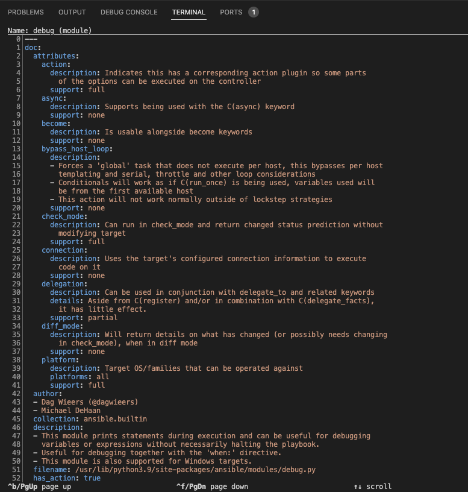

# Ejercicio 3: Ansible Facts

**Leálo en otros idiomas**:  [English](README.md),   [日本語](README.ja.md),  [Español](README.es.md).

## Índice

- [Objetivo](#objetivo)
- [Guía](#guía)
  - [Paso 1 - Usando la documentación](#paso-1---usando-la-documentación)
  - [Paso 2 - Creando el play](#paso-2---creando-el-play)
  - [Paso 3 - Crear la tarea de facts](#paso-3---crear-la-tarea-de-facts)
  - [Paso 4 - Ejecutando el playbook](#paso-4---ejecutando-el-playbook)
  - [Paso 5 - Usando el módulo de debug](#paso-5---usando-el-módulo-de-debug)
  - [Paso 6 - Usando la salida estándar stdout](#paso-6---usando-la-salida-estándar-stdout)
- [Consejos a recordar](#consejos-a-recordar)
- [Solución](#solución)
- [Completado](#completado)

## Objetivo

Demostración del uso de los hechos de Ansible (en adelante, `Ansible facts`) en una infraestructura de red.

Los hechos de Ansible (`facts`) son información derivada de la comunicación con elementos de red remotos. Los 'facts' son devueltos en forma de datos estructurados (JSON) lo que hace que sean fácilmente manipulables o modificables. Por ejemplo, un ingeniero de red podría crear un reporte de auditoría muy rápidamente usando los 'facts' de Ansible y creando una plantilla en un fichero markdown o HTML.

Este ejercicio cubrirá:

* Crear un Playbook de Ansible desde cero.
* Usar `ansible-navigator :doc` para la búsqueda de documentación
* Usar el módulo [cisco.ios.facts](https://docs.ansible.com/ansible/latest/collections/cisco/ios/ios_facts_module.html).
* Usar el módulo [debug](https://docs.ansible.com/ansible/latest/modules/debug_module.html).

## Guía

### Paso 1 - Usando la documentación

Ejecuta el comando `ansible-navigator` en modo interactivo en la terminal

```bash
$ ansible-navigator
```

pantallazo de `ansible-navigator`:


En el pantallazo anterior se puede ver una línea por cada documentación de módulo o plugin:
 
```
`:doc <plugin>`                 Review documentation for a module or plugin
 ```

Veamos por ejemplo el módulo `debug` escribiendo `:doc debug` en la terminal:

```bash
:doc debug
```

Este es un pantallazo de la salida del comando `ansible-navigator :doc debug`:



La documentación para el módulo de `debug` se muestra en la sesión de terminal interactiva. Es una representación en YAML de la misma documentación que está disponible en [docs.ansible.com](https://docs.ansible.com/ansible/latest/collections/ansible/builtin/debug_module.html). Los ejemplos pueden ser copiados y pegados directamente del módulo de documentación en un Playbook de Ansible.

Cuando nos referimos a un módulo no embebido, hay tres campos importantes:

```
namespace.collection.module
```
Por ejemplo:
```
cisco.ios.facts
```

Explicación de términos:
- **namespace** - ejemplo **cisco** - Un espacio de nombres ('namespace') es una agrupación de colecciones múltiples. El espacio de nombres **cisco** contiene múltiples colecciones, incluyendo **ios**, **nxos**, e **iosxr**.
- **collection** - ejemplo **ios** - Una colección es  es un formato de distribución para contenido de Ansible que incluye playbooks, roles, módulos, y plugins. La colección **ios** contiene todos los módulos del Cisco IOS/IOS-XE.
- **module** - ejemplo 'facts' - Los módulos son unidades discretas de código que puede usarse en una tarea de un playbook. Por ejemplo, los módulos de **facts** devolverán datos estructurados acerca de un determinado sistema.

Pulsa la tecla **Esc** para volver al menú principal. Intenta repetir el comando `:doc` con el módulo `cisco.ios.facts`.

```bash
:doc cisco.ios.facts
```

Usaremos el módulo 'facts' en nuestro playbook.

### Paso 2 - Creando el play

Los ficheros de Playbook de Ansible están en escritos en [**YAML**](https://yaml.org/). YAML es un formato de codificación estructurado que, además, es extremadamente leíble por los humanos (al contrario que su subconjunto - el formato JSON)

Crea un nuevo fichero en Visual Studio Code: 


Para simplificar, llama al fichero de playbook: `facts.yml`:


Inserta el siguiente play dentro del fichero `facts.yml`:

```yaml
---
- name: gather information from routers
  hosts: cisco
  gather_facts: no
```

Expliquemos cada línea:

* La primera línea, `---` indica que es un fichero YAML.
* La palabra clave `- name:` es una descipción opcional para el Playbook de Ansible en particular.
* La palabra clave `hosts:` significa este playbook se ejecutará en el grupo `cisco` definido en el archivo de inventario.
* La directiva `gather_facts: no` se requiere desde Ansible 2.8 y anteriores, sólo funciona en hosts Linux, y no en una infraestructura de red. La usaremos en un módulo específico para obtener los 'facts' para un dispositivo de red.

### Paso 3 - Crear la tarea de facts

Ahora, añade la primera tarea usando la directiva `task`. Esta tarea usará el módulo `cisco.ios.facts` para obtener los hechos ('facts')  sobre cada dispositivo del grupo `cisco`.

```yaml
---
- name: gather information from routers
  hosts: cisco
  gather_facts: no

  tasks:
    - name: gather router facts
      cisco.ios.facts:
```

> Nota:
>
> Un 'play' es una lista de tareas. Los módulos son código ya escrito que lleva a cabo una tarea.

Guarda el playbook.

### Paso 4 - Ejecutando el playbook

Ejecuta el Playbook de Ansible usando el comando `ansible-navigator`:

```sh
$ ansible-navigator run facts.yml
```

Esto abrirá una sesión interactiva mientras el playbook se ejecuta:

Pantallazo de facts.yml:


Para ampliar la salida del playbook, pulsaremos **0** que nos mostrará una vista centrada en el host. Puesto que sólo hay un host, sólo hay una opción.

Pantallazo de la ampliación:


Para ver la salida verbosa de **rtr1** pulsa **0** otra vez para ampliar los valores de retorno del módulo.

Pantallazo de la ampliación dentro del módulo 'data':


Puedes avanzar hacia abajo para ver cualquier 'fact' que haya sido obtenido del dispositivo de red Cisco.

### Paso 5 - Usando el módulo de debug

Escribe dos tareas adicionales que mostrarán la versión del SO y el número de serie del enrutador.

<!--  -->

``` yaml
---
- name: gather information from routers
  hosts: cisco
  gather_facts: no

  tasks:
    - name: gather router facts
      cisco.ios.facts:

    - name: display version
      debug:
        msg: "The IOS version is: {{ ansible_net_version }}"

    - name: display serial number
      debug:
        msg: "The serial number is:{{ ansible_net_serialnum }}"
```

<!--  -->

### Paso 6 - Usando la salida estándar stdout

Ahora, vuelve a ejecutar el playbook usando el comando `ansible-navigator` y el modificador `--mode stdout`

El comando completo es: `ansible-navigator run facts.yml --mode stdout`

Pantallazo de ansible-navigator usando la salida estándar:


Usando menos de 20 líneas de "código" has sido capaz de automatizar la obtención de la versión y el número de serie. ¡Imagina si estuvieras ejecutando esto en tu entorno de producción de red! Ahora tienes datos sobre los que poder ejecutar acciones y que no se quedan desactualizados.

## Consejos a recordar

* El comando `ansible-navigator :doc` nos permitirá acceder la documentación sin una conexión de red. Esta documentación también concuerda con la versión de Ansible en el nodo de control.
* El [módulo cisco.ios.facts](https://docs.ansible.com/ansible/latest/collections/cisco/ios/ios_config_module.html) obtiene datos estructurados específicos para Cisco IOS. Existen módulos relevantes para cada plataforma de red. Por ejemplo, existe un `junos_facts` para Juniper Junos, y un `eos_facts` para Arista EOS.
* El [módulo de debug](https://docs.ansible.com/ansible/latest/modules/debug_module.html) permite a un Playbook de Ansible imprimir los valores en la terminal.

## Solución

El Playbook de Ansible completo se provee aquí: [facts.yml](facts.yml).

## Completado

¡Felicidades, has completado el ejercicio de laboratorio 3!

---
[Ejercicio Anterior](../2-first-playbook/README.es.md) | [Próximo ejercicio](../4-resource-module/README.es.md)

[Haz click aquí para volver al taller Ansible Network Automation](../README.es.md)
