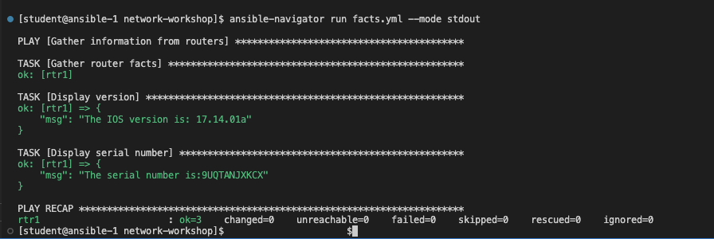

# Exercice 3 : Les Facts Ansible

**Lisez ceci dans d'autres langues** :  [English](README.md),  [日本語](README.ja.md),  [Español](README.es.md),  [Français](README.fr.md).

## Table des matières

- [Exercice 3 : Les Facts Ansible](#exercice-3--les-facts-ansible)
  - [Table des matières](#table-des-matières)
  - [Objectif](#objectif)
  - [Guide](#guide)
    - [Étape 1 - Utilisation de la documentation](#étape-1---utilisation-de-la-documentation)
    - [Étape 2 - Création du play](#étape-2---création-du-play)
    - [Étape 3 - Créer la tâche de facts](#étape-3---créer-la-tâche-de-facts)
    - [Étape 4 - Exécution du playbook](#étape-4---exécution-du-playbook)
    - [Étape 5 - Utilisation du module debug](#étape-5---utilisation-du-module-debug)
    - [Étape 6 - Utilisation du mode stdout](#étape-6---utilisation-du-mode-stdout)
  - [Points Clés](#points-clés)
  - [Solution](#solution)
  - [Conclusion](#conclusion)

## Objectif

Démonstration de l'utilisation des facts Ansible sur une infrastructure réseau.

Les facts Ansible sont des informations obtenues en interrogeant les éléments réseau distants. Ils sont retournés sous forme de données structurées (JSON), ce qui facilite leur manipulation ou modification. Par exemple, un ingénieur réseau pourrait créer rapidement un rapport d'audit en utilisant les facts Ansible et les modélisant dans un fichier Markdown ou HTML.

Cet exercice couvrira :

* La création d'un playbook Ansible depuis zéro.
* L'utilisation de `ansible-navigator :doc` pour la documentation.
* L'utilisation du [module cisco.ios.facts](https://docs.ansible.com/ansible/latest/collections/cisco/ios/ios_facts_module.html).
* L'utilisation du [module debug](https://docs.ansible.com/ansible/latest/modules/debug_module.html).

## Guide

### Étape 1 - Utilisation de la documentation

Entrez en mode interactif `ansible-navigator` sur le terminal

```bash
$ ansible-navigator
```

Capture d'écran de `ansible-navigator` :


Dans la capture d'écran ci-dessus, nous pouvons voir une ligne pour la documentation des modules ou plugins :

```
`:doc <plugin>`                 Consulter la documentation d'un module ou plugin
```

Examinons le module `debug` en tapant `:doc debug`

```bash
:doc debug
```

Capture d'écran de `ansible-navigator :doc debug` :


La documentation du module `debug` est maintenant affichée dans votre session interactive. C'est une représentation YAML de la même documentation que vous verriez sur [docs.ansible.com](https://docs.ansible.com/ansible/latest/collections/ansible/builtin/debug_module.html). Les exemples peuvent être copiés et collés directement dans votre playbook Ansible.

Pour les modules non-intégrés, trois champs sont importants :

```bash
namespace.collection.module
```
Par exemple :
```bash
cisco.ios.facts
```

Explication des termes :
- **namespace** - exemple **cisco** : Un namespace est un regroupement de collections. Le namespace **cisco** contient plusieurs collections, y compris **ios**, **nxos** et **iosxr**.
- **collection** - exemple **ios** : Une collection est un format de distribution pour le contenu Ansible pouvant inclure des playbooks, des rôles, des modules et des plugins. La collection **ios** contient tous les modules pour Cisco IOS/IOS-XE.
- **module** - exemple **facts** : Les modules sont des unités de code discrètes utilisables dans une tâche de playbook. Le module **facts** retournera des données structurées sur le système spécifié.

Appuyez sur la touche **Esc** pour revenir au menu principal. Essayez de répéter la commande `:doc` avec le module `cisco.ios.facts`.

```bash
:doc cisco.ios.facts
```

Nous utiliserons le module facts dans notre playbook.

### Étape 2 - Création du play

Les playbooks Ansible sont des fichiers <a target="_blank" href="https://yaml.org/">**YAML**</a>. YAML est un format de codage structuré qui est également très lisible par l'humain (contrairement à son sous-ensemble - le format JSON).

Créez un nouveau fichier dans Visual Studio Code :


Pour plus de simplicité, nommez le playbook : `facts.yml` :


Entrez la définition suivante dans `facts.yml` :

```yaml
---
- name: Récupérer des informations des routeurs
  hosts: cisco
  gather_facts: no
```

Explication de chaque ligne :

* La première ligne, `---` indique qu'il s'agit d'un fichier YAML.
* Le mot-clé `- name:` est une description facultative pour ce playbook Ansible.
* Le mot-clé `hosts:` signifie que ce playbook s'exécute contre le groupe `cisco` défini dans le fichier d'inventaire.
* Le mot-clé `gather_facts: no` est nécessaire car, depuis Ansible 2.8 et les versions antérieures, cela ne fonctionne que sur les hôtes Linux, et non sur l'infrastructure réseau. Nous utiliserons un module spécifique pour collecter les facts des équipements réseau.

### Étape 3 - Créer la tâche de facts

Ajoutez ensuite la première `task`. Cette tâche utilisera le module `cisco.ios.ios_facts` pour collecter des facts sur chaque dispositif du groupe `cisco`.

```yaml
---
- name: Récupérer des informations des routeurs
  hosts: cisco
  gather_facts: false

  tasks:
    - name: Récupérer les facts du routeur
      cisco.ios.ios_facts:
```

> Note :
>
> Un play est une liste de tâches. Les modules sont du code pré-écrit qui exécute la tâche.

Sauvegardez le playbook.

### Étape 4 - Exécution du playbook

Exécutez le playbook Ansible avec la commande `ansible-navigator` :

```sh
$ ansible-navigator run facts.yml
```

Cela ouvrira une session interactive pendant l'exécution du playbook :

Capture d'écran de facts.yml :


Pour zoomer sur la sortie du playbook, vous pouvez appuyer sur **0** pour afficher une vue centrée sur les hôtes. Comme il n'y a qu'un seul hôte, il n'y a qu'une option.

Capture d'écran de zoom :


Pour voir la sortie verbeuse de **rtr1**, appuyez encore une fois sur **0** pour zoomer sur les valeurs retournées par le module.

Capture d'écran de zoom des données du module :


Vous pouvez faire défiler l'écran pour voir les facts collectés sur l'équipement réseau Cisco.

### Étape 5 - Utilisation du module debug

Ajoutez deux tâches supplémentaires pour afficher la version du système d'exploitation des routeurs et leur numéro de série.

```yaml
---
- name: Récupérer des informations des routeurs
  hosts: cisco
  gather_facts: false

  tasks:
    - name: Récupérer les facts du routeur
      cisco.ios.ios_facts:

    - name: Afficher la version
      ansible.builtin.debug:
        msg: "La version IOS est : {{ ansible_net_version }}"

    - name: Afficher le numéro de série
      ansible.builtin.debug:
        msg: "Le numéro de série est : {{ ansible_net_serialnum }}"
```

### Étape 6 - Utilisation du mode stdout

Réexécutez le playbook avec `ansible-navigator` et le mode `--mode stdout`.

La commande complète est : `ansible-navigator run facts.yml --mode stdout`

Capture d'écran de ansible-navigator utilisant stdout :


Avec moins de 20 lignes de "code", vous venez d'automatiser la collecte de la version et du numéro de série. Imaginez si vous faisiez cela sur un réseau de production ! Vous avez maintenant des données exploitables qui ne deviennent pas obsolètes.

## Points Clés

* La commande `ansible-navigator :doc` vous donne accès à la documentation sans connexion Internet. Cette documentation correspond également à la version d'Ansible sur le nœud de contrôle.
* Le [module cisco.ios.facts](https://docs.ansible.com/ansible/latest/collections/cisco/ios/ios_config_module.html) collecte des données structurées spécifiques à Cisco IOS. Il existe des modules pertinents pour chaque plateforme réseau. Par exemple, junos_facts pour Juniper Junos et eos_facts pour Arista EOS.
* Le [module debug](https://docs.ansible.com/ansible/latest/modules/debug_module.html) permet à un playbook Ansible d'afficher des valeurs dans la fenêtre du terminal.

## Solution

Le playbook Ansible final est fourni ici comme référence : [facts.yml](facts.yml).

## Conclusion

Vous avez terminé l'exercice 3

---
[Exercice précédent](../2-first-playbook/README.fr.md) | [Exercice suivant](../4-resource-module/README.fr.md)

[Retour à l'atelier d'automatisation réseau Ansible](../README.fr.md)

